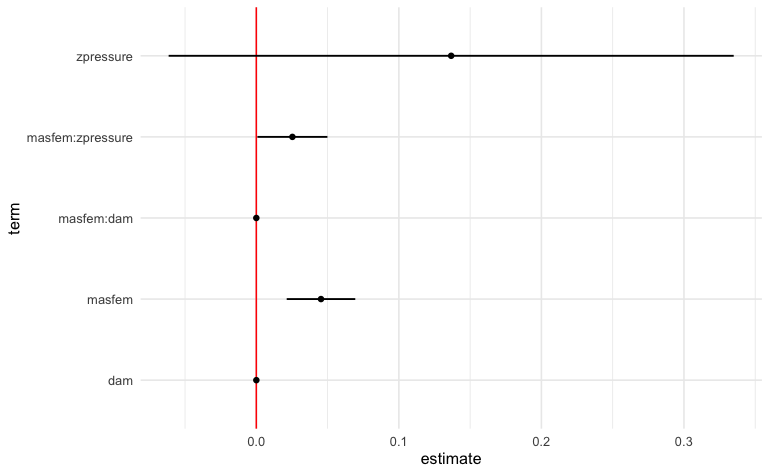

```{r chunk_options, include=FALSE}
knitr::opts_chunk$set(
  collapse = TRUE,
  comment = "#>",
  fig.path = "README_files/"
)
```

<!-- badges: start -->

[](https://github.com/MUCollective/multiverse/actions)
[](https://codecov.io/gh/MUCollective/multiverse)

<!-- badges: end -->

# Multiverse: An R package for creating multiverse analysis

`multiverse` is an R package that allows users to specify multiverse of statistical analysis, also called a multiverse analysis. In a multiverse analysis, researchers identify sets of defensible analysis choices (e.g., different ways of excluding outliers, different data transformations), implement them all, and then report the outcomes of all analyses resulting from all possible choice combinations. The **goal** of `multiverse` is to allow users to create multiverse analyses in a concise and easily interpretable manner.

Steegen et al. first put forth the concept of [multiverse analysis](https://journals.sagepub.com/doi/pdf/10.1177/1745691616658637); Simonsohn et al. put forth a similar notion called the [Specification curve analysis](https://repository.upenn.edu/cgi/viewcontent.cgi?article=1314&context=marketing_papers).

`multiverse` attempts to make it easy to declare alternate analysis paths by declaring **analysis parameters** at different levels of analysis:

  - **Data substitution parameters** offer to switch between different raw datasets, either collected or simulated.

  - **Data processing parameters** offer to process the same raw data in different ways before it is analyzed.

  - **Modeling parameters** offer different ways of analyzing the same processed data

  - **Presentation parameters** offer different ways of presenting analysis outcomes

The `multiverse` documentation follows the tidyverse syntax


## Installation

You can install the latest development version from GitHub with these R commands:

``` r
install.packages("devtools")
devtools::install_github("mucollective/multiverse")
```

## Overview

For details on how to quickly get started with this package, please refer to this document as well as the following vignettes:

- How alternate analysis paths can be declared in `multiverse` using [branch](mucollective.github.io/multiverse/articles/)
- How conditions can be declared in `multiverse` using [conditions](mucollective.github.io/multiverse/articles/); conditions can be used to state when two steps in a multiverse are incompatible with one another.
- How `multiverse` can be used in different environments: [using `multiverse` in RScripts and RMarkdown](mucollective.github.io/multiverse/articles/)
- How multiverse results can be extracted and visualised: [visualising multiverse results](mucollective.github.io/multiverse/articles/)

We also implement a series of other end-to-end multiverse implementations using this package to demonstrate how it might be used:

- Steegen et al.'s [https://journals.sagepub.com/doi/pdf/10.1177/1745691616658637] original multiverse analysis of the paper [The fluctuating female vote: Politics, religion, and the ovulatory cycle](https://doi.org/10.1177/0956797612466416); can also be found **below**.
- Simonsohn et al.'s [http://dx.doi.org/10.2139/ssrn.2694998] specification curve analysis of the paper [Female hurricanes are deadlier than male hurricanes](https://doi.org/10.1073/pnas.1402786111)
- Dragicevic et al.'s mini-paper [Adding Inferential Information to plots using Resampling and Animations](https://explorablemultiverse.github.io/examples/dance/) (from [Increasing the transparency of research papers with explorable multiverse analyses](https://hal.inria.fr/hal-01976951/document) )
- Dragicevic et al.'s mini-paper [Re-evaluating the efficiency of Physical Visualisations](https://explorablemultiverse.github.io/examples/frequentist/) (from [Increasing the transparency of research papers with explorable multiverse analyses](https://hal.inria.fr/hal-01976951/document) )

## Examples

In this document, we outline an initial approach to conducting a multiverse analysis in R. We will show how our package can be used to perform the multiverse analysis outlined by Steegen et al. in [Increasing Transparency Through a Multiverse Analysis](https://journals.sagepub.com/doi/pdf/10.1177/1745691616658637).

Data analysis can involve several decisions involving two or more options. In most statistical analysis, these decisions are taken by the researcher based on some reasonable justification. However, for several decisions, there can be more than one reasonable options to choose from. A multiverse analysis is a form of analysis which makes all such decisions explicit and conducts the complete analysis for all combinations of options (of each decision). 

Below, we illustrate an example of a single analysis for a dataset. And then extend it to a multiverse analysis.

```{r setup, include=FALSE}
library(knitr)
opts_knit$set(
  echo = TRUE,
  fig.width = 6, 
  fig.height = 4,
  fig.path = "README_files/"
)
library(dplyr)
library(tidyr)
library(ggplot2)
library(purrr)
library(broom)
library(gganimate)
library(cowplot)
library(multiverse)
```


## The data
The first step is to read the raw data from the file and store it as a tibble. We will be following the *_tidy data_* format here. The data is stored in two text files, and we can use `readr` to read the files into R. In this example, we will use the data collected by *Durante et al.*, which investigated the effect of fertility on religiosity and political attitudes. We will focus on their second study (which we store in `data.raw.study2`).

```{r data}
data("durante")

df_durante <- durante
```

The data look like this:

```{r, data-preview}
df_durante %>%
  head(10)
```

The original paper looked at the relationship between fertility, relationship status, and religiousity. But there are many reasonable ways to have defined each of these three variables from this dataset, so it is a good candidate for multiverse analysis.

## A single data set analysis: one possible analysis among many

The data collected needs to be processed before it can be modeled. Preparing the data set for analysis can involve several steps and decisions regarding how to encode the different raw values. The following is one example of data processing that can be performed for this study. 

```{r, single_analysis}
one_universe = df_durante %>%
  mutate( ComputedCycleLength = StartDateofLastPeriod - StartDateofPeriodBeforeLast ) %>%
  mutate( NextMenstrualOnset = StartDateofLastPeriod + ComputedCycleLength ) %>%
  mutate(
    CycleDay = 28 - (NextMenstrualOnset - DateTesting),
    CycleDay = ifelse(CycleDay > 1 & CycleDay < 28, CycleDay, ifelse(CycleDay < 1, 1, 28))
  ) %>%
  mutate(
    Relationship = factor(ifelse(Relationship==1 | Relationship==2, "Single", "Relationship"))
  ) %>%
  filter( ComputedCycleLength > 25 & ComputedCycleLength < 35) %>%
  filter( Sure1 > 6 | Sure2 > 6 ) %>%
  mutate( Fertility = factor( ifelse(CycleDay >= 7 & CycleDay <= 14, "high", ifelse(CycleDay >= 17 & CycleDay <= 25, "low", "medium")) ) )
```

The transformed data for this one universe looks like this:

```{r, universe-data}
one_universe %>%
  select( NextMenstrualOnset, Relationship, Sure1, Sure2, Fertility, everything() ) %>%
  head(10)
```

```{r, universe-summary, fig.align = 'center', eval = FALSE}
one_universe %>%
  ggplot(aes(x = Relationship, y = Rel1 + Rel2 + Rel3, color = Fertility)) +
  stat_summary(position = position_dodge(width = .1), fun.data = "mean_se")
```



However, there also exists other valid processing options: instead of calculating `NextMenstrualOnset = StartDateofLastPeriod + ComputedCycleLength`, it can also be calculated as `StartDateofLastPeriod + ReportedCycleLength`. Such alternate processing options can exist for several decisions that a researcher makes in the data processing, analysis and presentation stages. This can thus result in a *multiverse of analysis*, with the one described above representing a single *universe*. 

How would one declare such different anlternate ways of calculation easily and efficiently? Below, we describe how our package allows you to make such declarations with ease.

## Multiverse specification

`multiverse` provides flexible functions which can be used to perform a multiverse analysis.

The first step is to define a *new multiverse*. We will use the multiverse object to create a set of universes, each representing a different way of analysing our data.

```{r, multiverse-init}
M <- multiverse()
```

The next step is to define our possible alternate analysis paths inside the multiverse. The `multiverse` package includes functions that aim to make it easy to write multiverse analyses in as close a way to a single universe analysis as possible (as seen in the single analysis shown above). 

Consider these first few lines from the transformation code in the single analysis above:

```{r, data-processing, eval=FALSE}
df <- df_durante %>%
  mutate(ComputedCycleLength = StartDateofLastPeriod - StartDateofPeriodBeforeLast) %>%
  mutate(NextMenstrualOnset = StartDateofLastPeriod + ComputedCycleLength)
```

But `NextMenstrualOnset` could be calculated in at least two other reasonable ways:

* `NextMenstrualOnset = StartDateofLastPeriod + ReportedCycleLength`
* `NextMenstrualOnset = StartDateNext`

To create a multiverse that includes these three possible processing options, we can use the `branch()` function. The `branch()` function defines a *parameter* (here `menstrual_calculation`) and the different *options* that the parameter can take (here, `"mc_option1"`, `"mc_option2"`, `"mc_option3"`). Each option corresponds to a different chunk of code that would be executed in a different universe.

```{r parameter_options, eval = FALSE}
NextMenstrualOnset = branch(menstrual_calculation, 
  "mc_option1" ~ StartDateofLastPeriod + ComputedCycleLength,
  "mc_option2" ~ StartDateofLastPeriod + ReportedCycleLength,
  "mc_option3" ~ StartDateNext
)
```

More details on the `branch()` function can be found in the corresponding [vignette](mucollective.github.io/multiverse/articles/branch.html)

### Two ways to building a multiverse

The `branch()` function indicates that, *in our multiverse*, NextMenstrualOnset can take either of the three options (here, `"mc_option1"`, `"mc_option2"`, `"mc_option3"`). However, this is *clearly* not R syntax. To get around these limitations, we declare this code "inside the multiverse", which is another way of saying that the code is declared, processed and executed in a special environment. In the `multiverse` package we support this declaration in two ways:

- using *multiverse code chunks*, which allows users to declare multiverse code in a dedicated code chunk, and is more consistent with the interactive programming interface of RStudio. 
- using the `inside()` function. The inside function which allows users to declare multiverse code in RScripts or regular R code blocks, and is more suited for a script-style implementation.

**Note** that the `inside` function is more suited for a script-style implementation. Keeping consistency with the interactive programming interface of RStudio, we also offer the user a `multiverse code block` which can be used instead of the `r` code block to write code inside a multiverse object (see \link{multiverse-in-rmd} for more details on using the multiverse with RMarkdown). 


#### Multiverse code blocks

We can use the [*multiverse code blocks*](https://mucollective.github.io/multiverse/articles/multiverse-in-rmd.html) instead of the regular `r` code block to write code inside a multiverse object (see \link{multiverse-in-rmd} for more details on using the multiverse with RMarkdown). This allows you to write more concise code and is more consistent with the interactive programming interface of RStudio. A *multiverse code block* is a custom engine designed to work with the multiverse package, to implement the multiverse analyses. Below we show how the same code from above can be implemented using the *multiverse code block*

```{multiverse default-m-1, inside = M, echo = FALSE}
# here we just create the variable `df` in the multiverse
df <- df_durante

# here, we perform two `mutate` operations in the multiverse.
# although they could have been chained, this illustrates 
# how multiple variables can be declared together using the `{}`
df <- df %>%
  mutate( ComputedCycleLength = StartDateofLastPeriod - StartDateofPeriodBeforeLast ) %>%
  mutate( NextMenstrualOnset = branch(menstrual_calculation, 
    "mc_option1" ~ StartDateofLastPeriod + ComputedCycleLength,
    "mc_option2" ~ StartDateofLastPeriod + ReportedCycleLength,
    "mc_option3" ~ StartDateNext)
  )
```


````
```{multiverse default-m-1, inside = M}`r ''`
# here we just create the variable `df` in the multiverse
df <- df_durante

# here, we perform two `mutate` operations in the multiverse.
# although they could have been chained, this illustrates 
# how multiple variables can be declared together using the `{}`
df <- df_durante %>%
  mutate( ComputedCycleLength = StartDateofLastPeriod - StartDateofPeriodBeforeLast ) %>%
  mutate( NextMenstrualOnset = branch(menstrual_calculation, 
    "mc_option1" ~ StartDateofLastPeriod + ComputedCycleLength,
    "mc_option2" ~ StartDateofLastPeriod + ReportedCycleLength,
    "mc_option3" ~ StartDateNext)
  )
```
````


#### `inside()`
Alternatively, we can use regular `r` code blocks instead of the regular to write code inside a multiverse object
The `inside()` function takes in two arguments:
1. the multiverse object, M; and
2. the code for the analysis (including branches). Note that if you are passing multiple expressions, they should be enclosed within `{}`.

Note that `this`inside()` is primarily designed for script style programming.

```{r add_to_multiverse, eval = FALSE}
# here we just create the variable `df` in the multiverse
inside(M, df <- df_durante)

# here, we perform two `mutate` operations in the multiverse.
# although they could have been chained, this illustrates 
# how multiple variables can be declared together using the `{}`
inside(M, {
  df <- df %>%
    mutate( ComputedCycleLength = StartDateofLastPeriod - StartDateofPeriodBeforeLast )
  
  df <- df %>%
    mutate( NextMenstrualOnset = branch(menstrual_calculation, 
      "mc_option1" ~ StartDateofLastPeriod + ComputedCycleLength,
      "mc_option2" ~ StartDateofLastPeriod + ReportedCycleLength,
      "mc_option3" ~ StartDateNext)
    )
})
```

In the rest of this vignette, we will use **multiverse code blocks to specify the multiverse. Please refer to the vignette (`vignette("multiverse-in-rmd")`) for more details.

More details on the **declaring multiverse analyses in RScripts and RMarkdown** can be found in the corresponding [vignette](mucollective.github.io/multiverse/articles/multiverse-in-rmd.html)

## The multiverse, with declared code and branches
Once you add the code to the multiverse, it automatically parses the code to identify the `parameters` and the corresponding `options` that have been defined for each parameter.

Once the code has been added, the `multiverse` object will have the following attributes: 

1. `parameters`, which is a list of parameters

```{r parameter_list}
parameters(M)
```

2. `conditions`, which is a list of conditions (we'll define this later)
3. `expand`, which is a tibble consisting of all possible combination of values for the multiverse

```{r, view-multiverse-table}
expand(M) %>% select(-.code)
```

4. `code`, which is the code that the user passes to the multiverse to conduct a multiverse analysis. However, we do not execute this code and it is stored unevaluated. The user can interactively edit and rewrte this code, and can execute it for the current analysis or the entire multiverse using dedicated functions.

```{r, view-code}
code(M)
```

## Running a single analysis from the multiverse

At this point, we have defined three possible processing options (three universes) in our multiverse. Keeping consistency with the interactive programming interface of RStudio, we also execute the default analysis in each step. In the previous step, we stored the results in the variable `df`. We can see the result of the default analysis in th multiverse by accessing the data frame from the multiverse object as shown:

```{r, generate_code}
M$df %>% head()
```

## A multiverse with all possible combinations specified 

Besides calculating the onset of the next menstruation cycle, there are other variables which have multiple valid and reasonable processing options. These include defining `Relationship` and `Fertility`, and exclusion criteria based on the values for cycle length and certainty of responses. The next code chunk illustrates how this can be added to the multiverse object defined above.

```{multiverse default-m-2, inside = M, echo = FALSE}
df <- df %>%
    mutate(Relationship = branch( relationship_status, 
      "rs_option1" ~ factor(ifelse(Relationship==1 | Relationship==2, 'Single', 'Relationship')),
      "rs_option2" ~ factor(ifelse(Relationship==1, 'Single', 'Relationship')),
      "rs_option3" ~ factor(ifelse(Relationship==1, 'Single', ifelse(Relationship==3 | Relationship==4, 'Relationship', NA))) )
    ) %>%
    mutate(
      CycleDay = 28 - (NextMenstrualOnset - DateTesting),
      CycleDay = ifelse(CycleDay > 1 & CycleDay < 28, CycleDay, ifelse(CycleDay < 1, 1, 28))
    ) %>%
    filter( branch(cycle_length, 
      "cl_option1" ~ TRUE,
      "cl_option2" ~ ComputedCycleLength > 25 & ComputedCycleLength < 35,
      "cl_option3" ~ ReportedCycleLength > 25 & ReportedCycleLength < 35
    )) %>%
    filter( branch(certainty,
        "cer_option1" ~ TRUE,
        "cer_option2" ~ Sure1 > 6 | Sure2 > 6
    )) %>%
    mutate( Fertility = branch( fertile,
        "fer_option1" ~ factor( ifelse(CycleDay >= 7 & CycleDay <= 14, "high", ifelse(CycleDay >= 17 & CycleDay <= 25, "low", "medium")) ),
        "fer_option2" ~ factor( ifelse(CycleDay >= 6 & CycleDay <= 14, "high", ifelse(CycleDay >= 17 & CycleDay <= 27, "low", "medium")) ),
        "fer_option3" ~ factor( ifelse(CycleDay >= 9 & CycleDay <= 17, "high", ifelse(CycleDay >= 18 & CycleDay <= 25, "low", "medium")) ),
        "fer_option4" ~ factor( ifelse(CycleDay >= 8 & CycleDay <= 14, "high", "low") ),
        "fer_option5" ~ factor( ifelse(CycleDay >= 8 & CycleDay <= 17, "high", "low") )
    ))
```


```{multiverse default-m-2 inside = M}`r ''`
df <- df %>%
    mutate(Relationship = branch( relationship_status, 
      "rs_option1" ~ factor(ifelse(Relationship==1 | Relationship==2, 'Single', 'Relationship')),
      "rs_option2" ~ factor(ifelse(Relationship==1, 'Single', 'Relationship')),
      "rs_option3" ~ factor(ifelse(Relationship==1, 'Single', ifelse(Relationship==3 | Relationship==4, 'Relationship', NA))) )
    ) %>%
    mutate(
      CycleDay = 28 - (NextMenstrualOnset - DateTesting),
      CycleDay = ifelse(CycleDay > 1 & CycleDay < 28, CycleDay, ifelse(CycleDay < 1, 1, 28))
    ) %>%
    filter( branch(cycle_length, 
      "cl_option1" ~ TRUE,
      "cl_option2" ~ ComputedCycleLength > 25 & ComputedCycleLength < 35,
      "cl_option3" ~ ReportedCycleLength > 25 & ReportedCycleLength < 35
    )) %>%
    filter( branch(certainty,
        "cer_option1" ~ TRUE,
        "cer_option2" ~ Sure1 > 6 | Sure2 > 6
    )) %>%
    mutate( Fertility = branch( fertile,
        "fer_option1" ~ factor( ifelse(CycleDay >= 7 & CycleDay <= 14, "high", ifelse(CycleDay >= 17 & CycleDay <= 25, "low", "medium")) ),
        "fer_option2" ~ factor( ifelse(CycleDay >= 6 & CycleDay <= 14, "high", ifelse(CycleDay >= 17 & CycleDay <= 27, "low", "medium")) ),
        "fer_option3" ~ factor( ifelse(CycleDay >= 9 & CycleDay <= 17, "high", ifelse(CycleDay >= 18 & CycleDay <= 25, "low", "medium")) ),
        "fer_option4" ~ factor( ifelse(CycleDay >= 8 & CycleDay <= 14, "high", "low") ),
        "fer_option5" ~ factor( ifelse(CycleDay >= 8 & CycleDay <= 17, "high", "low") )
    ))
})
```
````

Since the multiverse object has already been created and the one parameter has already been defined, this will simply add to the previous code:

```{r, complete-code}
code(M)
```

The `expand` function will contain all the possible combinations of the parameter options that have been identified.

```{r, complete-multiverse-table}
expand(M) %>%
  select(-.code) %>%
  head()
```

In our multiverse we have identified 5 options for calculating `fertility`, 3 options for calculating `menstrual calculation` and `relationship status` each, 3 wyas of excluding participants based on their `cycle length` and 2 ways of excluding participants based on the self-reported `certainty` of their responses.

This results in $ 5 \times 3 \times 3 \times 3 \times 2 = 270$ possible combinations.

```{r, complete-n}
expand(M) %>% nrow()
```

We can then inspect the default analysis the default single universe analysis from this multiverse:

```{r, default-df-preview}
M$df %>%
  head()
```

```{r, universe-reassignment, eval = FALSE, include = FALSE}
#Or, we could get the code for a different single universe analysis by providing a list of parameter assignments (options which each parameter should take) to the `execute_default()` function and execute it:

universe_parameter_assignment <- list(
    menstrual_calculation = "mc_option",
    relationship_status = "rs_option3",
    cycle_length = "cl_option2",
    certainty = "cer_option1",
    fertile = "fer_option4"
  )

M %>% execute_universe( universe_parameter_assignment ) %>%
  select(ComputedCycleLength, NextMenstrualOnset, CycleDay, Relationship, Fertility, everything()) %>%
  head()
```


## Specifying conditions in the multiverse analysis

In our example, we are excluding participants based on their *cycle length*. This can be done in two ways: we can use the values of the variable,`ComputedCycleLength` or `ReportedCycleLength`. If we are using `ComputedCycleLength` to exclude participants, this means that we should not calculate the variable `NextMenstrualOnset` (date for the onset of the next menstrual cycle) using the `ReportedCycleLength` value. Similarly, if we are using `ReportedCycleLength` to exclude participants it is inconsistent to calculate `NextMenstrualOnset` using `ComputedCycleLength`. In a multiverse analysis, it may occur that the value of one variable might depend on the value of another variable defined previously. 

We should be able to express these conditions in the multiverse. We can do this in two ways:
1. `%when%`: when declaring a branch, we can use this operator to specify the conditional $A | B$ as `A %when% B`. The conditional $A | B$ is also referred to as the connective $A \implies B$. This has the meaning "if A is true, then B is also true" and is an abbreviation for $\neg A | B$
2. `branch_assert`: this function allows the user to specify any condition in the form of a logical operation

#### The %when% operator
There are two ways in which you can specify the `%when%` operator. The first is to specify it at the end of the branch. This will work even if you omit the branch option name.

```{r, when-operator, eval = FALSE}
df <- df_durante  %>%
  mutate( ComputedCycleLength = StartDateofLastPeriod - StartDateofPeriodBeforeLast ) %>%
  mutate(NextMenstrualOnset = branch(menstrual_calculation,
          "mc_option1" ~ (StartDateofLastPeriod + ComputedCycleLength) %when% (cycle_length != "cl_option3"),
          "mc_option2" ~ (StartDateofLastPeriod + ReportedCycleLength) %when% (cycle_length != "cl_option2"),
          "mc_option3" ~ StartDateNext)
  )
```

The other is to specify it at the head of the branch, right after the option name:

```{r, when-operator-alt, eval = FALSE}
df <- df  %>%
    mutate(NextMenstrualOnset = branch(menstrual_calculation,
            "mc_option1" %when% (cycle_length != "cl_option3") ~ StartDateofLastPeriod + ComputedCycleLength,
            "mc_option2" %when% (cycle_length != "cl_option2") ~ (StartDateofLastPeriod + ReportedCycleLength),
            "mc_option3" ~ StartDateNext)
    )
```

#### The `branch_assert()` function
Within the branch assert function, the user can specify any logical operation. 

For eg: the above logical operations can be specified as: `branch_assert(menstrual_calculation != "mc_option1" | cycle_length != "cl_option3")` or `branch_assert(!(menstrual_calculation == "mc_option1" | cycle_length == "cl_option3"))`

Both these operations have the same result, but the first may not be as easily interpretable. We specify the conditionals using the `branch_assert()` function in our example as:

```{r, branch_assert, eval = FALSE}
df <- df  %>%
    mutate(NextMenstrualOnset = branch(menstrual_calculation,
            "mc_option1" ~ StartDateofLastPeriod + ComputedCycleLength,
            "mc_option2" ~ StartDateofLastPeriod + ReportedCycleLength,
            "mc_option3" ~ StartDateNext)
    ) %>%
    branch_assert( ! (menstrual_calculation == "mc_option1" & cycle_length == "cl_option3")) %>%
    branch_assert( !(menstrual_calculation == "mc_option2" & cycle_length != "cl_option2"))
```

Specifying these conditions allows us to exclude inconsistent combinations from our analyses. Let's update our example by including these cnditions:

```{r, when-eg-2}
M = multiverse()
```


```{multiverse default-m-3, inside = M, echo = FALSE}
df <- df_durante  %>%
  mutate( ComputedCycleLength = StartDateofLastPeriod - StartDateofPeriodBeforeLast )  %>%
  dplyr::filter( branch(cycle_length,
          "cl_option1" ~ TRUE,
          "cl_option2" ~ ComputedCycleLength > 25 & ComputedCycleLength < 35,
          "cl_option3" ~ ReportedCycleLength > 25 & ReportedCycleLength < 35
  )) %>%
  dplyr::filter( branch(certainty,
          "cer_option1" ~ TRUE,
          "cer_option2" ~ Sure1 > 6 | Sure2 > 6
  )) %>%
  mutate(NextMenstrualOnset = branch(menstrual_calculation,
          "mc_option1" %when% (cycle_length != "cl_option3") ~ StartDateofLastPeriod + ComputedCycleLength,
          "mc_option2" %when% (cycle_length != "cl_option2") ~ StartDateofLastPeriod + ReportedCycleLength,
          "mc_option3" ~ StartDateNext)
  )  %>%
  mutate(
    CycleDay = 28 - (NextMenstrualOnset - DateTesting),
    CycleDay = ifelse(CycleDay > 1 & CycleDay < 28, CycleDay, ifelse(CycleDay < 1, 1, 28))
  ) %>%
  mutate( Fertility = branch( fertile,
          "fer_option1" ~ factor( ifelse(CycleDay >= 7 & CycleDay <= 14, "high", ifelse(CycleDay >= 17 & CycleDay <= 25, "low", NA)) ),
          "fer_option2" ~ factor( ifelse(CycleDay >= 6 & CycleDay <= 14, "high", ifelse(CycleDay >= 17 & CycleDay <= 27, "low", NA)) ),
          "fer_option3" ~ factor( ifelse(CycleDay >= 9 & CycleDay <= 17, "high", ifelse(CycleDay >= 18 & CycleDay <= 25, "low", NA)) ),
          "fer_option4" ~ factor( ifelse(CycleDay >= 8 & CycleDay <= 14, "high", "low") ),
          "fer_option45" ~ factor( ifelse(CycleDay >= 8 & CycleDay <= 17, "high", "low") )
  )) %>%
  mutate(RelationshipStatus = branch(relationship_status,
          "rs_option1" ~ factor(ifelse(Relationship==1 | Relationship==2, 'Single', 'Relationship')),
          "rs_option2" ~ factor(ifelse(Relationship==1, 'Single', 'Relationship')),
          "rs_option3" ~ factor(ifelse(Relationship==1, 'Single', ifelse(Relationship==3 | Relationship==4, 'Relationship', NA))) )
  )
```


````
```{multiverse default-m-3, inside = M, echo = FALSE}`r ''`
df <- df_durante  %>%
  mutate( ComputedCycleLength = StartDateofLastPeriod - StartDateofPeriodBeforeLast )  %>%
  dplyr::filter( branch(cycle_length,
          "cl_option1" ~ TRUE,
          "cl_option2" ~ ComputedCycleLength > 25 & ComputedCycleLength < 35,
          "cl_option3" ~ ReportedCycleLength > 25 & ReportedCycleLength < 35
  )) %>%
  dplyr::filter( branch(certainty,
          "cer_option1" ~ TRUE,
          "cer_option2" ~ Sure1 > 6 | Sure2 > 6
  )) %>%
  mutate(NextMenstrualOnset = branch(menstrual_calculation,
          "mc_option1" %when% (cycle_length != "cl_option3") ~ StartDateofLastPeriod + ComputedCycleLength,
          "mc_option2" %when% (cycle_length != "cl_option2") ~ StartDateofLastPeriod + ReportedCycleLength,
          "mc_option3" ~ StartDateNext)
  )  %>%
  mutate(
    CycleDay = 28 - (NextMenstrualOnset - DateTesting),
    CycleDay = ifelse(CycleDay > 1 & CycleDay < 28, CycleDay, ifelse(CycleDay < 1, 1, 28))
  ) %>%
  mutate( Fertility = branch( fertile,
          "fer_option1" ~ factor( ifelse(CycleDay >= 7 & CycleDay <= 14, "high", ifelse(CycleDay >= 17 & CycleDay <= 25, "low", NA)) ),
          "fer_option2" ~ factor( ifelse(CycleDay >= 6 & CycleDay <= 14, "high", ifelse(CycleDay >= 17 & CycleDay <= 27, "low", NA)) ),
          "fer_option3" ~ factor( ifelse(CycleDay >= 9 & CycleDay <= 17, "high", ifelse(CycleDay >= 18 & CycleDay <= 25, "low", NA)) ),
          "fer_option4" ~ factor( ifelse(CycleDay >= 8 & CycleDay <= 14, "high", "low") ),
          "fer_option45" ~ factor( ifelse(CycleDay >= 8 & CycleDay <= 17, "high", "low") )
  )) %>%
  mutate(RelationshipStatus = branch(relationship_status,
          "rs_option1" ~ factor(ifelse(Relationship==1 | Relationship==2, 'Single', 'Relationship')),
          "rs_option2" ~ factor(ifelse(Relationship==1, 'Single', 'Relationship')),
          "rs_option3" ~ factor(ifelse(Relationship==1, 'Single', ifelse(Relationship==3 | Relationship==4, 'Relationship', NA))) )
  )
```
````

After excluding the inconsistent choice combinations, $270 − 2 \times (5 \times 1 \times 3 \times 1 \times 2) = 210$ choice combinations remain:

```{r, df-conditions-assert}
expand(M) %>% nrow()
```

Now, we've created the complete multiverse that was presented as example #2 from Steegen et al.'s paper.

More details on the `conditions` can be found in the corresponding [vignette](mucollective.github.io/multiverse/articles/conditions.html)

## Modeling
Steegen et al. create 6 models. The first model uses data from example #1. The other five models use the data from example #2, which we've using so far.

### Model #2: Effect of Fertility and Relationship status on Religiosity
The authors compute a composite score of Religiosity by calculating the average of the three Religiosity items.

```{multiverse default-m-4, inside = M, echo = FALSE}
df <- df %>%
  mutate( RelComp = round((Rel1 + Rel2 + Rel3)/3, 2))
```


````
```{multiverse default-m-4, inside = M}`r ''`
df <- df %>%
  mutate( RelComp = round((Rel1 + Rel2 + Rel3)/3, 2))
```
````

The authors perform an ANOVA to study the effect of *Fertility*, *Relationship* and their interaction term, on the composite Religiosity score. We fit the linear model using the call: `lm( RelComp ~ Fertility * RelationshipStatus, data = df )` inside our multiverse and save the result to a variable called `fit_RelComp`.

```{multiverse default-m-8, inside = M, echo = FALSE}
fit_RelComp <- lm( RelComp ~ Fertility * RelationshipStatus, data = df )
```

````
```{multiverse default-m-8, inside = M, echo = FALSE}`r ''`
fit_RelComp <- lm( RelComp ~ Fertility * RelationshipStatus, data = df )
```
````

To extract the results from the analysis, we first create a tidy data-frame of the results of the model, using `broom::tidy`. 

```{multiverse default-m-10, inside = M, echo = FALSE}
summary_RelComp <- fit_RelComp %>% 
    broom::tidy( conf.int = TRUE )
```


````
```{multiverse default-m-10, inside = M}`r ''`
summary_RelComp <- fit_RelComp %>% 
    broom::tidy( conf.int = TRUE )
```
````


Recall that declaring a variable in the multiverse only executes it in the default universe, and hence we need to call `execute_multiverse()` to execute our analysis in each multiverse.

```{r, execute-multiverse}
execute_multiverse(M)
```

Now that we have performed the analysis in each universe of the multiverse, we need to plot the data. To plot the data, we need to extract the relevant result data-frame from each universe into a single data-frame. The following code does this, by extracting the variable where the estimates of the model are stored, `summary_RelComp` and creating a single tidy data-frame that can be accessed easily.

```{r, multiverse-model-1-summary}
expand(M) %>%
  select(-.code) %>%
  mutate( summary = map(.results, "summary_RelComp" ) ) %>%
  unnest( cols = c(summary) ) %>%
  head( 10 )
```

We then take this data frame and plot the results as a confidence interval and point estimate using `ggplot2`. As you can see, this is similar to how you would plot a point estimate and confidence intervals for a regular analysis. We then use `gganimate` to animate through the results of each universe to quickly get an overview of the robustness of the results.

Note: we discuss extracting results from the multiverse and visualizing them in more detail in the vignette [`Extracting and Visualizing the results of a multiverse analysis`](visualizing-multiverse.html)

```{r, model-1-vis, message = FALSE, eval = FALSE}
p <- expand(M) %>%
  mutate( summary = map(.results, "summary_RelComp") ) %>%
  unnest( cols = c(summary) ) %>%
  mutate( term = recode( term, 
                 "RelationshipStatusSingle" = "Single",
                 "Fertilitylow:RelationshipStatusSingle" = "Single:Fertility_low"
  ) ) %>%
  filter( term != "(Intercept)" ) %>%
  ggplot() + 
  geom_vline( xintercept = 0,  colour = '#979797' ) +
  geom_point( aes(x = estimate, y = term)) +
  geom_errorbarh( aes(xmin = conf.low, xmax = conf.high, y = term), height = 0) +
  transition_manual( .universe )

animate(p, nframes = 210, fps = 2)
```


## Conclusion
The authors also perform a number of other analysis using the same independent variables (`Fertility`, `Relationship Status` and their interaction term), but with different dependent variables: `Fiscal political attitudes`, `Social political attitudes`, `Voting preferences` and `Donation preferences`. These analyses can be found in the vignette [`A complete implementation of a multiverse analysis`](complete-multiverse-analysis.html)

In addition, we also implement a series of other end-to-end multiverse implementations using this package to demonstrate how it might be used:

- Simonsohn et al.'s [http://dx.doi.org/10.2139/ssrn.2694998] specification curve analysis of the paper [Female hurricanes are deadlier than male hurricanes](https://doi.org/10.1073/pnas.1402786111)
- Dragicevic et al.'s mini-paper [Adding Inferential Information to plots using Resampling and Animations](https://explorablemultiverse.github.io/examples/dance/) (from [Increasing the transparency of research papers with explorable multiverse analyses](https://hal.inria.fr/hal-01976951/document) )
- Dragicevic et al.'s mini-paper [Re-evaluating the efficiency of Physical Visualisations](https://explorablemultiverse.github.io/examples/frequentist/) (from [Increasing the transparency of research papers with explorable multiverse analyses](https://hal.inria.fr/hal-01976951/document) ) 


