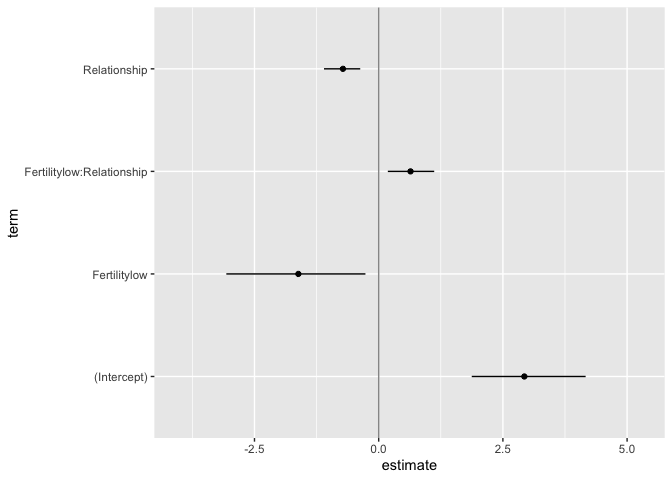

# Multidy: An R package for creating multiverse analysis

[](https://travis-ci.com/MUCollective/multidy)
[](https://codecov.io/gh/MUCollective/multidy?branch=master)

`multidy` is an R package that allows users to specify multiverse of statistical analysis, also called a multiverse analysis. In a multiverse analysis, researchers identify sets of defensible analysis choices (e.g., different ways of excluding outliers, different data transformations), implement them all, and then report the outcomes of all analyses resulting from all possible choice combinations.

Steegen et al. first put forth the concept of [multiverse analysis](https://journals.sagepub.com/doi/pdf/10.1177/1745691616658637); Simonsohn et al. put forth a similar notion called the [Specification curve analysis](https://repository.upenn.edu/cgi/viewcontent.cgi?article=1314&context=marketing_papers).

`multidy` attempts to make it easy to declare alternate analysis paths by declaring **analysis parameters** at different levels of analysis:

  - **Data substitution parameters** offer to switch between different raw datasets, either collected or simulated.

  - **Data processing parameters** offer to process the same raw data in different ways before it is analyzed.

  - **Modeling parameters** offer different ways of analyzing the same processed data

  - **Presentation parameters** offer different ways of presenting analysis outcomes

The `multidy` documentation follows the tidyverse syntax


## Installation

You can install the latest development version from
GitHub with these R commands:

``` r
install.packages("devtools")
devtools::install_github("mucollective/multidy")
```

## Examples

In this document, we outline an initial approach to conducting a
multiverse analysis in R. We will show how our package can be used to
perform the multiverse analysis outlined by Steegen et al. in
[Increasing Transparency Through a Multiverse
Analysis](https://journals.sagepub.com/doi/pdf/10.1177/1745691616658637).

Data analysis can involve several decisions involving two or more
options. In most statistical analysis, these decisions are taken by the
researcher based on some reasonable justification. However, for several
decisions, there can be more than one reasonable options to choose from.
A multiverse analysis is a form of analysis which makes all such
decisions explicit and conducts the complete analysis for all
combinations of options (of each decision).

Below, we illustrate an example of a single analysis for a dataset. And
then extend it to a multiverse analysis.


### The data

The first step is to read the raw data from the file and store it as a
tibble. We will be following the **tidy data** format here. The data is
stored in two text files, and we can use `readr` to read the files into
R. In this example, we will use the data collected by *Durante et al.*,
which investigated the effect of fertility on religiosity and political
attitudes. We will focus on their second study (which we store in
`data.raw.study2`).

``` r
data("durante")

data.raw.study2 <- durante %>%
  mutate(
    Abortion = abs(7 - Abortion) + 1,
    StemCell = abs(7 - StemCell) + 1,
    Marijuana = abs(7 - Marijuana) + 1,
    RichTax = abs(7 - RichTax) + 1,
    StLiving = abs(7 - StLiving) + 1,
    Profit = abs(7 - Profit) + 1,
    FiscConsComp = FreeMarket + PrivSocialSec + RichTax + StLiving + Profit,
    SocConsComp = Marriage + RestrictAbortion + Abortion + StemCell + Marijuana
  )
```

The data look like this:

``` r
data.raw.study2 %>%
  head(10)
```

<div class="kable-table">

| WorkerID |   Rel1 |   Rel2 |   Rel3 |  Abortion |  Marriage | StemCell  |  RestrictAbortion |
| -------: | -----: | -----: | -----: | --------: | --------: | --------: | ----------------: |
|        1 |      8 |      8 |      7 |         6 |         7 |         1 |                 7 | 
|        2 |      8 |      7 |      7 |         1 |         2 |         3 |                 1 | 
|        3 |      6 |      6 |      2 |         5 |         1 |         2 |                 4 | 
|        4 |      7 |      8 |      6 |         1 |         5 |         2 |                 2 | 
|        5 |      7 |      7 |      9 |         1 |         1 |         4 |                 1 | 
|        6 |      9 |      9 |      9 |         7 |         7 |         2 |                 7 | 
|        7 |      5 |      8 |      5 |         3 |         4 |         3 |                 5 | 
|        8 |      1 |      1 |      1 |         1 |         1 |         2 |                 1 | 
|        9 |      7 |      7 |      7 |         5 |         1 |         2 |                 1 | 
|       10 |      6 |      6 |      6 |         3 |         5 |         3 |                 1 |

… with 18 |  more variables: Marijuana [dbl], FreeMarket [dbl], RichTax [dbl], StLiving [dbl], Profit [dbl], PrivSocialSec [dbl],  Sure1 [dbl], Sure2 [dbl], Relationship [dbl], ReportedCycleLength [dbl], Vote [dbl], Donate [dbl], DateTesting [date], StartDateofLastPeriod [date], StartDateofPeriodBeforeLast [date], StartDateNext [date], FiscConsComp [dbl], SocConsComp [dbl]

</div>

The original paper looked at the relationship between fertility,
relationship status, and religiousity. But there are many reasonable
ways to have defined each of these three variables from this dataset, so
it is a good candidate for multiverse analysis.

### A single data set analysis: one possible analysis among many

The data collected needs to be processed before it can be modeled.
Preparing the data set for analysis can involve several steps and
decisions regarding how to encode the different raw values. The
following is one example of data processing that can be performed for
this study.

``` r
one_universe = data.raw.study2 %>%
  mutate( ComputedCycleLength = StartDateofLastPeriod - StartDateofPeriodBeforeLast ) %>%
  mutate( NextMenstrualOnset = StartDateofLastPeriod + ComputedCycleLength ) %>%
  mutate(
    CycleDay = 28 - (NextMenstrualOnset - DateTesting),
    CycleDay = ifelse(CycleDay > 1 & CycleDay < 28, CycleDay, ifelse(CycleDay < 1, 1, 28))
  ) %>%
  mutate(
    Relationship = factor(ifelse(Relationship==1 | Relationship==2, "Single", "Relationship"))
  ) %>%
  filter( ComputedCycleLength > 25 & ComputedCycleLength < 35) %>%
  filter( Sure1 > 6 | Sure2 > 6 ) %>%
  mutate( Fertility = factor( ifelse(CycleDay >= 7 & CycleDay <= 14, "high", ifelse(CycleDay >= 17 & CycleDay <= 25, "low", "medium")) ) )
```

The transformed data for this one universe looks like this:

``` r
one_universe %>%
  select( NextMenstrualOnset, Relationship, Sure1, Sure2, Fertility, everything() ) %>%
  head(10)
```

<div class="kable-table">

| NextMenstrualOnset |   Relationship | Sure1 | Sure2 | Fertility | WorkerID | Rel1 | Rel2 |
| -----------------: | -------------: | ----: | ----: | --------: | -------: | ---: | ---: |
|         2012-06-17 |   Relationship |    9  |     9 | medium    |       1  |   8  |   8  |
|         2012-05-28 |   Relationship |    9  |     9 | low       |       2  |   8  |   7  |
|         2012-05-31 |   Relationship |    8  |     8 | low       |       3  |   6  |   6  |
|         2012-05-23 |   Single       |    8  |     8 | medium    |       6  |   9  |   9  |
|         2012-05-31 |   Relationship |    9  |     9 | low       |       7  |   5  |   8  |
|         2012-06-15 |   Single       |    8  |     8 | medium    |      11  |   2  |   5  |
|         2012-06-08 |   Relationship |    9  |     9 | high      |      12  |   7  |   7  |
|         2012-06-14 |   Relationship |    9  |     9 | medium    |      13  |   9  |   9  |
|         2012-06-10 |   Relationship |    9  |     9 | high      |      17  |   6  |   4  |
|         2012-06-18 |   Single       |    9  |     9 | medium    |      18  |   9  |   9  |

</div>

... with 22 more variables

``` r
one_universe %>%
  ggplot(aes(x = Relationship, y = Rel1 + Rel2 + Rel3, color = Fertility)) +
  stat_summary(position = position_dodge(width = .1), fun.data = "mean_se")
```


However, there also exists other valid processing options: instead of
calculating
`NextMenstrualOnset = StartDateofLastPeriod + ComputedCycleLength`, it
can also be calculated as `StartDateofLastPeriod + ReportedCycleLength`.
Such alternate processing options can exist for several decisions that a
researcher makes in the data processing, analysis and presentation
stages. This can thus result in a *multiverse of analysis*, with the one
described above representing a single *universe*.

Below, we describe how our package allows you to conduct a multiverse
analysis with ease.

### Defining the multiverse

`multidy` provides flexible functions which can be used to perform a
multiverse analysis.

The first step is to define a *new multiverse*. We will use the
multiverse object to create a set of universes, each representing a
different way of analysing our data.

``` r
M <- multiverse()
```

The next step is to define our possible analyses inside the multiverse.
The `multidy` package includes functions that aim to make it easy to
write multiverse analyses in as close a way to a single universe
analysis as possible (as seen in the single analysis shown above).

Consider these first few lines from the transformation code in the
single analysis above:

``` r
df <- data.raw.study2 %>%
  mutate(ComputedCycleLength = StartDateofLastPeriod - StartDateofPeriodBeforeLast) %>%
  mutate(NextMenstrualOnset = StartDateofLastPeriod + ComputedCycleLength)
```

But `NextMenstrualOnset` could be calculated in at least two other
reasonable ways:

-   `NextMenstrualOnset = StartDateofLastPeriod + ReportedCycleLength`
-   `NextMenstrualOnset = StartDateNext`

To create a multiverse that includes these three possible processing
options, we can use the `branch()` function. The `branch()` function
defines a *parameter* (here `menstrual_calculation`) and the different
*options* that the parameter can take (here, `"mc_option1"`,
`"mc_option2"`, `"mc_option3"`). Each option corresponds to a different
chunk of code that would be executed in a different universe.

``` r
NextMenstrualOnset = branch(menstrual_calculation, 
  "mc_option1" ~ StartDateofLastPeriod + ComputedCycleLength,
  "mc_option2" ~ StartDateofLastPeriod + ReportedCycleLength,
  "mc_option3" ~ StartDateNext
)
```

The `branch()` function indicates that, *in our multiverse*,
NextMenstrualOnset can take either of the three options (here,
`"mc_option1"`, `"mc_option2"`, `"mc_option3"`). Thus, we need to
declare this data processing step inside the multiverse. We do this by
using the `inside()` function. The `inside()` function takes in two
arguments: 1. the multiverse object, M; and 2. the code for the analysis
(including branches). Note that if you are passing multiple expressions,
they should be enclosed within `{}`.

``` r
# here we just create the variable `df` in the multiverse
inside(M, df <- data.raw.study2)

# here, we perform two `mutate` operations in the multiverse.
# although they could have been chained, this illustrates 
# how multiple variables can be declared together using the `{}`
inside(M, {
  df <- df %>%
    mutate( ComputedCycleLength = StartDateofLastPeriod - StartDateofPeriodBeforeLast )
  
  df <- df %>%
    mutate( NextMenstrualOnset = branch(menstrual_calculation, 
      "mc_option1" ~ StartDateofLastPeriod + ComputedCycleLength,
      "mc_option2" ~ StartDateofLastPeriod + ReportedCycleLength,
      "mc_option3" ~ StartDateNext)
    )
})
```

Alternative to the `inside` function, we can use the more concise `<-`
operator to define the multiverse. However, any expression on the
right-hand-side of the `<-` operator needs to be preceded by the `~`
(tilde) which converts the expression to a formula. Thus, the syntax
looks like: `<multiverse_object>$<variable_name> <- ~ <expression>`

``` r
M$df <- ~ data.raw.study2  %>%
    mutate( ComputedCycleLength = StartDateofLastPeriod - StartDateofPeriodBeforeLast ) %>%
    mutate(NextMenstrualOnset = branch(menstrual_calculation, 
      "mc_option1" ~ StartDateofLastPeriod + ComputedCycleLength,
      "mc_option2" ~ StartDateofLastPeriod + ReportedCycleLength,
      "mc_option3" ~ StartDateNext)
    )
```

### The multiverse, with declared code and branches

Once you add the code to the multiverse, it automatically parses the
code to identify the `parameters` and the corresponding `options` that
have been defined for each parameter.

Once the code has been added, the `multiverse` object will have the
following attributes:

1.  `parameters`, which is a list of parameters

``` r
parameters(M)
```

    ## $menstrual_calculation
    ## $menstrual_calculation[[1]]
    ## [1] "mc_option1"
    ## 
    ## $menstrual_calculation[[2]]
    ## [1] "mc_option2"
    ## 
    ## $menstrual_calculation[[3]]
    ## [1] "mc_option3"

1.  `conditions`, which is a list of conditions (we’ll define this
    later)
2.  `multiverse_table`, which is a tibble consisting of all possible
    combination of values for the multiverse

``` r
multiverse_table(M)
```

    ## # A tibble: 3 x 5
    ##   .universe menstrual_calculation .parameter_assignment .code      .results
    ##       <int> <chr>                 <list>                <list>     <list>  
    ## 1         1 mc_option1            <named list [1]>      <language> <env>   
    ## 2         2 mc_option2            <named list [1]>      <language> <env>   
    ## 3         3 mc_option3            <named list [1]>      <language> <env>

1.  `current_parameter_assignment`, which is a list of one set of
    options for each parameter defined in the multiverse. It initialises
    to the first option for each parameter. This should be the default
    analysis.

``` r
default_parameter_assignment(M)
```

    ## $menstrual_calculation
    ## [1] "mc_option1"

1.  `code`, which is the code that the user passes to the multiverse to
    conduct a multiverse analysis. However, we do not execute this code
    and it is stored unevaluated. The user can interactively edit and
    rewrte this code, and can execute it for the current analysis or the
    entire multiverse using dedicated functions.

``` r
code(M)
```

    ## {
    ##     df <- data.raw.study2
    ##     df <- df %>% mutate(ComputedCycleLength = StartDateofLastPeriod - 
    ##         StartDateofPeriodBeforeLast)
    ##     df <- df %>% mutate(NextMenstrualOnset = branch(menstrual_calculation, 
    ##         "mc_option1" ~ StartDateofLastPeriod + ComputedCycleLength, 
    ##         "mc_option2" ~ StartDateofLastPeriod + ReportedCycleLength, 
    ##         "mc_option3" ~ StartDateNext))
    ## }

### Running a single analysis from the multiverse

At this point, we have defined three possible processing options (three
universes) in our multiverse. Keeping consistency with the interactive
programming interface of RStudio, we also execute the default analysis
in each step. In the previous step, we stored the results in the
variable `df`. We can see the result of this analysis in the appropriate
row (universe) of the multiverse table.

``` r
M$df %>% head()
```

### A multiverse with all possible combinations specified

Besides calculating the onset of the next menstruation cycle, there are
other variables which have multiple valid and reasonable processing
options. These include defining `Relationship` and `Fertility`, and
exclusion criteria based on the values for cycle length and certainty of
responses. The next code chunk illustrates how this can be added to the
multiverse object defined above. We’ll also try the more concise `<-`
assignment operator now.

``` r
M$df <- ~ df %>%
    mutate(Relationship = branch( relationship_status, 
      "rs_option1" ~ factor(ifelse(Relationship==1 | Relationship==2, 'Single', 'Relationship')),
      "rs_option2" ~ factor(ifelse(Relationship==1, 'Single', 'Relationship')),
      "rs_option3" ~ factor(ifelse(Relationship==1, 'Single', ifelse(Relationship==3 | Relationship==4, 'Relationship', NA))) )
    ) %>%
    mutate(
      CycleDay = 28 - (NextMenstrualOnset - DateTesting),
      CycleDay = ifelse(CycleDay > 1 & CycleDay < 28, CycleDay, ifelse(CycleDay < 1, 1, 28))
    ) %>%
    filter( branch(cycle_length, 
      "cl_option1" ~ TRUE,
      "cl_option2" ~ ComputedCycleLength > 25 & ComputedCycleLength < 35,
      "cl_option3" ~ ReportedCycleLength > 25 & ReportedCycleLength < 35
    )) %>%
    filter( branch(certainty,
        "cer_option1" ~ TRUE,
        "cer_option2" ~ Sure1 > 6 | Sure2 > 6
    )) %>%
    mutate( Fertility = branch( fertile,
        "fer_option1" ~ factor( ifelse(CycleDay >= 7 & CycleDay <= 14, "high", ifelse(CycleDay >= 17 & CycleDay <= 25, "low", "medium")) ),
        "fer_option2" ~ factor( ifelse(CycleDay >= 6 & CycleDay <= 14, "high", ifelse(CycleDay >= 17 & CycleDay <= 27, "low", "medium")) ),
        "fer_option3" ~ factor( ifelse(CycleDay >= 9 & CycleDay <= 17, "high", ifelse(CycleDay >= 18 & CycleDay <= 25, "low", "medium")) ),
        "fer_option4" ~ factor( ifelse(CycleDay >= 8 & CycleDay <= 14, "high", "low") ),
        "fer_option5" ~ factor( ifelse(CycleDay >= 8 & CycleDay <= 17, "high", "low") )
    ))
```

Since the multiverse object has already been created and the one
parameter has already been defined, the inside function will add to the
previous code.

``` r
code(M)
```

    ## {
    ##     df <- data.raw.study2
    ##     df <- df %>% mutate(ComputedCycleLength = StartDateofLastPeriod - 
    ##         StartDateofPeriodBeforeLast)
    ##     df <- df %>% mutate(NextMenstrualOnset = branch(menstrual_calculation, 
    ##         "mc_option1" ~ StartDateofLastPeriod + ComputedCycleLength, 
    ##         "mc_option2" ~ StartDateofLastPeriod + ReportedCycleLength, 
    ##         "mc_option3" ~ StartDateNext))
    ##     df <- df %>% mutate(Relationship = branch(relationship_status, 
    ##         "rs_option1" ~ factor(ifelse(Relationship == 1 | Relationship == 
    ##             2, "Single", "Relationship")), "rs_option2" ~ factor(ifelse(Relationship == 
    ##             1, "Single", "Relationship")), "rs_option3" ~ factor(ifelse(Relationship == 
    ##             1, "Single", ifelse(Relationship == 3 | Relationship == 
    ##             4, "Relationship", NA))))) %>% mutate(CycleDay = 28 - 
    ##         (NextMenstrualOnset - DateTesting), CycleDay = ifelse(CycleDay > 
    ##         1 & CycleDay < 28, CycleDay, ifelse(CycleDay < 1, 1, 
    ##         28))) %>% filter(branch(cycle_length, "cl_option1" ~ 
    ##         TRUE, "cl_option2" ~ ComputedCycleLength > 25 & ComputedCycleLength < 
    ##         35, "cl_option3" ~ ReportedCycleLength > 25 & ReportedCycleLength < 
    ##         35)) %>% filter(branch(certainty, "cer_option1" ~ TRUE, 
    ##         "cer_option2" ~ Sure1 > 6 | Sure2 > 6)) %>% mutate(Fertility = branch(fertile, 
    ##         "fer_option1" ~ factor(ifelse(CycleDay >= 7 & CycleDay <= 
    ##             14, "high", ifelse(CycleDay >= 17 & CycleDay <= 25, 
    ##             "low", "medium"))), "fer_option2" ~ factor(ifelse(CycleDay >= 
    ##             6 & CycleDay <= 14, "high", ifelse(CycleDay >= 17 & 
    ##             CycleDay <= 27, "low", "medium"))), "fer_option3" ~ 
    ##             factor(ifelse(CycleDay >= 9 & CycleDay <= 17, "high", 
    ##                 ifelse(CycleDay >= 18 & CycleDay <= 25, "low", 
    ##                   "medium"))), "fer_option4" ~ factor(ifelse(CycleDay >= 
    ##             8 & CycleDay <= 14, "high", "low")), "fer_option5" ~ 
    ##             factor(ifelse(CycleDay >= 8 & CycleDay <= 17, "high", 
    ##                 "low"))))
    ## }

The `multiverse_table` will contain all the possible combinations of the
parameter options that have been identified.

``` r
multiverse_table(M) %>%
  head()
```

    ## # A tibble: 6 x 9
    ##   .universe menstrual_calcu… relationship_st… cycle_length certainty
    ##       <int> <chr>            <chr>            <chr>        <chr>    
    ## 1         1 mc_option1       rs_option1       cl_option1   cer_opti…
    ## 2         2 mc_option2       rs_option1       cl_option1   cer_opti…
    ## 3         3 mc_option3       rs_option1       cl_option1   cer_opti…
    ## 4         4 mc_option1       rs_option2       cl_option1   cer_opti…
    ## 5         5 mc_option2       rs_option2       cl_option1   cer_opti…
    ## 6         6 mc_option3       rs_option2       cl_option1   cer_opti…
    ## # … with 4 more variables: fertile <chr>, .parameter_assignment <list>,
    ## #   .code <list>, .results <list>

In our multiverse we have identified 5 options for calculating
`fertility`, 3 options for calculating `menstrual calculation` and
`relationship status` each, 3 wyas of excluding participants based on
their `cycle length` and 2 ways of excluding participants based on the
self-reported `certainty` of their responses.

This results in $ 5 3 3 3 2 = 270$ possible combinations.

``` r
multiverse_table(M) %>% nrow()
```

    ## [1] 270

We can then inspect the default analysis the default single universe
analysis from this multiverse:

``` r
M$df %>%
  head()
```

    ## # A tibble: 6 x 30
    ##   WorkerID  Rel1  Rel2  Rel3 Abortion Marriage StemCell RestrictAbortion
    ##      <dbl> <dbl> <dbl> <dbl>    <dbl>    <dbl>    <dbl>            <dbl>
    ## 1        1     8     8     7        6        7        1                7
    ## 2        2     8     7     7        1        2        3                1
    ## 3        3     6     6     2        5        1        2                4
    ## 4        4     7     8     6        1        5        2                2
    ## 5        5     7     7     9        1        1        4                1
    ## 6        6     9     9     9        7        7        2                7
    ## # … with 22 more variables: Marijuana <dbl>, FreeMarket <dbl>,
    ## #   RichTax <dbl>, StLiving <dbl>, Profit <dbl>, PrivSocialSec <dbl>,
    ## #   Sure1 <dbl>, Sure2 <dbl>, Relationship <fct>,
    ## #   ReportedCycleLength <dbl>, Vote <dbl>, Donate <dbl>,
    ## #   DateTesting <date>, StartDateofLastPeriod <date>,
    ## #   StartDateofPeriodBeforeLast <date>, StartDateNext <date>,
    ## #   FiscConsComp <dbl>, SocConsComp <dbl>, ComputedCycleLength <drtn>,
    ## #   NextMenstrualOnset <date>, CycleDay <dbl>, Fertility <fct>

### Specifying conditions in the multiverse analysis

In a multiverse analysis, it may occur that the value of one variable
might depend on the value of another variable defined previously. For
example, in our example, we are excluding participants based on their
*cycle length*. This can be done in two ways: we can use the values of
the variable,`ComputedCycleLength` or `ReportedCycleLength`. If we are
using `ComputedCycleLength` to exclude participants, this means that we
should not calculate the variable `NextMenstrualOnset` (date for the
onset of the next menstrual cycle) using the `ReportedCycleLength`
value. Similarly, if we are using `ReportedCycleLength` to exclude
participants it is inconsistent to calculate `NextMenstrualOnset` using
`ComputedCycleLength`.

We should be able to express these conditions in the multiverse. We can
do this in two ways: 1. `%when%`: when declaring a branch, we can use
this operator to specify the conditional *A*\|*B* as `A %when% B`. The
conditional *A*\|*B* is also referred to as the connective *A* ⟹ *B*.
This has the meaning “if A is true, then B is also true” and is an
abbreviation for ¬*A*\|*B* 2. `branch_assert`: this function allows the
user to specify any condition in the form of a logical operation

#### The %when% operator

There are two ways in which you can specify the `%when%` operator. The
first is to specify it at the end of the branch. This will work even if
you omit the branch option name.

``` r
M$df <- data.raw.study2  %>%
    mutate( ComputedCycleLength = StartDateofLastPeriod - StartDateofPeriodBeforeLast ) %>%
    mutate(NextMenstrualOnset = branch(menstrual_calculation,
            "mc_option1" ~ (StartDateofLastPeriod + ComputedCycleLength) %when% (cycle_length != "cl_option3"),
            "mc_option2" ~ (StartDateofLastPeriod + ReportedCycleLength) %when% (cycle_length != "cl_option2"),
            "mc_option3" ~ StartDateNext)
    )
```

The other is to specify it at the head of the branch, right after the
option name:

``` r
M$df <- df  %>%
    mutate(NextMenstrualOnset = branch(menstrual_calculation,
            "mc_option1" %when% (cycle_length != "cl_option3") ~ StartDateofLastPeriod + ComputedCycleLength,
            "mc_option2" %when% (cycle_length != "cl_option2") ~ (StartDateofLastPeriod + ReportedCycleLength),
            "mc_option3" ~ StartDateNext)
    )
```

#### The `branch_assert()` function

Within the branch assert function, the user can specify any logical
operation.

For eg: the above logical operations can be specified as:
`branch_assert(menstrual_calculation != "mc_option1" | cycle_length != "cl_option3")`
or
`branch_assert(!(menstrual_calculation == "mc_option1" | cycle_length == "cl_option3"))`

Both these operations have the same result, but the first may not be as
easily interpretable. We specify the conditionals using the
`branch_assert()` function in our example as:

``` r
M$df <- df  %>%
    mutate(NextMenstrualOnset = branch(menstrual_calculation,
            "mc_option1" ~ StartDateofLastPeriod + ComputedCycleLength,
            "mc_option2" ~ StartDateofLastPeriod + ReportedCycleLength,
            "mc_option3" ~ StartDateNext)
    ) %>%
    branch_assert( ! (menstrual_calculation == "mc_option1" & cycle_length == "cl_option3")) %>%
    branch_assert( !(menstrual_calculation == "mc_option2" & cycle_length != "cl_option2"))
```

Specifying these conditions allows us to exclude inconsistent
combinations from our analyses. Let’s update our example by including
these cnditions:

``` r
M = multiverse()
M$df <- ~ data.raw.study2  %>%
    mutate( ComputedCycleLength = StartDateofLastPeriod - StartDateofPeriodBeforeLast )  %>%
    dplyr::filter( branch(cycle_length,
            "cl_option1" ~ TRUE,
            "cl_option2" ~ ComputedCycleLength > 25 & ComputedCycleLength < 35,
            "cl_option3" ~ ReportedCycleLength > 25 & ReportedCycleLength < 35
    )) %>%
    dplyr::filter( branch(certainty,
            "cer_option1" ~ TRUE,
            "cer_option2" ~ Sure1 > 6 | Sure2 > 6
    )) %>%
    mutate(NextMenstrualOnset = branch(menstrual_calculation,
            "mc_option1" %when% (cycle_length != "cl_option3") ~ StartDateofLastPeriod + ComputedCycleLength,
            "mc_option2" %when% (cycle_length != "cl_option2") ~ StartDateofLastPeriod + ReportedCycleLength,
            "mc_option3" ~ StartDateNext)
    )  %>%
    mutate(
      CycleDay = 28 - (NextMenstrualOnset - DateTesting),
      CycleDay = ifelse(CycleDay > 1 & CycleDay < 28, CycleDay, ifelse(CycleDay < 1, 1, 28))
    ) %>%
    mutate( Fertility = branch( fertile,
            "fer_option1" ~ factor( ifelse(CycleDay >= 7 & CycleDay <= 14, "high", ifelse(CycleDay >= 17 & CycleDay <= 25, "low", NA)) ),
            "fer_option2" ~ factor( ifelse(CycleDay >= 6 & CycleDay <= 14, "high", ifelse(CycleDay >= 17 & CycleDay <= 27, "low", NA)) ),
            "fer_option3" ~ factor( ifelse(CycleDay >= 9 & CycleDay <= 17, "high", ifelse(CycleDay >= 18 & CycleDay <= 25, "low", NA)) ),
            "fer_option4" ~ factor( ifelse(CycleDay >= 8 & CycleDay <= 14, "high", "low") ),
            "fer_option45" ~ factor( ifelse(CycleDay >= 8 & CycleDay <= 17, "high", "low") )
    )) %>%
    mutate(RelationshipStatus = branch(relationship_status,
            "rs_option1" ~ factor(ifelse(Relationship==1 | Relationship==2, 'Single', 'Relationship')),
            "rs_option2" ~ factor(ifelse(Relationship==1, 'Single', 'Relationship')),
            "rs_option3" ~ factor(ifelse(Relationship==1, 'Single', ifelse(Relationship==3 | Relationship==4, 'Relationship', NA))) )
    )
```

After excluding the inconsistent choice combinations,
270 − 2 × (5 × 1 × 3 × 1 × 2) = 210 choice combinations remain:

``` r
multiverse_table(M) %>% nrow()
```

    ## [1] 210

Now, we’ve created the complete multiverse that was presented as example
\#2 from Steegen et al.’s paper.

### Modeling

Steegen et al. create 6 models. The first model uses data from example
\#1. The other five models use the data from example \#2, which we’ve
using so far.

#### Model \#2: Effect of Fertility and Relationship status on Religiosity

The authors compute a composite score of Religiosity by calculating the
average of the three Religiosity items.

``` r
M$df <- ~ df %>%
  mutate( RelComp = round((Rel1 + Rel2 + Rel3)/3, 2))
```

The authors perform an ANOVA to study the effect of *Fertility*,
*Relationship* and their interaction term, on the composite Religiosity
score. We fit the linear model using the call:
`lm( RelComp ~ Fertility * RelationshipStatus, data = df )` inside our
multiverse and save the result to a variable called `fit_RelComp`.

``` r
M$fit_RelComp <- ~ lm( RelComp ~ Fertility * RelationshipStatus, data = df )
```

To extract the results from the analysis, we first create a tidy
data-frame of the results of the model, using `broom::tidy`. Recall that
declaring a variable in the multiverse only executes it in the default
universe, and hence we need to call `execute_multiverse` to execute our
analysis in each multiverse.

``` r
M$summary_RelComp <- ~ fit_RelComp %>% 
  broom::tidy( conf.int = TRUE )

execute_multiverse(M)
```

Now that we have performed the analysis in each universe of the
multiverse, we need to plot the data. To plot the data, we need to
extract the relevant result data-frame from each universe into a single
data-frame. The following code does this, by extracting the variable
where the estimates of the model are stored, `summary_RelComp` and
creating a single tidy data-frame that can be accessed easily.

``` r
multiverse_table(M) %>%
  unnest( map(.results, "summary_RelComp" ) ) %>%
  head( 10 )
```

    ## # A tibble: 10 x 13
    ##    .universe cycle_length certainty menstrual_calcu… fertile
    ##        <int> <chr>        <chr>     <chr>            <chr>  
    ##  1         1 cl_option1   cer_opti… mc_option1       fer_op…
    ##  2         1 cl_option1   cer_opti… mc_option1       fer_op…
    ##  3         1 cl_option1   cer_opti… mc_option1       fer_op…
    ##  4         1 cl_option1   cer_opti… mc_option1       fer_op…
    ##  5         2 cl_option2   cer_opti… mc_option1       fer_op…
    ##  6         2 cl_option2   cer_opti… mc_option1       fer_op…
    ##  7         2 cl_option2   cer_opti… mc_option1       fer_op…
    ##  8         2 cl_option2   cer_opti… mc_option1       fer_op…
    ##  9         4 cl_option1   cer_opti… mc_option1       fer_op…
    ## 10         4 cl_option1   cer_opti… mc_option1       fer_op…
    ## # … with 8 more variables: relationship_status <chr>, term <chr>,
    ## #   estimate <dbl>, std.error <dbl>, statistic <dbl>, p.value <dbl>,
    ## #   conf.low <dbl>, conf.high <dbl>

We then take this data frame and plot the results as a confidence
interval and point estimate using `ggplot2`. As you can see, this is
similar to how you would plot a point estimate and confidence intervals
for a regular analysis. We then use `gganimate` to animate through the
results of each universe to quickly get an overview of the robustness of
the results.

Note: we discuss extracting results from the multiverse and visualizing
them in more detail in the vignette
[`Extracting and Visualizing the results of a multiverse analysis`](visualizing-multiverse.html)

``` r
p <- multiverse_table(M) %>%
  unnest( map(.results, "summary_RelComp" ) ) %>%
  mutate( term = recode( term, 
                 "RelationshipStatusSingle" = "Single",
                 "Fertilitylow:RelationshipStatusSingle" = "Single:Fertility_low"
  ) ) %>%
  filter( term != "(Intercept)" ) %>%
  ggplot() + 
  geom_vline( xintercept = 0,  colour = '#979797' ) +
  geom_point( aes(x = estimate, y = term)) +
  geom_errorbarh( aes(xmin = conf.low, xmax = conf.high, y = term), height = 0) +
  transition_manual( .universe )

animate(p, nframes = 210, fps = 2)
```


The authors also perform a number of other analysis using the same
independent variables (`Fertility`, `Relationship Status` and their
interaction term), but with different dependent variables:
`Fiscal political attitudes`, `Social political attitudes`,
`Voting preferences` and `Donation preferences`. Below we perform these
analyses and visualize the results.

``` r
M$fit_FiscConsComp <- ~ lm( FiscConsComp ~ Fertility * RelationshipStatus, data = df)
M$summary_FiscConsComp <- ~ fit_FiscConsComp %>% 
  broom::tidy( conf.int = TRUE )

M$fit_SocConsComp <- ~ lm( SocConsComp ~ Fertility * RelationshipStatus, data = df)
M$summary_SocConsComp <- ~ fit_SocConsComp %>% 
  broom::tidy( conf.int = TRUE )

M$fit_Donate <- ~ glm( Donate ~ Fertility * Relationship, data = df, family = binomial(link = "logit") )
M$summary_Donate <- ~ fit_Donate %>% 
  broom::tidy( conf.int = TRUE )

M$fit_Vote <- ~ glm( Vote ~ Fertility * Relationship, data = df, family = binomial(link = "logit") )
M$summary_Vote <- ~ fit_Vote %>% 
  broom::tidy( conf.int = TRUE )

execute_multiverse(M)
```

### Model \#3: Effect of Fertility and Relationship status on Fiscal political attitudes

``` r
p <- multiverse_table(M) %>%
  unnest( map(.results, "summary_FiscConsComp" ) ) %>%
  mutate( term = recode( term, 
                 "RelationshipStatusSingle" = "Single",
                 "Fertilitylow:RelationshipStatusSingle" = "Single:Fertility_low"
  ) ) %>%
  filter( term != "(Intercept)" ) %>%
  ggplot() + 
  geom_vline( xintercept = 0,  colour = '#979797' ) +
  geom_point( aes(x = estimate, y = term)) +
  geom_errorbarh( aes(xmin = conf.low, xmax = conf.high, y = term), height = 0) +
  transition_manual( .universe )

animate(p, nframes = 210, fps = 2)
```


### Model \#4: Effect of Fertility and Relationship status on Social political attitudes

``` r
p <- multiverse_table(M) %>%
  unnest( map(.results, "summary_SocConsComp" ) ) %>%
  mutate( term = recode( term, 
                 "RelationshipStatusSingle" = "Single",
                 "Fertilitylow:RelationshipStatusSingle" = "Single:Fertility_low"
  ) ) %>%
  filter( term !=  "(Intercept)") %>%
  ggplot() + 
  geom_vline( xintercept = 0,  colour = '#979797' ) +
  geom_point( aes(x = estimate, y = term)) +
  geom_errorbarh( aes(xmin = conf.low, xmax = conf.high, y = term), height = 0) +
  transition_manual( .universe )

animate(p, nframes = 210, fps = 2)
```


### Model \#5: Effect of Fertility and Relationship status on Voting preferences

``` r
p <- multiverse_table(M) %>%
  unnest( map(.results, "summary_Donate" ) ) %>%
  mutate( term = recode( term, 
                 "RelationshipStatusSingle" = "Single",
                 "Fertilitylow:RelationshipStatusSingle" = "Single:Fertility_low"
  ) ) %>%
  ggplot() + 
  geom_vline( xintercept = 0,  colour = '#979797' ) +
  geom_point( aes(x = estimate, y = term)) +
  geom_errorbarh( aes(xmin = conf.low, xmax = conf.high, y = term), height = 0) +
  transition_manual( .universe )

animate(p, nframes = 210, fps = 2)
```



### Model \#6: Effect of Fertility and Relationship status on Donation preferences

``` r
p <- multiverse_table(M) %>%
  unnest( map(.results, "summary_Vote" ) ) %>%
  mutate( term = recode( term, 
                 "RelationshipStatusSingle" = "Single",
                 "Fertilitylow:RelationshipStatusSingle" = "Single:Fertility_low"
  ) ) %>%
  ggplot() + 
  geom_vline( xintercept = 0,  colour = '#979797' ) +
  geom_point( aes(x = estimate, y = term)) +
  geom_errorbarh( aes(xmin = conf.low, xmax = conf.high, y = term), height = 0) +
  transition_manual( .universe )

animate(p, nframes = 210, fps = 2)
```


