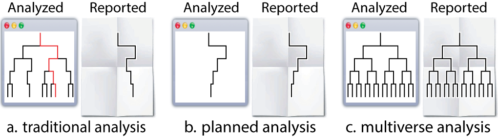

<!-- badges: start -->

[](https://github.com/MUCollective/multiverse/actions)
[](https://codecov.io/gh/MUCollective/multiverse)
[](https://cran.r-project.org/package=multiverse)


<!-- badges: end -->

# Multiverse: An R package for creating multiverse analysis

In any end-to-end analysis there likely exists points in the analysis
where researchers have to make a decision between two or more equally
defensible choices (e.g., different ways of excluding outliers,
different data transformations). In a multiverse analysis, researchers
identify all the possible decision points for an analysis, determine
alternative analysis steps at each decision point, implements them all,
and then report the outcomes of all analyses resulting from all possible
choice combinations.

However, declaring several alternative analysis paths can be tricky,
often requiring custom control flows such as nested for-loops and
multiple if-else statements. The **goal** of `multiverse` is to allow
users to create a multitude of end-to-end analyses in a concise and
easily interpretable manner. `multiverse` enables this by providing both
an embedded Domain-Specific Language (DSL) as well as an API to interact
with and extract results from a multiverse analysis, which can then be
neatly wrapped within a larger analysis in R.

For more background on what a *multiverse analysis* is, please refer to
the works of Steegen et al., who first put forth the concept of
[multiverse
analysis](https://journals.sagepub.com/doi/pdf/10.1177/1745691616658637),
and Simonsohn et al., who put forth a similar notion called the
[Specification curve
analysis](https://repository.upenn.edu/cgi/viewcontent.cgi?article=1314&context=marketing_papers).

The `multiverse` documentation predominantly follows the tidyverse
syntax.

## Installation

You can install the latest development version from GitHub with these R
commands:

``` r
install.packages("devtools")
devtools::install_github("mucollective/multiverse")
```

## Overview

In this document, we will provide you with details on how to quickly get
started with this package. Please refer to the following vignettes for
further information on:

-   How `multiverse` can be used in different environments such as in
    RMarkdown and RScripts. See `vignette("multiverse-in-rmd")`.
-   How alternate analysis paths are declared in `multiverse` using
    branch, and how `multiverse` processes the user-declared
    (`multiverse` DSL) code to create multiple end-to-end executable R
    analysis code. See `vignette("branch")`.
-   How conditions and dependencies can be declared in `multiverse`;
    conditions can be used to state when two steps in a multiverse are
    incompatible with one another. See `vignette("conditions")`.
-   How multiverse results can be extracted and visualised. . See
    `vignette("visualising-multiverse")`.

We also implement a series of end-to-end multiverse implementations
using this package to demonstrate how it might be used (which can be
found in the
[vignettes](https://mucollective.github.io/multiverse/articles/)):

-   Steegen et al.’s [original multiverse
    analysis](https://journals.sagepub.com/doi/pdf/10.1177/1745691616658637)
    of the paper [The fluctuating female vote: Politics, religion, and
    the ovulatory cycle](https://doi.org/10.1177/0956797612466416); can
    also be found **below**.
-   Simonsohn et al.’s [specification curve
    analysis](http://dx.doi.org/10.2139/ssrn.2694998) of the paper
    [Female hurricanes are deadlier than male
    hurricanes](https://doi.org/10.1073/pnas.1402786111)
-   Dragicevic et al.’s mini-paper [Adding Inferential Information to
    plots using Resampling and
    Animations](https://explorablemultiverse.github.io/examples/dance/)
    (from [Increasing the transparency of research papers with
    explorable multiverse
    analyses](https://hal.inria.fr/hal-01976951/document) )
-   Dragicevic et al.’s mini-paper [Re-evaluating the efficiency of
    Physical
    Visualisations](https://explorablemultiverse.github.io/examples/frequentist/)
    (from [Increasing the transparency of research papers with
    explorable multiverse
    analyses](https://hal.inria.fr/hal-01976951/document) )

## Example analysis

In this document, we outline an initial approach to conducting a
multiverse analysis in R. We will show how our package can be used to
perform the multiverse analysis outlined by Simohnsohn et al. in
[Specification Curve: Descriptive and Inferential Statistics on All
Reasonable Specifications](http://dx.doi.org/10.2139/ssrn.2694998) where
they reanalysed the study titled [Female hurricanes are deadlier than
male hurricanes](https://doi.org/10.1073/pnas.1402786111).

Before we dive into the analysis, it might be helpful to establish a
terminology to help describe the steps that go into creating a
multiverse analysis. We adopt the “tree of analysis” metaphor (see
Figure below): “an analysis proceeds from top to bottom, and each
branching represents a choice between different analysis options”.



In this terminology:

-   a *parameter* represents a node in the tree that has more than one
    child—a point in the analysis where the analyst must decide between
    reasonable alternatives
-   an *option* is one of those children.
-   A singular analysis (i.e. universe) is a complete path from the root
    to a leaf.

### Background: The Data

The dataset used by Jung et al., in their study [Female hurricanes are
deadlier than male hurricanes](https://doi.org/10.1073/pnas.1402786111),
contained information on 94 hurricanes from a list published by National
Oceanic and Atmospheric Administration (NOAA). For each storm, the
authors compiled information on the year (`year`), number of deaths
(`deaths`), minimum pressure (`pressure`), maximum wind speed at time of
landfall (`wind`), dollar amount of property damages (`damage`) and
hurricane severity or category of the storm (category). Nine independent
coders were asked to rate the names of the hurricanes on a two-item
11-point scale (1 = more masculine; 11 = more feminine), and the
`femininity` of each name was computed as the mean of these two items.

We first load the raw data and store it as a tibble. The data is
provided with the package and can be loaded using the `data("hurricane)`
command.

``` r
data("hurricane")
hurricane_data <- hurricane %>%
    # rename some variables
    rename(
        year = Year,
        name = Name,
        dam = NDAM,
        death = alldeaths,
        female = Gender_MF,
        masfem = MasFem,
        category = Category,
        pressure = Minpressure_Updated_2014,
        wind = HighestWindSpeed
    ) %>%
    # create new variables
    # which are relevant later on
    mutate(
        post = ifelse(year>1979, 1, 0),
        zcat = as.numeric(scale(category)),
        zpressure = -scale(pressure),
        zwind = as.numeric(scale(wind)),
        z3 = as.numeric((zpressure + zcat + zwind) / 3)
    )
```

The data look like this:

``` r
hurricane_data %>%
  head()
```

<div class="kable-table">

| year | name     |  masfem | MinPressure_before | pressure | female | category | death | wind |   dam | Elapsed.Yrs | Source | post |       zcat |  zpressure |      zwind |         z3 |
|-----:|:---------|--------:|-------------------:|---------:|-------:|---------:|------:|-----:|------:|------------:|:-------|-----:|-----------:|-----------:|-----------:|-----------:|
| 1950 | Easy     | 5.40625 |                958 |      960 |      0 |        3 |     2 |  125 |  2380 |          63 | MWR    |    0 |  0.8281862 |  0.2017975 | -0.0200624 |  0.3366404 |
| 1950 | King     | 1.59375 |                955 |      955 |      0 |        4 |     4 |  134 |  7220 |          63 | MWR    |    0 |  1.7661320 |  0.4513891 |  0.2725724 |  0.8300312 |
| 1952 | Able     | 2.96875 |                985 |      985 |      0 |        1 |     3 |  125 |   210 |          61 | MWR    |    0 | -1.0477054 | -1.0461607 | -0.0200624 | -0.7046428 |
| 1953 | Barbara  | 8.62500 |                987 |      987 |      1 |        1 |     1 |   75 |    78 |          60 | MWR    |    0 | -1.0477054 | -1.1459973 | -1.6458116 | -1.2798381 |
| 1953 | Florence | 7.87500 |                985 |      985 |      1 |        1 |     0 |  115 |    21 |          60 | MWR    |    0 | -1.0477054 | -1.0461607 | -0.3452123 | -0.8130261 |
| 1954 | Carol    | 8.53125 |                960 |      960 |      1 |        3 |    60 |  115 | 24962 |          59 | MWR    |    0 |  0.8281862 |  0.2017975 | -0.3452123 |  0.2282571 |

</div>

### A single data set analysis: one possible analysis among many

The original analysis removed the two hurricanes with the highest death
toll as outliers. To test their hypothesis that hurricanes with more
feminine names result in more deaths, the authors fit a negative
binomial model using the number of deaths as the response variable (due
to some issues with implementing the negative binomial model in R, we
approximate it by fitting a poisson model instead). For predictors, they
use `femininity`, `damages`, standardised value of pressure
(`zpressure)`, interaction between `femininity` and `damages`, and the
interaction between `femininity` and `zpressure`.

The following code block contains the steps involved in implementing the
original analysis:

``` r
df.filtered = hurricane_data %>% 
  filter(name != "Katrina" & name != "Audrey") %>%
  mutate(zpressure = -scale(pressure))

fit = glm(
  death ~ masfem * dam + masfem * zpressure,
  data = df.filtered,
  family = "poisson"
)
```

The result below indicates that there is a small but positive effect of
`masfem` (femininity of the name of a hurricane) on `deaths`, when
controlled for damages. This appears to support the original hypothesis.

``` r
tidy(fit) %>%
  filter(term != "(Intercept)") %>%
  ggplot() +
  geom_vline(xintercept = 0, color = "red") +
  geom_pointinterval(aes(x = estimate, y = term, xmin = estimate + qnorm(0.025)*std.error, xmax = estimate + qnorm(0.975)*std.error)) +
  theme_minimal()
```


However, the original analysis involved at least four analysis decisions
(A-D), and at each decision point (node) alternative choices may have
led to a different result. These decisions are highlighted in the figure
below:


Several subsequent studies, each proposing a different analysis
strategy, found no presence of such an effect, suggesting that the
original finding may have been a result of a idiosyncratic combination
of analysis choices. Data analysis can often involve several decisions
involving two or more options. In most statistical analysis, these
decisions are taken by the researcher based on some reasonable
justification. However, for several decisions, there can be more than
one reasonable option to choose from. A multiverse analysis makes all
such decisions explicit and conducts the complete analysis for all
combinations of options (of each decision). Below, we use this analysis
as an example of how a single analysis can be extended to a multiverse
analysis.

## Multiverse specification

`multiverse` provides flexible functions which can be used to easily
multiplex over alternative analysis steps, and perform a multiverse
analysis. To describe both the features of multiverse and to sketch out
how an analyst might progressively create a multiverse from the bottom
up, we describe how to modify the traditional, single-universe analysis
from the previous figure in to a multiverse analysis.

The first step is to load the library and define a *new multiverse*,
which is the variable `M`. We will use this multiverse object to create
a set of universes, each representing a different way of analysing our
data.

``` r
#load the library
library(multiverse)

#create multiverse object
M = multiverse()
```

### Two ways to building a multiverse

Through the `multiverse` DSL, users are specifying multiple analysis
paths at the same time. The DSL cannot be executed directly in an R
environment or R code chunk and needs to be declared, processed and
executed in a special environment. To be more precise, `multiverse`
takes the user declared code, parses and rewrites the code into multiple
versions of valid R code, each corresponding to an unique analysis path
in the multiverse. For more information on this processing step, see
vignette(branch)

To get around these limitations, we need to declare this (multiverse
DSL) code “inside a multiverse object”. The `multiverse` package
facilitates this through some boilerplate code:

-   *multiverse code chunks*: allows users to declare multiverse code in
    a dedicated code chunk, and is more consistent with the interactive
    programming interface of RStudio.
-   the `inside()` function: allows users to declare multiverse code in
    RScripts (or withn regular R code blocks).

**Note** that the `inside` function is more suited for a script-style
implementation. When using the interactive programming interface of
RStudio, user should use `multiverse code chunks`.

#### Multiverse code blocks

RMarkdown [supports languages other than
R](https://bookdown.org/yihui/rmarkdown/language-engines.html) and these
languages have dedicated code blocks. We extend this by providing
[*multiverse code
blocks*](https://mucollective.github.io/multiverse/articles/multiverse-in-rmd.html)
which can be used instead of the regular `r` code block to write code
inside a multiverse object (see \\link{multiverse-in-rmd} for more
details on using the multiverse code blocks with RMarkdown). A
*multiverse code block* is a custom engine designed to work with the
`multiverse` package, to implement the multiverse analyses. This allows
you to write more concise code and is more consistent with the
interactive programming interface of RStudio. Below we show how code can
be implemented using the *multiverse code block:*

    ```{multiverse default-m-1, inside = M}
    # here we just create the variable `df` in the multiverse
    df = hurricane_data

    # here, we perform a `filter` operation in the multiverse
    df.filtered = df %>%
      filter(branch(death_outliers,
          "no_exclusion" ~ TRUE,
          "most_extreme" ~ name != "Katrina",
          "two_most_extreme" ~ !(name %in% c("Katrina", "Audrey"))
    ))
    ```

The code within the `filter` function call is written in the
`multiverse` DSL and cannot be executed directly in R. For now, ignore
what the `branch` function does as we will discuss about this in more
detail in the next section. When this code is written and executed
inside a *multiverse code block*, it allows the multiverse library to
process and compile it to three different analyses.

We provide the ability to declare multiverse code block as an *Addin* in
RStudio. Users can click on *Addins* toolbar menu in RStudio (see the
image below). This would create a multiverse code block at the location
of the cursor in the document.


Alternately, users can insert a multiverse code block using a keyboard
shortcut. Users can create a keyboard shortcut to declare a multiverse
code block inside a RMarkdown document through the following steps:

-   Tools > Addins > Browse Addins… > Keyboard Shortcuts
-   Next, in the filter input field, type *multiverse*. You will see one
    result with “Insert multiverse code chunk” as the name.
-   Click on the Shortcut field and press Cmd+Option+M (on Mac OS) or
    Ctrl+Shift+Alt+M (on Windows).
-   Click “Apply” and exit the dialog box

Please refer to \\link{multiverse-in-rmd} for more details on using the
multiverse code blocks with RMarkdown. The vignette also contains
information on steps for debugging some of the common problems in
assigning keyboard shortcuts.

#### `inside()`

Alternatively, when working with RScripts (or in a regular `r` code
block), users can make use of the `inside()` function to write code
inside a multiverse object. `inside()` takes in two arguments:

1.  the multiverse object, M; and
2.  the code for the analysis (including branches). Note that if you are
    passing multiple expressions, they should be enclosed within `{}`.

Note that `inside()` is primarily designed for script style programming.
If a user is working with an RScript, the previous code can be declared
“inside the multiverse object” using the `inside()` function as follows:

``` r
# here we just create the variable `df` in the multiverse
inside(M, df = hurricane_data)

# here, we perform two `mutate` operations in the multiverse.
# although they could have been chained, this illustrates 
# how multiple variables can be declared together using the `{}`
inside(M, {
  df.filtered = df %>%
    filter(branch(death_outliers,
        "no_exclusion" ~ TRUE,
        "most_extreme" ~ name != "Katrina",
        "two_most_extreme" ~ !(name %in% c("Katrina", "Audrey"))
  ))
})
```

In the rest of this vignette, we will use **multiverse code blocks** to
specify the multiverse. Please refer to the vignette
(`vignette("multiverse-in-rmd")`) for more details on **declaring
multiverse analyses in both RMarkdown and RScripts**

### Declaring alternative analysis

After you’ve specified the appropriate boilerplate which is necessary to
use the `multiverse` DSL, the next step is to define our possible
alternate analysis paths. The multiverse package includes functions that
aim to make it easy to declare multiple alternate choices at each
analysis decision point. We do this by enabling analysts to declare code
using syntax which is as close to that of a single universe analysis as
possible. Consider these first few lines from the transformation code in
the single analysis above:

``` r
df.filtered = hurricane_data %>% 
  filter(name != "Katrina" & name != "Audrey")
```

Here, the researchers are faced with the decision of which hurricanes to
exclude as outliers. They decide to exclude the two hurricanes which
have caused the most deaths. However, this decision is arbitrary. Why
not include all hurricanes? Why not exclude only the one with most
deaths? Thus we could have three possible ways of removing outliers
based on extreme number of deaths:

-   No exclusion
-   Remove one most extreme hurricane
-   Remove two most extreme hurricanes

To create a multiverse that includes these three possible analysis
options, we use the `branch()` function. The `branch()` function accepts
three or more arguments. The first argument defines a *parameter* (here
`death outliers`). The subsequent arguments, which we refer to as
*options*, define the different choices that a researcher can make at
that decision node of their analysis; these follow the syntax
`<option_name> ~ <option_definition>`. The `<option_name>` part is
intended to allow naming the branches with meaningful names to help the
user keep track of declared options (in the multiverse specification
below, “no_exclusion”, “most_extreme”, “two_most_extreme” are used as
option names). However, names can be omitted; if omitted, the entire
syntax for performing that operation will be treated as the name for
that particular option.

Putting it all together, a decision point in a multiverse analysis can
thus be declared as:

    ```{multiverse branch_definition, inside = M}
    # here we just create the variable `df` in the multiverse
    df = hurricane_data

    # here, we perform a `filter` operation in the multiverse
    df.filtered = df %>%
      filter(branch(death_outliers,
          "no_exclusion" ~ TRUE,
          "most_extreme" ~ name != "Katrina",
          "two_most_extreme" ~ !(name %in% c("Katrina", "Audrey"))
    ))
    ```

The `multiverse` library then takes this user-declared syntax in the
multiverse DSL and and compiles it into three separate, executable R
expressions as shown in the figure below:


More details on the `branch()` function can be found in the
corresponding `vignette(branch)`.

## Interfacing with the multiverse

Once you add the code to the multiverse, it automatically processes the
code to identify the `parameters` and the corresponding `options` that
have been defined for each parameter.

Once the code has been added, the `multiverse` object will have the
following attributes:

1.  `parameters`, which is a list of parameters

``` r
parameters(M)
#> $death_outliers
#> $death_outliers[[1]]
#> [1] "no_exclusion"
#> 
#> $death_outliers[[2]]
#> [1] "most_extreme"
#> 
#> $death_outliers[[3]]
#> [1] "two_most_extreme"
```

1.  `conditions`, which is a list of conditions (we’ll define this
    later)

2.  `expand` returns a table where each row corresponds to a single
    analysis path (i.e., a single universe). This view provides the user
    with the information of which choices have resulted in the analysis
    path, along with the entire unevaluated code expression
    corresponding to each analysis. Analysts can use this table to
    explore multiverse specifications with all the tools available in R
    and RStudio for exploring data tables.

``` r
expand(M)
```

<div class="kable-table">

| .universe | death_outliers   | .parameter_assignment | .code                                                                                       | .results                       |
|----------:|:-----------------|:----------------------|:--------------------------------------------------------------------------------------------|:-------------------------------|
|         1 | no_exclusion     | no_exclusion          | {, df = hurricane_data, df.filtered = df %>% filter(TRUE), }                                | \<environment: 0x7f7e50151d88> |
|         2 | most_extreme     | most_extreme          | {, df = hurricane_data, df.filtered = df %>% filter(name != “Katrina”), }                   | \<environment: 0x7f7e50174338> |
|         3 | two_most_extreme | two_most_extreme      | {, df = hurricane_data, df.filtered = df %>% filter(!(name %in% c(“Katrina”, “Audrey”))), } | \<environment: 0x7f7e5018edb8> |

</div>

1.  `code`, which is the code that the user passes to the multiverse to
    conduct a multiverse analysis. However, we do not execute this code
    and it is stored unevaluated. The user can interactively edit and
    rewrite this code, and can execute it for the current analysis or
    the entire multiverse using dedicated functions.

``` r
code(M)
#> $branch_definition
#> {
#>     df = hurricane_data
#>     df.filtered = df %>% filter(branch(death_outliers, "no_exclusion" ~ 
#>         TRUE, "most_extreme" ~ name != "Katrina", "two_most_extreme" ~ 
#>         !(name %in% c("Katrina", "Audrey"))))
#> }
```

1.  `extract_variables(M, <variable names>)` extracts the supplied
    variable from the results of each analysis path, returning a table
    similar to the output of `expand(M)`, but with new columns for each
    variable that has been extracted. This would allow an analyst to,
    for example, extract summary statistics or even entire data tables
    from all universes simultaneously. These columns can easily be
    turned into long format data tables using the `tidyverse` packages
    and then visualized using the `ggplot2` package

``` r
extract_variables(M, df.filtered)
```

<div class="kable-table">

| .universe | death_outliers   | .parameter_assignment | .code                                                                                       | .results                       | df.filtered                                                                                                                                                                                                                                                                                                                                                                                                                                                                                                                                                                                                                                                                                                                                                                                                                                                                                                                                                                                                                                                                                                                                                                                                                                                                                                                                                                                                                                                                                                                                                                                                                                                                                                                                                                                                                                                                                                                                                                                                                                                                                                                                                                                                                                                                                                                                                                                                                                                                                                                                                                                                                                                                                                                                                                                                                                                                                                                                                                                                                                                                                                                                                                                                                                                                                                                                                                                                                                                                                                                                                                                                                                                                                                                                                                                                                                                                                                                                                                                                                                                                                                                                                                                                                                                                                                                                                                                                                                                                                                                                                                                                                                                                                                                                                                                                                                                                                                                                                                                                                                                                                                                                                                                                                                                                                                                                                                                                                                                                                                                                                                                                                                                                                                                                                                                                                                                                                                                                                                                                                                                                                                                                                                                                                                                                                                                                                                                                                                                                                                                                                                                                                                                                                                                                                                                                                                                                                                                                                                                                                                                                                                                                                                                                                                                                                                                                                                                                                                                                                                                                                                                                                                                                                                                                                                                                                                                                                                                                                                                                                                                                                                                                                                                                                                                                                                                                                                                                                                                                                                                                                                                                                                                                                                                                                                                                                                                                                                                                                                                                                                                                                                                                                                                                                                                                                                                                                                                                                                                                                                                                                                                                                                                                                                                                                                                                                                                                                                                                                                                                                                                                                                                                                                                                                                                                                                                                                                                                                                                                                                                                                                                                                                                                                                                                                                                                                                                                                                                                                                                                                                                                                                                                                                                                                                                                                                                                                                                                                                                                                                                                                                                                                                                                                                                                                                                                                                                                                                                                                                                                                                                                                                                                                                                                                                                                                                                                                                                                                                                                                                                                                                                                                                                                                                                                                                                                                                                                                                                                                                                                                                                                                                                                                                                                                                                                                                                                                                                                                                                                                                                                                                                                                                                                                                                                                                                                                                                                                                                                                                                                                                                                                                                                                                                                                                                                                                                                                                                                                                                                                                                                                                                                                                                                                                                                                                                                                                                                                                                                                                                                                                      |
|----------:|:-----------------|:----------------------|:--------------------------------------------------------------------------------------------|:-------------------------------|:-------------------------------------------------------------------------------------------------------------------------------------------------------------------------------------------------------------------------------------------------------------------------------------------------------------------------------------------------------------------------------------------------------------------------------------------------------------------------------------------------------------------------------------------------------------------------------------------------------------------------------------------------------------------------------------------------------------------------------------------------------------------------------------------------------------------------------------------------------------------------------------------------------------------------------------------------------------------------------------------------------------------------------------------------------------------------------------------------------------------------------------------------------------------------------------------------------------------------------------------------------------------------------------------------------------------------------------------------------------------------------------------------------------------------------------------------------------------------------------------------------------------------------------------------------------------------------------------------------------------------------------------------------------------------------------------------------------------------------------------------------------------------------------------------------------------------------------------------------------------------------------------------------------------------------------------------------------------------------------------------------------------------------------------------------------------------------------------------------------------------------------------------------------------------------------------------------------------------------------------------------------------------------------------------------------------------------------------------------------------------------------------------------------------------------------------------------------------------------------------------------------------------------------------------------------------------------------------------------------------------------------------------------------------------------------------------------------------------------------------------------------------------------------------------------------------------------------------------------------------------------------------------------------------------------------------------------------------------------------------------------------------------------------------------------------------------------------------------------------------------------------------------------------------------------------------------------------------------------------------------------------------------------------------------------------------------------------------------------------------------------------------------------------------------------------------------------------------------------------------------------------------------------------------------------------------------------------------------------------------------------------------------------------------------------------------------------------------------------------------------------------------------------------------------------------------------------------------------------------------------------------------------------------------------------------------------------------------------------------------------------------------------------------------------------------------------------------------------------------------------------------------------------------------------------------------------------------------------------------------------------------------------------------------------------------------------------------------------------------------------------------------------------------------------------------------------------------------------------------------------------------------------------------------------------------------------------------------------------------------------------------------------------------------------------------------------------------------------------------------------------------------------------------------------------------------------------------------------------------------------------------------------------------------------------------------------------------------------------------------------------------------------------------------------------------------------------------------------------------------------------------------------------------------------------------------------------------------------------------------------------------------------------------------------------------------------------------------------------------------------------------------------------------------------------------------------------------------------------------------------------------------------------------------------------------------------------------------------------------------------------------------------------------------------------------------------------------------------------------------------------------------------------------------------------------------------------------------------------------------------------------------------------------------------------------------------------------------------------------------------------------------------------------------------------------------------------------------------------------------------------------------------------------------------------------------------------------------------------------------------------------------------------------------------------------------------------------------------------------------------------------------------------------------------------------------------------------------------------------------------------------------------------------------------------------------------------------------------------------------------------------------------------------------------------------------------------------------------------------------------------------------------------------------------------------------------------------------------------------------------------------------------------------------------------------------------------------------------------------------------------------------------------------------------------------------------------------------------------------------------------------------------------------------------------------------------------------------------------------------------------------------------------------------------------------------------------------------------------------------------------------------------------------------------------------------------------------------------------------------------------------------------------------------------------------------------------------------------------------------------------------------------------------------------------------------------------------------------------------------------------------------------------------------------------------------------------------------------------------------------------------------------------------------------------------------------------------------------------------------------------------------------------------------------------------------------------------------------------------------------------------------------------------------------------------------------------------------------------------------------------------------------------------------------------------------------------------------------------------------------------------------------------------------------------------------------------------------------------------------------------------------------------------------------------------------------------------------------------------------------------------------------------------------------------------------------------------------------------------------------------------------------------------------------------------------------------------------------------------------------------------------------------------------------------------------------------------------------------------------------------------------------------------------------------------------------------------------------------------------------------------------------------------------------------------------------------------------------------------------------------------------------------------------------------------------------------------------------------------------------------------------------------------------------------------------------------------------------------------------------------------------------------------------------------------------------------------------------------------------------------------------------------------------------------------------------------------------------------------------------------------------------------------------------------------------------------------------------------------------------------------------------------------------------------------------------------------------------------------------------------------------------------------------------------------------------------------------------------------------------------------------------------------------------------------------------------------------------------------------------------------------------------------------------------------------------------------------------------------------------------------------------------------------------------------------------------------------------------------------------------------------------------------------------------------------------------------------------------------------------------------------------------------------------------------------------------------------------------------------------------------------------------------------------------------------------------------------------------------------------------------------------------------------------------------------------------------------------------------------------------------------------------------------------------------------------------------------------------------------------------------------------------------------------------------------------------------------------------------------------------------------------------------------------------------------------------------------------------------------------------------------------------------------------------------------------------------------------------------------------------------------------------------------------------------------------------------------------------------------------------------------------------------------------------------------------------------------------------------------------------------------------------------------------------------------------------------------------------------------------------------------------------------------------------------------------------------------------------------------------------------------------------------------------------------------------------------------------------------------------------------------------------------------------------------------------------------------------------------------------------------------------------------------------------------------------------------------------------------------------------------------------------------------------------------------------------------------------------------------------------------------------------------------------------------------------------------------------------------------------------------------------------------------------------------------------------------------------------------------------------------------------------------------------------------------------------------------------------------------------------------------------------------------------------------------------------------------------------------------------------------------------------------------------------------------------------------------------------------------------------------------------------------------------------------------------------------------------------------------------------------------------------------------------------------------------------------------------------------------------------------------------------------------------------------------------------------------------------------------------------------------------------------------------------------------------------------------------------------------------------------------------------------------------------------------------------------------------------------------------------------------------------------------------------------------------------------------------------------------------------------------------------------------------------------------------------------------------------------------------------------------------------------------------------------------------------------------------------------------------------------------------------------------------------------------------------------------------------------------------------------------------------------------------------------------------------------------------------------------------------------------------------------------------------------------------------------------------------------------------------------------------------------------------------------------------------------------------------------------------------------------------------------------------------------------------------------------------------------------------------------------------------------------------------------------------------------------------------------------------------------------------------------------------------------------------------------------------------------------------------------------------------------------------|
|         1 | no_exclusion     | no_exclusion          | {, df = hurricane_data, df.filtered = df %>% filter(TRUE), }                                | \<environment: 0x7f7e50151d88> | 1950 , 1950 , 1952 , 1953 , 1953 , 1954 , 1954 , 1954 , 1955 , 1955 , 1955 , 1956 , 1958 , 1959 , 1959 , 1960 , 1960 , 1961 , 1963 , 1964 , 1964 , 1964 , 1964 , 1965 , 1966 , 1966 , 1967 , 1968 , 1969 , 1970 , 1971 , 1971 , 1971 , 1972 , 1974 , 1975 , 1976 , 1977 , 1979 , 1979 , 1979 , 1980 , 1983 , 1984 , 1985 , 1985 , 1985 , 1985 , 1985 , 1985 , 1986 , 1986 , 1987 , 1988 , 1989 , 1989 , 1989 , 1991 , 1992 , 1993 , 1995 , 1995 , 1996 , 1996 , 1997 , 1998 , 1998 , 1998 , 1999 , 1999 , 1999 , 2002 , 2003 , 2003 , 2004 , 2004 , 2004 , 2004 , 2004 , 2004 , 2005 , 2005 , 2005 , 2005 , 2005 , 2007 , 2008 , 2008 , 2008 , 2011 , 2012 , 2012 , Easy , King , Able , Barbara , Florence , Carol , Edna , Hazel , Connie , Diane , Ione , Flossy , Helene , Debra , Gracie , Donna , Ethel , Carla , Cindy , Cleo , Dora , Hilda , Isbell , Betsy , Alma , Inez , Beulah , Gladys , Camille , Celia , Edith , Fern , Ginger , Agnes , Carmen , Eloise , Belle , Babe , Bob , David , Frederic , Allen , Alicia , Diana , Bob , Danny , Elena , Gloria , Juan , Kate , Bonnie , Charley , Floyd , Florence , Chantal , Hugo , Jerry , Bob , Andrew , Emily , Erin , Opal , Bertha , Fran , Danny , Bonnie , Earl , Georges , Bret , Floyd , Irene , Lili , Claudette , Isabel , Alex , Charley , Frances , Gaston , Ivan , Jeanne , Cindy , Dennis , Ophelia , Rita , Wilma , Humberto , Dolly , Gustav , Ike , Irene , Isaac , Sandy , 5.40625 , 1.59375 , 2.96875 , 8.625 , 7.875 , 8.53125 , 7.625 , 8.21875 , 8 , 8.875 , 6.21875 , 7.21875 , 8.8125 , 8.4375 , 9.53125 , 8.875 , 7.0625 , 8.625 , 8.9375 , 7.125 , 8.28125 , 7.65625 , 8.3125 , 9 , 7.15625 , 6.46875 , 6.34375 , 7.65625 , 8.875 , 9.21875 , 7.65625 , 6.71875 , 8.65625 , 7.03125 , 7.78125 , 8.4375 , 9.78125 , 7.90625 , 1.71875 , 1.5625 , 2.0625 , 2.03125 , 9.34375 , 9.21875 , 1.71875 , 2.90625 , 8.71875 , 9.1875 , 1.875 , 9.1875 , 9.25 , 4 , 2.40625 , 7.875 , 8.3125 , 2 , 2.78125 , 1.71875 , 1.78125 , 10.03125 , 7.125 , 7.65625 , 7.375 , 7.0625 , 2.90625 , 9.25 , 1.875 , 3.375 , 2.90625 , 2.40625 , 8.5625 , 9.59375 , 8.71875 , 9.625 , 4.0625 , 4 , 6.03125 , 2.40625 , 2.09375 , 7.90625 , 8.9375 , 2 , 9.125 , 8.4375 , 8.375 , 2.21875 , 10.0625 , 2.09375 , 2.21875 , 8.5625 , 2 , 7.9375 , 958 , 955 , 985 , 987 , 985 , 960 , 954 , 938 , 962 , 987 , 960 , 975 , 946 , 984 , 950 , 930 , 981 , 931 , 996 , 968 , 966 , 950 , 974 , 948 , 982 , 983 , 950 , 977 , 909 , 945 , 978 , 979 , 995 , 980 , 952 , 955 , 980 , 995 , 986 , 970 , 946 , 945 , 962 , 949 , 1002 , 987 , 959 , 942 , 971 , 967 , 990 , 990 , 993 , 984 , 986 , 934 , 983 , 962 , 922 , 960 , 973 , 942 , 974 , 954 , 984 , 964 , 987 , 964 , 951 , 956 , 987 , 963 , 979 , 957 , 972 , 941 , 960 , 985 , 946 , 950 , 991 , 946 , 982 , 937 , 950 , 985 , 963 , 951 , 935 , 952 , 965 , 945 , 960 , 955 , 985 , 987 , 985 , 960 , 954 , 938 , 962 , 987 , 960 , 975 , 946 , 984 , 950 , 930 , 981 , 931 , 996 , 968 , 966 , 950 , 974 , 948 , 982 , 983 , 950 , 977 , 909 , 945 , 978 , 979 , 995 , 980 , 952 , 955 , 980 , 995 , 986 , 970 , 946 , 945 , 962 , 949 , 1003 , 987 , 959 , 942 , 971 , 967 , 990 , 990 , 993 , 984 , 986 , 934 , 983 , 962 , 922 , 961 , 973 , 942 , 974 , 954 , 984 , 964 , 987 , 964 , 951 , 956 , 964 , 963 , 979 , 957 , 972 , 941 , 960 , 985 , 946 , 950 , 991 , 946 , 982 , 937 , 950 , 985 , 967 , 954 , 950 , 952 , 966 , 942 , 0 , 0 , 0 , 1 , 1 , 1 , 1 , 1 , 1 , 1 , 1 , 1 , 1 , 1 , 1 , 1 , 1 , 1 , 1 , 1 , 1 , 1 , 1 , 1 , 1 , 1 , 1 , 1 , 1 , 1 , 1 , 1 , 1 , 1 , 1 , 1 , 1 , 1 , 0 , 0 , 0 , 0 , 1 , 1 , 0 , 0 , 1 , 1 , 0 , 1 , 1 , 0 , 0 , 1 , 1 , 0 , 0 , 0 , 0 , 1 , 1 , 1 , 1 , 1 , 0 , 1 , 0 , 0 , 0 , 0 , 1 , 1 , 1 , 1 , 0 , 0 , 1 , 0 , 0 , 1 , 1 , 0 , 1 , 1 , 1 , 0 , 1 , 0 , 0 , 1 , 0 , 1 , 3 , 4 , 1 , 1 , 1 , 3 , 3 , 4 , 3 , 1 , 3 , 2 , 3 , 1 , 3 , 4 , 1 , 4 , 1 , 2 , 2 , 3 , 2 , 3 , 2 , 1 , 3 , 2 , 5 , 3 , 2 , 1 , 1 , 1 , 3 , 3 , 1 , 1 , 1 , 2 , 3 , 3 , 3 , 2 , 1 , 1 , 3 , 3 , 1 , 2 , 1 , 1 , 1 , 1 , 1 , 4 , 1 , 2 , 5 , 3 , 2 , 3 , 2 , 3 , 1 , 2 , 1 , 2 , 3 , 2 , 1 , 1 , 1 , 2 , 1 , 4 , 2 , 1 , 3 , 3 , 1 , 3 , 1 , 3 , 3 , 1 , 1 , 2 , 2 , 1 , 1 , 2 , 2 , 4 , 3 , 1 , 0 , 60 , 20 , 20 , 0 , 200 , 7 , 15 , 1 , 0 , 22 , 50 , 0 , 46 , 3 , 3 , 5 , 37 , 3 , 75 , 6 , 3 , 15 , 3 , 256 , 22 , 0 , 2 , 0 , 117 , 1 , 21 , 5 , 0 , 1 , 15 , 5 , 2 , 21 , 3 , 0 , 1 , 4 , 8 , 12 , 5 , 3 , 5 , 0 , 1 , 13 , 21 , 3 , 15 , 62 , 3 , 6 , 9 , 8 , 26 , 10 , 3 , 3 , 1 , 0 , 56 , 8 , 2 , 3 , 51 , 1 , 10 , 7 , 8 , 25 , 5 , 1 , 15 , 1 , 62 , 5 , 1 , 1 , 52 , 84 , 41 , 5 , 159 , 125 , 134 , 125 , 75 , 115 , 115 , 125 , 134 , 137 , 103 , 140 , 90 , 150 , 85 , 140 , 143 , 115 , 174 , 80 , 155 , 134 , 150 , 125 , 155 , 125 , 150 , 162 , 145 , 174 , 127 , 160 , 90 , 110 , 87 , 149 , 125 , 120 , 75 , 75 , 174 , 134 , 190 , 115 , 134 , 75 , 90 , 127 , 143 , 103 , 121 , 115 , 149 , 75 , 80 , 80 , 162 , 85 , 115 , 174 , 162 , 100 , 149 , 115 , 121 , 80 , 115 , 87 , 155 , 145 , 155 , 109 , 143 , 90 , 168 , 120 , 149 , 143 , 75 , 168 , 121 , 75 , 149 , 115 , 177 , 183 , 85 , 99 , 155 , 143 , 121 , 81 , 115 , 2380 , 7220 , 210 , 78 , 21 , 24962 , 4010 , 36450 , 2710 , 52990 , 8410 , 2060 , 778 , 620 , 710 , 78260 , 45 , 22270 , 410 , 8750 , 22720 , 3620 , 1120 , 21250 , 1120 , 120 , 7010 , 1170 , 28520 , 9050 , 380 , 690 , 270 , 26440 , 1530 , 8500 , 720 , 88 , 90 , 3840 , 17170 , 3040 , 22330 , 620 , 190 , 200 , 5360 , 3920 , 6140 , 1800 , 7 , 79 , 2 , 2 , 390 , 27430 , 320 , 4690 , 90250 , 130 , 2240 , 16510 , 1020 , 18930 , 270 , 2410 , 220 , 4860 , 120 , 16030 , 1940 , 1610 , 330 , 11010 , 7 , 37180 , 19990 , 240 , 36910 , 16800 , 420 , 3930 , 130 , 23110 , 33410 , 63 , 1940 , 7900 , 44260 , 17160 , 3430 , 80090 , 63 , 63 , 61 , 60 , 60 , 59 , 59 , 59 , 58 , 58 , 58 , 57 , 55 , 54 , 54 , 53 , 53 , 52 , 50 , 49 , 49 , 49 , 49 , 48 , 47 , 47 , 46 , 45 , 44 , 43 , 42 , 42 , 42 , 41 , 39 , 38 , 37 , 36 , 34 , 34 , 34 , 33 , 30 , 29 , 28 , 28 , 28 , 28 , 28 , 28 , 27 , 27 , 26 , 25 , 24 , 24 , 24 , 22 , 21 , 20 , 18 , 18 , 17 , 17 , 16 , 15 , 15 , 15 , 14 , 14 , 14 , 11 , 10 , 10 , 9 , 9 , 9 , 9 , 9 , 9 , 8 , 8 , 8 , 8 , 8 , 6 , 5 , 5 , 5 , 2 , 1 , 1 , MWR , MWR , MWR , MWR , MWR , MWR , MWR , MWR , MWR , MWR , MWR , MWR , MWR , MWR , MWR , <http://www.nhc.noaa.gov/pdf/NWS-TPC-5.pdf> , MWR , MWR , MWR , MWR , MWR , MWR , MWR , MWR , MWR , MWR , MWR , MWR , MWR , WIKI (<http://en.wikipedia.org/wiki/Hurricane_Celia>), MWR , MWR , MWR , MWR , MWR , MWR , MWR , MWR , MWR , MWR , MWR , MWR , MWR , MWR , MWR , MWR , MWR , MWR , MWR , MWR , MWR , MWR , MWR , MWR , MWR , MWR , MWR , MWR , MWR , MWR , MWR , MWR , MWR , MWR , MWR , MWR , MWR , MWR , MWR , MWR , MWR , MWR , MWR , MWR , MWR , MWR , MWR , MWR , MWR , MWR , MWR , MWR , MWR , MWR , MWR , MWR , MWR , MWR , MWR , MWR , MWR , MWR , 0 , 0 , 0 , 0 , 0 , 0 , 0 , 0 , 0 , 0 , 0 , 0 , 0 , 0 , 0 , 0 , 0 , 0 , 0 , 0 , 0 , 0 , 0 , 0 , 0 , 0 , 0 , 0 , 0 , 0 , 0 , 0 , 0 , 0 , 0 , 0 , 0 , 0 , 0 , 0 , 0 , 1 , 1 , 1 , 1 , 1 , 1 , 1 , 1 , 1 , 1 , 1 , 1 , 1 , 1 , 1 , 1 , 1 , 1 , 1 , 1 , 1 , 1 , 1 , 1 , 1 , 1 , 1 , 1 , 1 , 1 , 1 , 1 , 1 , 1 , 1 , 1 , 1 , 1 , 1 , 1 , 1 , 1 , 1 , 1 , 1 , 1 , 1 , 1 , 1 , 1 , 1 , 0.828186210165083 , 1.76613203854481 , -1.04770544659438 , -1.04770544659438 , -1.04770544659438 , 0.828186210165083 , 0.828186210165083 , 1.76613203854481 , 0.828186210165083 , -1.04770544659438 , 0.828186210165083 , -0.10975961821465 , 0.828186210165083 , -1.04770544659438 , 0.828186210165083 , 1.76613203854481 , -1.04770544659438 , 1.76613203854481 , -1.04770544659438 , -0.10975961821465 , -0.10975961821465 , 0.828186210165083 , -0.10975961821465 , 0.828186210165083 , -0.10975961821465 , -1.04770544659438 , 0.828186210165083 , -0.10975961821465 , 2.70407786692455 , 0.828186210165083 , -0.10975961821465 , -1.04770544659438 , -1.04770544659438 , -1.04770544659438 , 0.828186210165083 , 0.828186210165083 , -1.04770544659438 , -1.04770544659438 , -1.04770544659438 , -0.10975961821465 , 0.828186210165083 , 0.828186210165083 , 0.828186210165083 , -0.10975961821465 , -1.04770544659438 , -1.04770544659438 , 0.828186210165083 , 0.828186210165083 , -1.04770544659438 , -0.10975961821465 , -1.04770544659438 , -1.04770544659438 , -1.04770544659438 , -1.04770544659438 , -1.04770544659438 , 1.76613203854481 , -1.04770544659438 , -0.10975961821465 , 2.70407786692455 , 0.828186210165083 , -0.10975961821465 , 0.828186210165083 , -0.10975961821465 , 0.828186210165083 , -1.04770544659438 , -0.10975961821465 , -1.04770544659438 , -0.10975961821465 , 0.828186210165083 , -0.10975961821465 , -1.04770544659438 , -1.04770544659438 , -1.04770544659438 , -0.10975961821465 , -1.04770544659438 , 1.76613203854481 , -0.10975961821465 , -1.04770544659438 , 0.828186210165083 , 0.828186210165083 , -1.04770544659438 , 0.828186210165083 , -1.04770544659438 , 0.828186210165083 , 0.828186210165083 , -1.04770544659438 , -1.04770544659438 , -0.10975961821465 , -0.10975961821465 , -1.04770544659438 , -1.04770544659438 , -0.10975961821465 , 0.201797486874259 , 0.451389115376633 , -1.04616065563761 , -1.14599730703856 , -1.04616065563761 , 0.201797486874259 , 0.501307441077108 , 1.30000065228471 , 0.101960835473309 , -1.14599730703856 , 0.201797486874259 , -0.546977398632865 , 0.900654046680907 , -0.996242329937139 , 0.700980743879008 , 1.69934725788851 , -0.846487352835714 , 1.64942893218803 , -1.59526223834284 , -0.19754911872954 , -0.0977124673285906 , 0.700980743879008 , -0.49705907293239 , 0.800817395279958 , -0.896405678536189 , -0.946324004236664 , 0.700980743879008 , -0.646814050033814 , 2.74763209759848 , 0.950572372381382 , -0.696732375734289 , -0.746650701434764 , -1.54534391264236 , -0.796569027135239 , 0.601144092478058 , 0.451389115376633 , -0.796569027135239 , -1.54534391264236 , -1.09607898133809 , -0.29738577013049 , 0.900654046680907 , 0.950572372381382 , 0.101960835473309 , 0.750899069579483 , -1.94469051824616 , -1.14599730703856 , 0.251715812574734 , 1.10032734948281 , -0.347304095830965 , -0.147630793029066 , -1.29575228413999 , -1.29575228413999 , -1.44550726124141 , -0.996242329937139 , -1.09607898133809 , 1.49967395508661 , -0.946324004236664 , 0.101960835473309 , 2.0986938634923 , 0.151879161173784 , -0.447140747231915 , 1.10032734948281 , -0.49705907293239 , 0.501307441077108 , -0.996242329937139 , 0.00212418407235918 , -1.14599730703856 , 0.00212418407235918 , 0.651062418178533 , 0.401470789676158 , 0.00212418407235918 , 0.0520425097728341 , -0.746650701434764 , 0.351552463975683 , -0.39722242153144 , 1.15024567518328 , 0.201797486874259 , -1.04616065563761 , 0.900654046680907 , 0.700980743879008 , -1.34567060984046 , 0.900654046680907 , -0.896405678536189 , 1.34991897798518 , 0.700980743879008 , -1.04616065563761 , -0.147630793029066 , 0.501307441077108 , 0.700980743879008 , 0.601144092478058 , -0.0977124673285906 , 1.10032734948281 , -0.020062436121072 , 0.272572407989734 , -0.020062436121072 , -1.64581157006999 , -0.345212262910856 , -0.345212262910856 , -0.020062436121072 , 0.272572407989734 , 0.370117356026669 , -0.735392055058597 , 0.467662304063604 , -1.15808682988532 , 0.792812130853388 , -1.32066174328021 , 0.467662304063604 , 0.565207252100539 , -0.345212262910856 , 1.57317171514887 , -1.4832366566751 , 0.95538704424828 , 0.272572407989734 , 0.792812130853388 , -0.020062436121072 , 0.95538704424828 , -0.020062436121072 , 0.792812130853388 , 1.18299192300113 , 0.630237217458496 , 1.57317171514887 , 0.0449675292368848 , 1.11796195764317 , -1.15808682988532 , -0.507787176305748 , -1.25563177792225 , 0.76029714817441 , -0.020062436121072 , -0.182637349515964 , -1.64581157006999 , -1.64581157006999 , 1.57317171514887 , 0.272572407989734 , 2.09341143801252 , -0.345212262910856 , 0.272572407989734 , -1.64581157006999 , -1.15808682988532 , 0.0449675292368848 , 0.565207252100539 , -0.735392055058597 , -0.150122366836986 , -0.345212262910856 , 0.76029714817441 , -1.64581157006999 , -1.4832366566751 , -1.4832366566751 , 1.18299192300113 , -1.32066174328021 , -0.345212262910856 , 1.57317171514887 , 1.18299192300113 , -0.832937003095532 , 0.76029714817441 , -0.345212262910856 , -0.150122366836986 , -1.4832366566751 , -0.345212262910856 , -1.25563177792225 , 0.95538704424828 , 0.630237217458496 , 0.95538704424828 , -0.540302158984726 , 0.565207252100539 , -1.15808682988532 , 1.378081819075 , -0.182637349515964 , 0.76029714817441 , 0.565207252100539 , -1.64581157006999 , 1.378081819075 , -0.150122366836986 , -1.64581157006999 , 0.76029714817441 , -0.345212262910856 , 1.6707166631858 , 1.86580655925967 , -1.32066174328021 , -0.86545198577451 , 0.95538704424828 , 0.565207252100539 , -0.150122366836986 , -1.45072167399612 , -0.345212262910856 , 0.33664042030609 , 0.830031187303727 , -0.704642846117689 , -1.27983810790098 , -0.813026121714284 , 0.228257144709495 , 0.43647707170704 , 1.11290169960642 , 0.433421467221687 , -0.976364936230514 , 0.499215333700982 , -0.604941282244277 , 0.840550795899793 , -1.12153650660391 , 0.665609752702565 , 1.34356218284462 , -0.746468354113651 , 1.6629108952939 , -1.37540144720411 , 0.216026102434697 , 0.0217001074821645 , 0.773993028299159 , -0.208960375756037 , 0.861463549897773 , -0.342075910957303 , -0.400405773325886 , 0.904052959015073 , -0.0421121502633227 , 2.3416272265573 , 0.607908703927783 , 0.103823321231411 , -0.984147659304821 , -1.03361217851416 , -1.03330208388396 , 0.729875816939183 , 0.419837629806881 , -0.675637274415195 , -1.41295364310225 , -1.26319866600082 , 0.38867544226791 , 0.667137554945241 , 1.29072334018633 , 0.194978260909179 , 0.304570619784856 , -1.54606917830351 , -1.11726319450609 , 0.374956517325567 , 0.83124027058281 , -0.710133865827981 , -0.135837592693567 , -0.896223331215075 , -0.527720194186653 , -1.37967475930193 , -1.17572814440221 , -1.20900702820252 , 1.48293263887752 , -1.10489706470375 , -0.117670348550732 , 2.12531448185524 , 0.721019098113332 , -0.463279122847365 , 0.896270235940766 , -0.317343651352632 , 0.393123761468402 , -1.17572814440221 , -0.150949232351049 , -1.14977817718507 , 0.28258387003533 , 0.703161948600704 , 0.415699405236596 , -0.528627807168916 , -0.143485228240336 , -0.984147659304821 , 0.539958221612011 , -0.542521739213929 , 1.22555828730084 , 0.219081706920049 , -1.24655922410066 , 1.03564069197366 , 0.459681529069035 , -1.34639587550161 , 0.829712468340133 , -0.763107796013809 , 1.28294061711202 , 1.13165783776792 , -1.13817594850407 , -0.686929408465986 , 0.448978289036913 , 0.385476125921632 , -0.198894573651103 , -0.865379862639698 , 0.215118489452434 |
|         2 | most_extreme     | most_extreme          | {, df = hurricane_data, df.filtered = df %>% filter(name != “Katrina”), }                   | \<environment: 0x7f7e50174338> | 1950 , 1950 , 1952 , 1953 , 1953 , 1954 , 1954 , 1954 , 1955 , 1955 , 1955 , 1956 , 1958 , 1959 , 1959 , 1960 , 1960 , 1961 , 1963 , 1964 , 1964 , 1964 , 1964 , 1965 , 1966 , 1966 , 1967 , 1968 , 1969 , 1970 , 1971 , 1971 , 1971 , 1972 , 1974 , 1975 , 1976 , 1977 , 1979 , 1979 , 1979 , 1980 , 1983 , 1984 , 1985 , 1985 , 1985 , 1985 , 1985 , 1985 , 1986 , 1986 , 1987 , 1988 , 1989 , 1989 , 1989 , 1991 , 1992 , 1993 , 1995 , 1995 , 1996 , 1996 , 1997 , 1998 , 1998 , 1998 , 1999 , 1999 , 1999 , 2002 , 2003 , 2003 , 2004 , 2004 , 2004 , 2004 , 2004 , 2004 , 2005 , 2005 , 2005 , 2005 , 2005 , 2007 , 2008 , 2008 , 2008 , 2011 , 2012 , 2012 , Easy , King , Able , Barbara , Florence , Carol , Edna , Hazel , Connie , Diane , Ione , Flossy , Helene , Debra , Gracie , Donna , Ethel , Carla , Cindy , Cleo , Dora , Hilda , Isbell , Betsy , Alma , Inez , Beulah , Gladys , Camille , Celia , Edith , Fern , Ginger , Agnes , Carmen , Eloise , Belle , Babe , Bob , David , Frederic , Allen , Alicia , Diana , Bob , Danny , Elena , Gloria , Juan , Kate , Bonnie , Charley , Floyd , Florence , Chantal , Hugo , Jerry , Bob , Andrew , Emily , Erin , Opal , Bertha , Fran , Danny , Bonnie , Earl , Georges , Bret , Floyd , Irene , Lili , Claudette , Isabel , Alex , Charley , Frances , Gaston , Ivan , Jeanne , Cindy , Dennis , Ophelia , Rita , Wilma , Humberto , Dolly , Gustav , Ike , Irene , Isaac , Sandy , 5.40625 , 1.59375 , 2.96875 , 8.625 , 7.875 , 8.53125 , 7.625 , 8.21875 , 8 , 8.875 , 6.21875 , 7.21875 , 8.8125 , 8.4375 , 9.53125 , 8.875 , 7.0625 , 8.625 , 8.9375 , 7.125 , 8.28125 , 7.65625 , 8.3125 , 9 , 7.15625 , 6.46875 , 6.34375 , 7.65625 , 8.875 , 9.21875 , 7.65625 , 6.71875 , 8.65625 , 7.03125 , 7.78125 , 8.4375 , 9.78125 , 7.90625 , 1.71875 , 1.5625 , 2.0625 , 2.03125 , 9.34375 , 9.21875 , 1.71875 , 2.90625 , 8.71875 , 9.1875 , 1.875 , 9.1875 , 9.25 , 4 , 2.40625 , 7.875 , 8.3125 , 2 , 2.78125 , 1.71875 , 1.78125 , 10.03125 , 7.125 , 7.65625 , 7.375 , 7.0625 , 2.90625 , 9.25 , 1.875 , 3.375 , 2.90625 , 2.40625 , 8.5625 , 9.59375 , 8.71875 , 9.625 , 4.0625 , 4 , 6.03125 , 2.40625 , 2.09375 , 7.90625 , 8.9375 , 2 , 9.125 , 8.4375 , 8.375 , 2.21875 , 10.0625 , 2.09375 , 2.21875 , 8.5625 , 2 , 7.9375 , 958 , 955 , 985 , 987 , 985 , 960 , 954 , 938 , 962 , 987 , 960 , 975 , 946 , 984 , 950 , 930 , 981 , 931 , 996 , 968 , 966 , 950 , 974 , 948 , 982 , 983 , 950 , 977 , 909 , 945 , 978 , 979 , 995 , 980 , 952 , 955 , 980 , 995 , 986 , 970 , 946 , 945 , 962 , 949 , 1002 , 987 , 959 , 942 , 971 , 967 , 990 , 990 , 993 , 984 , 986 , 934 , 983 , 962 , 922 , 960 , 973 , 942 , 974 , 954 , 984 , 964 , 987 , 964 , 951 , 956 , 987 , 963 , 979 , 957 , 972 , 941 , 960 , 985 , 946 , 950 , 991 , 946 , 982 , 937 , 950 , 985 , 963 , 951 , 935 , 952 , 965 , 945 , 960 , 955 , 985 , 987 , 985 , 960 , 954 , 938 , 962 , 987 , 960 , 975 , 946 , 984 , 950 , 930 , 981 , 931 , 996 , 968 , 966 , 950 , 974 , 948 , 982 , 983 , 950 , 977 , 909 , 945 , 978 , 979 , 995 , 980 , 952 , 955 , 980 , 995 , 986 , 970 , 946 , 945 , 962 , 949 , 1003 , 987 , 959 , 942 , 971 , 967 , 990 , 990 , 993 , 984 , 986 , 934 , 983 , 962 , 922 , 961 , 973 , 942 , 974 , 954 , 984 , 964 , 987 , 964 , 951 , 956 , 964 , 963 , 979 , 957 , 972 , 941 , 960 , 985 , 946 , 950 , 991 , 946 , 982 , 937 , 950 , 985 , 967 , 954 , 950 , 952 , 966 , 942 , 0 , 0 , 0 , 1 , 1 , 1 , 1 , 1 , 1 , 1 , 1 , 1 , 1 , 1 , 1 , 1 , 1 , 1 , 1 , 1 , 1 , 1 , 1 , 1 , 1 , 1 , 1 , 1 , 1 , 1 , 1 , 1 , 1 , 1 , 1 , 1 , 1 , 1 , 0 , 0 , 0 , 0 , 1 , 1 , 0 , 0 , 1 , 1 , 0 , 1 , 1 , 0 , 0 , 1 , 1 , 0 , 0 , 0 , 0 , 1 , 1 , 1 , 1 , 1 , 0 , 1 , 0 , 0 , 0 , 0 , 1 , 1 , 1 , 1 , 0 , 0 , 1 , 0 , 0 , 1 , 1 , 0 , 1 , 1 , 1 , 0 , 1 , 0 , 0 , 1 , 0 , 1 , 3 , 4 , 1 , 1 , 1 , 3 , 3 , 4 , 3 , 1 , 3 , 2 , 3 , 1 , 3 , 4 , 1 , 4 , 1 , 2 , 2 , 3 , 2 , 3 , 2 , 1 , 3 , 2 , 5 , 3 , 2 , 1 , 1 , 1 , 3 , 3 , 1 , 1 , 1 , 2 , 3 , 3 , 3 , 2 , 1 , 1 , 3 , 3 , 1 , 2 , 1 , 1 , 1 , 1 , 1 , 4 , 1 , 2 , 5 , 3 , 2 , 3 , 2 , 3 , 1 , 2 , 1 , 2 , 3 , 2 , 1 , 1 , 1 , 2 , 1 , 4 , 2 , 1 , 3 , 3 , 1 , 3 , 1 , 3 , 3 , 1 , 1 , 2 , 2 , 1 , 1 , 2 , 2 , 4 , 3 , 1 , 0 , 60 , 20 , 20 , 0 , 200 , 7 , 15 , 1 , 0 , 22 , 50 , 0 , 46 , 3 , 3 , 5 , 37 , 3 , 75 , 6 , 3 , 15 , 3 , 256 , 22 , 0 , 2 , 0 , 117 , 1 , 21 , 5 , 0 , 1 , 15 , 5 , 2 , 21 , 3 , 0 , 1 , 4 , 8 , 12 , 5 , 3 , 5 , 0 , 1 , 13 , 21 , 3 , 15 , 62 , 3 , 6 , 9 , 8 , 26 , 10 , 3 , 3 , 1 , 0 , 56 , 8 , 2 , 3 , 51 , 1 , 10 , 7 , 8 , 25 , 5 , 1 , 15 , 1 , 62 , 5 , 1 , 1 , 52 , 84 , 41 , 5 , 159 , 125 , 134 , 125 , 75 , 115 , 115 , 125 , 134 , 137 , 103 , 140 , 90 , 150 , 85 , 140 , 143 , 115 , 174 , 80 , 155 , 134 , 150 , 125 , 155 , 125 , 150 , 162 , 145 , 174 , 127 , 160 , 90 , 110 , 87 , 149 , 125 , 120 , 75 , 75 , 174 , 134 , 190 , 115 , 134 , 75 , 90 , 127 , 143 , 103 , 121 , 115 , 149 , 75 , 80 , 80 , 162 , 85 , 115 , 174 , 162 , 100 , 149 , 115 , 121 , 80 , 115 , 87 , 155 , 145 , 155 , 109 , 143 , 90 , 168 , 120 , 149 , 143 , 75 , 168 , 121 , 75 , 149 , 115 , 177 , 183 , 85 , 99 , 155 , 143 , 121 , 81 , 115 , 2380 , 7220 , 210 , 78 , 21 , 24962 , 4010 , 36450 , 2710 , 52990 , 8410 , 2060 , 778 , 620 , 710 , 78260 , 45 , 22270 , 410 , 8750 , 22720 , 3620 , 1120 , 21250 , 1120 , 120 , 7010 , 1170 , 28520 , 9050 , 380 , 690 , 270 , 26440 , 1530 , 8500 , 720 , 88 , 90 , 3840 , 17170 , 3040 , 22330 , 620 , 190 , 200 , 5360 , 3920 , 6140 , 1800 , 7 , 79 , 2 , 2 , 390 , 27430 , 320 , 4690 , 90250 , 130 , 2240 , 16510 , 1020 , 18930 , 270 , 2410 , 220 , 4860 , 120 , 16030 , 1940 , 1610 , 330 , 11010 , 7 , 37180 , 19990 , 240 , 36910 , 16800 , 420 , 3930 , 130 , 23110 , 33410 , 63 , 1940 , 7900 , 44260 , 17160 , 3430 , 80090 , 63 , 63 , 61 , 60 , 60 , 59 , 59 , 59 , 58 , 58 , 58 , 57 , 55 , 54 , 54 , 53 , 53 , 52 , 50 , 49 , 49 , 49 , 49 , 48 , 47 , 47 , 46 , 45 , 44 , 43 , 42 , 42 , 42 , 41 , 39 , 38 , 37 , 36 , 34 , 34 , 34 , 33 , 30 , 29 , 28 , 28 , 28 , 28 , 28 , 28 , 27 , 27 , 26 , 25 , 24 , 24 , 24 , 22 , 21 , 20 , 18 , 18 , 17 , 17 , 16 , 15 , 15 , 15 , 14 , 14 , 14 , 11 , 10 , 10 , 9 , 9 , 9 , 9 , 9 , 9 , 8 , 8 , 8 , 8 , 8 , 6 , 5 , 5 , 5 , 2 , 1 , 1 , MWR , MWR , MWR , MWR , MWR , MWR , MWR , MWR , MWR , MWR , MWR , MWR , MWR , MWR , MWR , <http://www.nhc.noaa.gov/pdf/NWS-TPC-5.pdf> , MWR , MWR , MWR , MWR , MWR , MWR , MWR , MWR , MWR , MWR , MWR , MWR , MWR , WIKI (<http://en.wikipedia.org/wiki/Hurricane_Celia>), MWR , MWR , MWR , MWR , MWR , MWR , MWR , MWR , MWR , MWR , MWR , MWR , MWR , MWR , MWR , MWR , MWR , MWR , MWR , MWR , MWR , MWR , MWR , MWR , MWR , MWR , MWR , MWR , MWR , MWR , MWR , MWR , MWR , MWR , MWR , MWR , MWR , MWR , MWR , MWR , MWR , MWR , MWR , MWR , MWR , MWR , MWR , MWR , MWR , MWR , MWR , MWR , MWR , MWR , MWR , MWR , MWR , MWR , MWR , MWR , MWR , MWR , 0 , 0 , 0 , 0 , 0 , 0 , 0 , 0 , 0 , 0 , 0 , 0 , 0 , 0 , 0 , 0 , 0 , 0 , 0 , 0 , 0 , 0 , 0 , 0 , 0 , 0 , 0 , 0 , 0 , 0 , 0 , 0 , 0 , 0 , 0 , 0 , 0 , 0 , 0 , 0 , 0 , 1 , 1 , 1 , 1 , 1 , 1 , 1 , 1 , 1 , 1 , 1 , 1 , 1 , 1 , 1 , 1 , 1 , 1 , 1 , 1 , 1 , 1 , 1 , 1 , 1 , 1 , 1 , 1 , 1 , 1 , 1 , 1 , 1 , 1 , 1 , 1 , 1 , 1 , 1 , 1 , 1 , 1 , 1 , 1 , 1 , 1 , 1 , 1 , 1 , 1 , 1 , 0.828186210165083 , 1.76613203854481 , -1.04770544659438 , -1.04770544659438 , -1.04770544659438 , 0.828186210165083 , 0.828186210165083 , 1.76613203854481 , 0.828186210165083 , -1.04770544659438 , 0.828186210165083 , -0.10975961821465 , 0.828186210165083 , -1.04770544659438 , 0.828186210165083 , 1.76613203854481 , -1.04770544659438 , 1.76613203854481 , -1.04770544659438 , -0.10975961821465 , -0.10975961821465 , 0.828186210165083 , -0.10975961821465 , 0.828186210165083 , -0.10975961821465 , -1.04770544659438 , 0.828186210165083 , -0.10975961821465 , 2.70407786692455 , 0.828186210165083 , -0.10975961821465 , -1.04770544659438 , -1.04770544659438 , -1.04770544659438 , 0.828186210165083 , 0.828186210165083 , -1.04770544659438 , -1.04770544659438 , -1.04770544659438 , -0.10975961821465 , 0.828186210165083 , 0.828186210165083 , 0.828186210165083 , -0.10975961821465 , -1.04770544659438 , -1.04770544659438 , 0.828186210165083 , 0.828186210165083 , -1.04770544659438 , -0.10975961821465 , -1.04770544659438 , -1.04770544659438 , -1.04770544659438 , -1.04770544659438 , -1.04770544659438 , 1.76613203854481 , -1.04770544659438 , -0.10975961821465 , 2.70407786692455 , 0.828186210165083 , -0.10975961821465 , 0.828186210165083 , -0.10975961821465 , 0.828186210165083 , -1.04770544659438 , -0.10975961821465 , -1.04770544659438 , -0.10975961821465 , 0.828186210165083 , -0.10975961821465 , -1.04770544659438 , -1.04770544659438 , -1.04770544659438 , -0.10975961821465 , -1.04770544659438 , 1.76613203854481 , -0.10975961821465 , -1.04770544659438 , 0.828186210165083 , 0.828186210165083 , -1.04770544659438 , 0.828186210165083 , -1.04770544659438 , 0.828186210165083 , 0.828186210165083 , -1.04770544659438 , -1.04770544659438 , -0.10975961821465 , -0.10975961821465 , -1.04770544659438 , -1.04770544659438 , -0.10975961821465 , 0.201797486874259 , 0.451389115376633 , -1.04616065563761 , -1.14599730703856 , -1.04616065563761 , 0.201797486874259 , 0.501307441077108 , 1.30000065228471 , 0.101960835473309 , -1.14599730703856 , 0.201797486874259 , -0.546977398632865 , 0.900654046680907 , -0.996242329937139 , 0.700980743879008 , 1.69934725788851 , -0.846487352835714 , 1.64942893218803 , -1.59526223834284 , -0.19754911872954 , -0.0977124673285906 , 0.700980743879008 , -0.49705907293239 , 0.800817395279958 , -0.896405678536189 , -0.946324004236664 , 0.700980743879008 , -0.646814050033814 , 2.74763209759848 , 0.950572372381382 , -0.696732375734289 , -0.746650701434764 , -1.54534391264236 , -0.796569027135239 , 0.601144092478058 , 0.451389115376633 , -0.796569027135239 , -1.54534391264236 , -1.09607898133809 , -0.29738577013049 , 0.900654046680907 , 0.950572372381382 , 0.101960835473309 , 0.750899069579483 , -1.94469051824616 , -1.14599730703856 , 0.251715812574734 , 1.10032734948281 , -0.347304095830965 , -0.147630793029066 , -1.29575228413999 , -1.29575228413999 , -1.44550726124141 , -0.996242329937139 , -1.09607898133809 , 1.49967395508661 , -0.946324004236664 , 0.101960835473309 , 2.0986938634923 , 0.151879161173784 , -0.447140747231915 , 1.10032734948281 , -0.49705907293239 , 0.501307441077108 , -0.996242329937139 , 0.00212418407235918 , -1.14599730703856 , 0.00212418407235918 , 0.651062418178533 , 0.401470789676158 , 0.00212418407235918 , 0.0520425097728341 , -0.746650701434764 , 0.351552463975683 , -0.39722242153144 , 1.15024567518328 , 0.201797486874259 , -1.04616065563761 , 0.900654046680907 , 0.700980743879008 , -1.34567060984046 , 0.900654046680907 , -0.896405678536189 , 1.34991897798518 , 0.700980743879008 , -1.04616065563761 , -0.147630793029066 , 0.501307441077108 , 0.700980743879008 , 0.601144092478058 , -0.0977124673285906 , 1.10032734948281 , -0.020062436121072 , 0.272572407989734 , -0.020062436121072 , -1.64581157006999 , -0.345212262910856 , -0.345212262910856 , -0.020062436121072 , 0.272572407989734 , 0.370117356026669 , -0.735392055058597 , 0.467662304063604 , -1.15808682988532 , 0.792812130853388 , -1.32066174328021 , 0.467662304063604 , 0.565207252100539 , -0.345212262910856 , 1.57317171514887 , -1.4832366566751 , 0.95538704424828 , 0.272572407989734 , 0.792812130853388 , -0.020062436121072 , 0.95538704424828 , -0.020062436121072 , 0.792812130853388 , 1.18299192300113 , 0.630237217458496 , 1.57317171514887 , 0.0449675292368848 , 1.11796195764317 , -1.15808682988532 , -0.507787176305748 , -1.25563177792225 , 0.76029714817441 , -0.020062436121072 , -0.182637349515964 , -1.64581157006999 , -1.64581157006999 , 1.57317171514887 , 0.272572407989734 , 2.09341143801252 , -0.345212262910856 , 0.272572407989734 , -1.64581157006999 , -1.15808682988532 , 0.0449675292368848 , 0.565207252100539 , -0.735392055058597 , -0.150122366836986 , -0.345212262910856 , 0.76029714817441 , -1.64581157006999 , -1.4832366566751 , -1.4832366566751 , 1.18299192300113 , -1.32066174328021 , -0.345212262910856 , 1.57317171514887 , 1.18299192300113 , -0.832937003095532 , 0.76029714817441 , -0.345212262910856 , -0.150122366836986 , -1.4832366566751 , -0.345212262910856 , -1.25563177792225 , 0.95538704424828 , 0.630237217458496 , 0.95538704424828 , -0.540302158984726 , 0.565207252100539 , -1.15808682988532 , 1.378081819075 , -0.182637349515964 , 0.76029714817441 , 0.565207252100539 , -1.64581157006999 , 1.378081819075 , -0.150122366836986 , -1.64581157006999 , 0.76029714817441 , -0.345212262910856 , 1.6707166631858 , 1.86580655925967 , -1.32066174328021 , -0.86545198577451 , 0.95538704424828 , 0.565207252100539 , -0.150122366836986 , -1.45072167399612 , -0.345212262910856 , 0.33664042030609 , 0.830031187303727 , -0.704642846117689 , -1.27983810790098 , -0.813026121714284 , 0.228257144709495 , 0.43647707170704 , 1.11290169960642 , 0.433421467221687 , -0.976364936230514 , 0.499215333700982 , -0.604941282244277 , 0.840550795899793 , -1.12153650660391 , 0.665609752702565 , 1.34356218284462 , -0.746468354113651 , 1.6629108952939 , -1.37540144720411 , 0.216026102434697 , 0.0217001074821645 , 0.773993028299159 , -0.208960375756037 , 0.861463549897773 , -0.342075910957303 , -0.400405773325886 , 0.904052959015073 , -0.0421121502633227 , 2.3416272265573 , 0.607908703927783 , 0.103823321231411 , -0.984147659304821 , -1.03361217851416 , -1.03330208388396 , 0.729875816939183 , 0.419837629806881 , -0.675637274415195 , -1.41295364310225 , -1.26319866600082 , 0.38867544226791 , 0.667137554945241 , 1.29072334018633 , 0.194978260909179 , 0.304570619784856 , -1.54606917830351 , -1.11726319450609 , 0.374956517325567 , 0.83124027058281 , -0.710133865827981 , -0.135837592693567 , -0.896223331215075 , -0.527720194186653 , -1.37967475930193 , -1.17572814440221 , -1.20900702820252 , 1.48293263887752 , -1.10489706470375 , -0.117670348550732 , 2.12531448185524 , 0.721019098113332 , -0.463279122847365 , 0.896270235940766 , -0.317343651352632 , 0.393123761468402 , -1.17572814440221 , -0.150949232351049 , -1.14977817718507 , 0.28258387003533 , 0.703161948600704 , 0.415699405236596 , -0.528627807168916 , -0.143485228240336 , -0.984147659304821 , 0.539958221612011 , -0.542521739213929 , 1.22555828730084 , 0.219081706920049 , -1.24655922410066 , 1.03564069197366 , 0.459681529069035 , -1.34639587550161 , 0.829712468340133 , -0.763107796013809 , 1.28294061711202 , 1.13165783776792 , -1.13817594850407 , -0.686929408465986 , 0.448978289036913 , 0.385476125921632 , -0.198894573651103 , -0.865379862639698 , 0.215118489452434 |
|         3 | two_most_extreme | two_most_extreme      | {, df = hurricane_data, df.filtered = df %>% filter(!(name %in% c(“Katrina”, “Audrey”))), } | \<environment: 0x7f7e5018edb8> | 1950 , 1950 , 1952 , 1953 , 1953 , 1954 , 1954 , 1954 , 1955 , 1955 , 1955 , 1956 , 1958 , 1959 , 1959 , 1960 , 1960 , 1961 , 1963 , 1964 , 1964 , 1964 , 1964 , 1965 , 1966 , 1966 , 1967 , 1968 , 1969 , 1970 , 1971 , 1971 , 1971 , 1972 , 1974 , 1975 , 1976 , 1977 , 1979 , 1979 , 1979 , 1980 , 1983 , 1984 , 1985 , 1985 , 1985 , 1985 , 1985 , 1985 , 1986 , 1986 , 1987 , 1988 , 1989 , 1989 , 1989 , 1991 , 1992 , 1993 , 1995 , 1995 , 1996 , 1996 , 1997 , 1998 , 1998 , 1998 , 1999 , 1999 , 1999 , 2002 , 2003 , 2003 , 2004 , 2004 , 2004 , 2004 , 2004 , 2004 , 2005 , 2005 , 2005 , 2005 , 2005 , 2007 , 2008 , 2008 , 2008 , 2011 , 2012 , 2012 , Easy , King , Able , Barbara , Florence , Carol , Edna , Hazel , Connie , Diane , Ione , Flossy , Helene , Debra , Gracie , Donna , Ethel , Carla , Cindy , Cleo , Dora , Hilda , Isbell , Betsy , Alma , Inez , Beulah , Gladys , Camille , Celia , Edith , Fern , Ginger , Agnes , Carmen , Eloise , Belle , Babe , Bob , David , Frederic , Allen , Alicia , Diana , Bob , Danny , Elena , Gloria , Juan , Kate , Bonnie , Charley , Floyd , Florence , Chantal , Hugo , Jerry , Bob , Andrew , Emily , Erin , Opal , Bertha , Fran , Danny , Bonnie , Earl , Georges , Bret , Floyd , Irene , Lili , Claudette , Isabel , Alex , Charley , Frances , Gaston , Ivan , Jeanne , Cindy , Dennis , Ophelia , Rita , Wilma , Humberto , Dolly , Gustav , Ike , Irene , Isaac , Sandy , 5.40625 , 1.59375 , 2.96875 , 8.625 , 7.875 , 8.53125 , 7.625 , 8.21875 , 8 , 8.875 , 6.21875 , 7.21875 , 8.8125 , 8.4375 , 9.53125 , 8.875 , 7.0625 , 8.625 , 8.9375 , 7.125 , 8.28125 , 7.65625 , 8.3125 , 9 , 7.15625 , 6.46875 , 6.34375 , 7.65625 , 8.875 , 9.21875 , 7.65625 , 6.71875 , 8.65625 , 7.03125 , 7.78125 , 8.4375 , 9.78125 , 7.90625 , 1.71875 , 1.5625 , 2.0625 , 2.03125 , 9.34375 , 9.21875 , 1.71875 , 2.90625 , 8.71875 , 9.1875 , 1.875 , 9.1875 , 9.25 , 4 , 2.40625 , 7.875 , 8.3125 , 2 , 2.78125 , 1.71875 , 1.78125 , 10.03125 , 7.125 , 7.65625 , 7.375 , 7.0625 , 2.90625 , 9.25 , 1.875 , 3.375 , 2.90625 , 2.40625 , 8.5625 , 9.59375 , 8.71875 , 9.625 , 4.0625 , 4 , 6.03125 , 2.40625 , 2.09375 , 7.90625 , 8.9375 , 2 , 9.125 , 8.4375 , 8.375 , 2.21875 , 10.0625 , 2.09375 , 2.21875 , 8.5625 , 2 , 7.9375 , 958 , 955 , 985 , 987 , 985 , 960 , 954 , 938 , 962 , 987 , 960 , 975 , 946 , 984 , 950 , 930 , 981 , 931 , 996 , 968 , 966 , 950 , 974 , 948 , 982 , 983 , 950 , 977 , 909 , 945 , 978 , 979 , 995 , 980 , 952 , 955 , 980 , 995 , 986 , 970 , 946 , 945 , 962 , 949 , 1002 , 987 , 959 , 942 , 971 , 967 , 990 , 990 , 993 , 984 , 986 , 934 , 983 , 962 , 922 , 960 , 973 , 942 , 974 , 954 , 984 , 964 , 987 , 964 , 951 , 956 , 987 , 963 , 979 , 957 , 972 , 941 , 960 , 985 , 946 , 950 , 991 , 946 , 982 , 937 , 950 , 985 , 963 , 951 , 935 , 952 , 965 , 945 , 960 , 955 , 985 , 987 , 985 , 960 , 954 , 938 , 962 , 987 , 960 , 975 , 946 , 984 , 950 , 930 , 981 , 931 , 996 , 968 , 966 , 950 , 974 , 948 , 982 , 983 , 950 , 977 , 909 , 945 , 978 , 979 , 995 , 980 , 952 , 955 , 980 , 995 , 986 , 970 , 946 , 945 , 962 , 949 , 1003 , 987 , 959 , 942 , 971 , 967 , 990 , 990 , 993 , 984 , 986 , 934 , 983 , 962 , 922 , 961 , 973 , 942 , 974 , 954 , 984 , 964 , 987 , 964 , 951 , 956 , 964 , 963 , 979 , 957 , 972 , 941 , 960 , 985 , 946 , 950 , 991 , 946 , 982 , 937 , 950 , 985 , 967 , 954 , 950 , 952 , 966 , 942 , 0 , 0 , 0 , 1 , 1 , 1 , 1 , 1 , 1 , 1 , 1 , 1 , 1 , 1 , 1 , 1 , 1 , 1 , 1 , 1 , 1 , 1 , 1 , 1 , 1 , 1 , 1 , 1 , 1 , 1 , 1 , 1 , 1 , 1 , 1 , 1 , 1 , 1 , 0 , 0 , 0 , 0 , 1 , 1 , 0 , 0 , 1 , 1 , 0 , 1 , 1 , 0 , 0 , 1 , 1 , 0 , 0 , 0 , 0 , 1 , 1 , 1 , 1 , 1 , 0 , 1 , 0 , 0 , 0 , 0 , 1 , 1 , 1 , 1 , 0 , 0 , 1 , 0 , 0 , 1 , 1 , 0 , 1 , 1 , 1 , 0 , 1 , 0 , 0 , 1 , 0 , 1 , 3 , 4 , 1 , 1 , 1 , 3 , 3 , 4 , 3 , 1 , 3 , 2 , 3 , 1 , 3 , 4 , 1 , 4 , 1 , 2 , 2 , 3 , 2 , 3 , 2 , 1 , 3 , 2 , 5 , 3 , 2 , 1 , 1 , 1 , 3 , 3 , 1 , 1 , 1 , 2 , 3 , 3 , 3 , 2 , 1 , 1 , 3 , 3 , 1 , 2 , 1 , 1 , 1 , 1 , 1 , 4 , 1 , 2 , 5 , 3 , 2 , 3 , 2 , 3 , 1 , 2 , 1 , 2 , 3 , 2 , 1 , 1 , 1 , 2 , 1 , 4 , 2 , 1 , 3 , 3 , 1 , 3 , 1 , 3 , 3 , 1 , 1 , 2 , 2 , 1 , 1 , 2 , 2 , 4 , 3 , 1 , 0 , 60 , 20 , 20 , 0 , 200 , 7 , 15 , 1 , 0 , 22 , 50 , 0 , 46 , 3 , 3 , 5 , 37 , 3 , 75 , 6 , 3 , 15 , 3 , 256 , 22 , 0 , 2 , 0 , 117 , 1 , 21 , 5 , 0 , 1 , 15 , 5 , 2 , 21 , 3 , 0 , 1 , 4 , 8 , 12 , 5 , 3 , 5 , 0 , 1 , 13 , 21 , 3 , 15 , 62 , 3 , 6 , 9 , 8 , 26 , 10 , 3 , 3 , 1 , 0 , 56 , 8 , 2 , 3 , 51 , 1 , 10 , 7 , 8 , 25 , 5 , 1 , 15 , 1 , 62 , 5 , 1 , 1 , 52 , 84 , 41 , 5 , 159 , 125 , 134 , 125 , 75 , 115 , 115 , 125 , 134 , 137 , 103 , 140 , 90 , 150 , 85 , 140 , 143 , 115 , 174 , 80 , 155 , 134 , 150 , 125 , 155 , 125 , 150 , 162 , 145 , 174 , 127 , 160 , 90 , 110 , 87 , 149 , 125 , 120 , 75 , 75 , 174 , 134 , 190 , 115 , 134 , 75 , 90 , 127 , 143 , 103 , 121 , 115 , 149 , 75 , 80 , 80 , 162 , 85 , 115 , 174 , 162 , 100 , 149 , 115 , 121 , 80 , 115 , 87 , 155 , 145 , 155 , 109 , 143 , 90 , 168 , 120 , 149 , 143 , 75 , 168 , 121 , 75 , 149 , 115 , 177 , 183 , 85 , 99 , 155 , 143 , 121 , 81 , 115 , 2380 , 7220 , 210 , 78 , 21 , 24962 , 4010 , 36450 , 2710 , 52990 , 8410 , 2060 , 778 , 620 , 710 , 78260 , 45 , 22270 , 410 , 8750 , 22720 , 3620 , 1120 , 21250 , 1120 , 120 , 7010 , 1170 , 28520 , 9050 , 380 , 690 , 270 , 26440 , 1530 , 8500 , 720 , 88 , 90 , 3840 , 17170 , 3040 , 22330 , 620 , 190 , 200 , 5360 , 3920 , 6140 , 1800 , 7 , 79 , 2 , 2 , 390 , 27430 , 320 , 4690 , 90250 , 130 , 2240 , 16510 , 1020 , 18930 , 270 , 2410 , 220 , 4860 , 120 , 16030 , 1940 , 1610 , 330 , 11010 , 7 , 37180 , 19990 , 240 , 36910 , 16800 , 420 , 3930 , 130 , 23110 , 33410 , 63 , 1940 , 7900 , 44260 , 17160 , 3430 , 80090 , 63 , 63 , 61 , 60 , 60 , 59 , 59 , 59 , 58 , 58 , 58 , 57 , 55 , 54 , 54 , 53 , 53 , 52 , 50 , 49 , 49 , 49 , 49 , 48 , 47 , 47 , 46 , 45 , 44 , 43 , 42 , 42 , 42 , 41 , 39 , 38 , 37 , 36 , 34 , 34 , 34 , 33 , 30 , 29 , 28 , 28 , 28 , 28 , 28 , 28 , 27 , 27 , 26 , 25 , 24 , 24 , 24 , 22 , 21 , 20 , 18 , 18 , 17 , 17 , 16 , 15 , 15 , 15 , 14 , 14 , 14 , 11 , 10 , 10 , 9 , 9 , 9 , 9 , 9 , 9 , 8 , 8 , 8 , 8 , 8 , 6 , 5 , 5 , 5 , 2 , 1 , 1 , MWR , MWR , MWR , MWR , MWR , MWR , MWR , MWR , MWR , MWR , MWR , MWR , MWR , MWR , MWR , <http://www.nhc.noaa.gov/pdf/NWS-TPC-5.pdf> , MWR , MWR , MWR , MWR , MWR , MWR , MWR , MWR , MWR , MWR , MWR , MWR , MWR , WIKI (<http://en.wikipedia.org/wiki/Hurricane_Celia>), MWR , MWR , MWR , MWR , MWR , MWR , MWR , MWR , MWR , MWR , MWR , MWR , MWR , MWR , MWR , MWR , MWR , MWR , MWR , MWR , MWR , MWR , MWR , MWR , MWR , MWR , MWR , MWR , MWR , MWR , MWR , MWR , MWR , MWR , MWR , MWR , MWR , MWR , MWR , MWR , MWR , MWR , MWR , MWR , MWR , MWR , MWR , MWR , MWR , MWR , MWR , MWR , MWR , MWR , MWR , MWR , MWR , MWR , MWR , MWR , MWR , MWR , 0 , 0 , 0 , 0 , 0 , 0 , 0 , 0 , 0 , 0 , 0 , 0 , 0 , 0 , 0 , 0 , 0 , 0 , 0 , 0 , 0 , 0 , 0 , 0 , 0 , 0 , 0 , 0 , 0 , 0 , 0 , 0 , 0 , 0 , 0 , 0 , 0 , 0 , 0 , 0 , 0 , 1 , 1 , 1 , 1 , 1 , 1 , 1 , 1 , 1 , 1 , 1 , 1 , 1 , 1 , 1 , 1 , 1 , 1 , 1 , 1 , 1 , 1 , 1 , 1 , 1 , 1 , 1 , 1 , 1 , 1 , 1 , 1 , 1 , 1 , 1 , 1 , 1 , 1 , 1 , 1 , 1 , 1 , 1 , 1 , 1 , 1 , 1 , 1 , 1 , 1 , 1 , 0.828186210165083 , 1.76613203854481 , -1.04770544659438 , -1.04770544659438 , -1.04770544659438 , 0.828186210165083 , 0.828186210165083 , 1.76613203854481 , 0.828186210165083 , -1.04770544659438 , 0.828186210165083 , -0.10975961821465 , 0.828186210165083 , -1.04770544659438 , 0.828186210165083 , 1.76613203854481 , -1.04770544659438 , 1.76613203854481 , -1.04770544659438 , -0.10975961821465 , -0.10975961821465 , 0.828186210165083 , -0.10975961821465 , 0.828186210165083 , -0.10975961821465 , -1.04770544659438 , 0.828186210165083 , -0.10975961821465 , 2.70407786692455 , 0.828186210165083 , -0.10975961821465 , -1.04770544659438 , -1.04770544659438 , -1.04770544659438 , 0.828186210165083 , 0.828186210165083 , -1.04770544659438 , -1.04770544659438 , -1.04770544659438 , -0.10975961821465 , 0.828186210165083 , 0.828186210165083 , 0.828186210165083 , -0.10975961821465 , -1.04770544659438 , -1.04770544659438 , 0.828186210165083 , 0.828186210165083 , -1.04770544659438 , -0.10975961821465 , -1.04770544659438 , -1.04770544659438 , -1.04770544659438 , -1.04770544659438 , -1.04770544659438 , 1.76613203854481 , -1.04770544659438 , -0.10975961821465 , 2.70407786692455 , 0.828186210165083 , -0.10975961821465 , 0.828186210165083 , -0.10975961821465 , 0.828186210165083 , -1.04770544659438 , -0.10975961821465 , -1.04770544659438 , -0.10975961821465 , 0.828186210165083 , -0.10975961821465 , -1.04770544659438 , -1.04770544659438 , -1.04770544659438 , -0.10975961821465 , -1.04770544659438 , 1.76613203854481 , -0.10975961821465 , -1.04770544659438 , 0.828186210165083 , 0.828186210165083 , -1.04770544659438 , 0.828186210165083 , -1.04770544659438 , 0.828186210165083 , 0.828186210165083 , -1.04770544659438 , -1.04770544659438 , -0.10975961821465 , -0.10975961821465 , -1.04770544659438 , -1.04770544659438 , -0.10975961821465 , 0.201797486874259 , 0.451389115376633 , -1.04616065563761 , -1.14599730703856 , -1.04616065563761 , 0.201797486874259 , 0.501307441077108 , 1.30000065228471 , 0.101960835473309 , -1.14599730703856 , 0.201797486874259 , -0.546977398632865 , 0.900654046680907 , -0.996242329937139 , 0.700980743879008 , 1.69934725788851 , -0.846487352835714 , 1.64942893218803 , -1.59526223834284 , -0.19754911872954 , -0.0977124673285906 , 0.700980743879008 , -0.49705907293239 , 0.800817395279958 , -0.896405678536189 , -0.946324004236664 , 0.700980743879008 , -0.646814050033814 , 2.74763209759848 , 0.950572372381382 , -0.696732375734289 , -0.746650701434764 , -1.54534391264236 , -0.796569027135239 , 0.601144092478058 , 0.451389115376633 , -0.796569027135239 , -1.54534391264236 , -1.09607898133809 , -0.29738577013049 , 0.900654046680907 , 0.950572372381382 , 0.101960835473309 , 0.750899069579483 , -1.94469051824616 , -1.14599730703856 , 0.251715812574734 , 1.10032734948281 , -0.347304095830965 , -0.147630793029066 , -1.29575228413999 , -1.29575228413999 , -1.44550726124141 , -0.996242329937139 , -1.09607898133809 , 1.49967395508661 , -0.946324004236664 , 0.101960835473309 , 2.0986938634923 , 0.151879161173784 , -0.447140747231915 , 1.10032734948281 , -0.49705907293239 , 0.501307441077108 , -0.996242329937139 , 0.00212418407235918 , -1.14599730703856 , 0.00212418407235918 , 0.651062418178533 , 0.401470789676158 , 0.00212418407235918 , 0.0520425097728341 , -0.746650701434764 , 0.351552463975683 , -0.39722242153144 , 1.15024567518328 , 0.201797486874259 , -1.04616065563761 , 0.900654046680907 , 0.700980743879008 , -1.34567060984046 , 0.900654046680907 , -0.896405678536189 , 1.34991897798518 , 0.700980743879008 , -1.04616065563761 , -0.147630793029066 , 0.501307441077108 , 0.700980743879008 , 0.601144092478058 , -0.0977124673285906 , 1.10032734948281 , -0.020062436121072 , 0.272572407989734 , -0.020062436121072 , -1.64581157006999 , -0.345212262910856 , -0.345212262910856 , -0.020062436121072 , 0.272572407989734 , 0.370117356026669 , -0.735392055058597 , 0.467662304063604 , -1.15808682988532 , 0.792812130853388 , -1.32066174328021 , 0.467662304063604 , 0.565207252100539 , -0.345212262910856 , 1.57317171514887 , -1.4832366566751 , 0.95538704424828 , 0.272572407989734 , 0.792812130853388 , -0.020062436121072 , 0.95538704424828 , -0.020062436121072 , 0.792812130853388 , 1.18299192300113 , 0.630237217458496 , 1.57317171514887 , 0.0449675292368848 , 1.11796195764317 , -1.15808682988532 , -0.507787176305748 , -1.25563177792225 , 0.76029714817441 , -0.020062436121072 , -0.182637349515964 , -1.64581157006999 , -1.64581157006999 , 1.57317171514887 , 0.272572407989734 , 2.09341143801252 , -0.345212262910856 , 0.272572407989734 , -1.64581157006999 , -1.15808682988532 , 0.0449675292368848 , 0.565207252100539 , -0.735392055058597 , -0.150122366836986 , -0.345212262910856 , 0.76029714817441 , -1.64581157006999 , -1.4832366566751 , -1.4832366566751 , 1.18299192300113 , -1.32066174328021 , -0.345212262910856 , 1.57317171514887 , 1.18299192300113 , -0.832937003095532 , 0.76029714817441 , -0.345212262910856 , -0.150122366836986 , -1.4832366566751 , -0.345212262910856 , -1.25563177792225 , 0.95538704424828 , 0.630237217458496 , 0.95538704424828 , -0.540302158984726 , 0.565207252100539 , -1.15808682988532 , 1.378081819075 , -0.182637349515964 , 0.76029714817441 , 0.565207252100539 , -1.64581157006999 , 1.378081819075 , -0.150122366836986 , -1.64581157006999 , 0.76029714817441 , -0.345212262910856 , 1.6707166631858 , 1.86580655925967 , -1.32066174328021 , -0.86545198577451 , 0.95538704424828 , 0.565207252100539 , -0.150122366836986 , -1.45072167399612 , -0.345212262910856 , 0.33664042030609 , 0.830031187303727 , -0.704642846117689 , -1.27983810790098 , -0.813026121714284 , 0.228257144709495 , 0.43647707170704 , 1.11290169960642 , 0.433421467221687 , -0.976364936230514 , 0.499215333700982 , -0.604941282244277 , 0.840550795899793 , -1.12153650660391 , 0.665609752702565 , 1.34356218284462 , -0.746468354113651 , 1.6629108952939 , -1.37540144720411 , 0.216026102434697 , 0.0217001074821645 , 0.773993028299159 , -0.208960375756037 , 0.861463549897773 , -0.342075910957303 , -0.400405773325886 , 0.904052959015073 , -0.0421121502633227 , 2.3416272265573 , 0.607908703927783 , 0.103823321231411 , -0.984147659304821 , -1.03361217851416 , -1.03330208388396 , 0.729875816939183 , 0.419837629806881 , -0.675637274415195 , -1.41295364310225 , -1.26319866600082 , 0.38867544226791 , 0.667137554945241 , 1.29072334018633 , 0.194978260909179 , 0.304570619784856 , -1.54606917830351 , -1.11726319450609 , 0.374956517325567 , 0.83124027058281 , -0.710133865827981 , -0.135837592693567 , -0.896223331215075 , -0.527720194186653 , -1.37967475930193 , -1.17572814440221 , -1.20900702820252 , 1.48293263887752 , -1.10489706470375 , -0.117670348550732 , 2.12531448185524 , 0.721019098113332 , -0.463279122847365 , 0.896270235940766 , -0.317343651352632 , 0.393123761468402 , -1.17572814440221 , -0.150949232351049 , -1.14977817718507 , 0.28258387003533 , 0.703161948600704 , 0.415699405236596 , -0.528627807168916 , -0.143485228240336 , -0.984147659304821 , 0.539958221612011 , -0.542521739213929 , 1.22555828730084 , 0.219081706920049 , -1.24655922410066 , 1.03564069197366 , 0.459681529069035 , -1.34639587550161 , 0.829712468340133 , -0.763107796013809 , 1.28294061711202 , 1.13165783776792 , -1.13817594850407 , -0.686929408465986 , 0.448978289036913 , 0.385476125921632 , -0.198894573651103 , -0.865379862639698 , 0.215118489452434 |

</div>

## Building up a complete analysis

Subsequent branch calls will progressively expand the multiverse, by
enumerating all possible combinations. We will now expand our multiverse
to include other possible decision points in the analysis where
reasonable alternatives could have been chosen. For instance, the
researchers could have:

1.  used a binary indicator for whether a hurricane’s name was female,
    instead of the 11-point rating of how feminine the name of a
    hurricane was
2.  log transformed the `damage` variable, as it is a positive only
    value with a long right-tail

This would result in 3 × 2 × 2 = 12 analysis paths.

    ```{multiverse label = variable_definitions, inside = M}
        df.filtered <- df.filtered %>%
            mutate(
                femininity = branch(femininity_calculation,
                  "masfem" ~ masfem,
                  "female" ~ female
                ),
                damage = branch(damage_transform,
                  "no_transform" ~ identity(dam),
                  "log_transform" ~ log(dam)
                )
            )
    ```

The next step in this multiverse analysis is to estimate the effect of
`femininity` on `deaths` using linear regression. There are multiple
decisions involved at this step. We take this opportunity to introduce
certain scenarios that an analyst may encounter while attempting to
create a multiverse, that may be difficult to discover but are supported
by the library.

### Reusing analysis parameters in `branch()`

One way of implementing this regression analysis may be a poisson model
with the number of deaths caused by the hurricane as the response
variable. Recall that this is specified as:

``` r
fit = glm(death ~ masfem * dam + masfem * zpressure, data = df.filtered, family = "poisson")
```

Although this is a reasonable choice for count data, one can also argue
for a log-linear regression model instead, as count data such as deaths
tend to be approximately log-normally distributed.

Specifying this in a multiverse analysis may require changes in two
different locations in the code: the specification of the `deaths`
dependent variable and the value of the `family` argument. However,
these are not two separate decisions, but rather a consequence of the
same analysis parameter: the choice of model. Often, a single analysis
parameter will require the analyst to change the code in more than one
location. To represent these semantics, multiverse allows us to re-use
the same analysis parameter in multiple `branch()` statements, so long
as each `branch()` uses the exact same set of analysis options. In a
branch on a previously defined parameter, option names must be the same,
but the code for each option can be different. Thus, we represent the
consequences of the choice of model with a single analysis parameter:
model. We insert two branch() statements using this parameter, one to
set the variable transformation and one to set the family.

    ```{multiverse label = variable_definitions, inside = M}
    fit <- glm(branch(model,
            "linear" ~ log(death+1),
            "poisson" ~ death
        ) ~ femininity * damage + femininity * zpressure,
        family = branch(model, 
            "linear" ~ gaussian, 
            "poisson" ~ poisson
        ), data = df.filtered)
    ```

### Specifying conditions in the multiverse analysis

Another decision that was made at this step was the choice of
predictors, which includes the interaction between `femininity` and
`damage`, and between `femininity` and `zpressure.` Here, the predictors
`damage` and `zpressure` are used as measures of the storm severity,
with the interaction between femininity and damage indicating whether
the main effect is stronger in more “destructive” or “severe” storms.
Yet again, there are other reasonable approaches to study the primary
effect which may include *no interaction term* or only include
interactions between femininity and variables such as pressure, wind or
category in conjunction with the interaction between femininity and
damage.

In a multiverse analysis, there may arise such dependencies between two
or more analysis parameters that make certain analysis paths
inconsistent, or even impossible. In other words, the applicability of
some analysis options may be conditional on a previous, upstream
decision. By default, multiverse assumes all combinations of options are
valid. However, it provides a flexible way to specify that an analysis
option is incompatible with previously-specified analysis options. These
dependencies can be specified using the `%when%` operator followed by a
boolean expression, right after the option name. Here, interaction term
between `femininity` and `zpressure` only make sense in the presence of
the interaction involving `damage`, so we use a `%when%` expression in
the definition of the `other_predictors` analysis parameter.

This results in the following multiverse specification (for now, let’s
ignore the previous decision on choice of models):

    ```{multiverse label = variable_definitions, inside = M}
    fit <- glm(death ~ 
              branch(main_interaction,
                  "no" ~ femininity + damage,
                  "yes" ~ femininity * damage
              ) + branch(other_predictors,
                  "none" ~ NULL,
                  "pressure" %when% (main_interaction == "yes") ~ femininity * zpressure,
                  "wind" %when% (main_interaction == "yes") ~ femininity * zwind,
                  "category" %when% (main_interaction == "yes") ~ femininity * zcat,
                  "all" %when% (main_interaction == "yes") ~ femininity * z3,
                  "all_no_interaction" %when% (main_interaction == "no") ~ z3
              ), family = "poisson", data = df)
    ```

For more details on how this can be done, as well as other details on
conditions, please refer to vignette(conditions).

## Executing multiverse code

As with code chunks in a typical computational notebook, users can
execute a multiverse code chunk in the interactive editor in RStudio.
When a user executes a single code chunk, multiverse internally
transforms the input from that code chunk into one unevaluated
expression (R’s internal representation of an abstract syntax tree) for
each unique combination of analysis options and immediately executes the
default analysis: the analysis path obtained by taking the first
analysis option at each decision point. The default analysis is executed
in the current active R environment (i.e. the same environment that
regular R code blocks are executed in — the R Global Environment). Thus,
the result of the default analysis is always accessible to the user. The
output of an executed code chunk (text or visualization) is displayed
immediately below it, mimicking notebook code chunks

    ```{multiverse label = default-m-3, inside = M}
    fit = glm(branch(model, "linear" ~ log(death + 1), "poisson" ~ death) ~ 
              branch(main_interaction,
                  "no" ~ femininity + damage,
                  "yes" ~ femininity * damage
              ) + branch(other_predictors,
                  "none" ~ NULL,
                  "pressure" %when% (main_interaction == "yes") ~ femininity * zpressure,
                  "wind" %when% (main_interaction == "yes") ~ femininity * zwind,
                  "category" %when% (main_interaction == "yes") ~ femininity * zcat,
                  "all" %when% (main_interaction == "yes") ~ femininity * z3,
                  "all_no_interaction" %when% (main_interaction == "no") ~ z3
              ) + branch(covariates, "1" ~ NULL, "2" ~ year:damage, "3" ~ post:damage), 
              family = branch(model, "linear" ~ "gaussian", "poisson" ~ "poisson"),  
              data = df)
    ```

The following code chunk illustrates this behavior. Even though the
variable `fit` was defined in a multiverse code block, since the default
analysis is executed in the active R environment, the version
corresponding to the default analysis can be accessed directly in R:

``` r
broom::tidy(fit)
```

<div class="kable-table">

| term              |   estimate | std.error |  statistic |   p.value |
|:------------------|-----------:|----------:|-----------:|----------:|
| (Intercept)       | -3.5929974 | 0.4505740 | -7.9742669 | 0.0000000 |
| femininity        | -0.1463726 | 0.5038777 | -0.2904923 | 0.7714396 |
| damage            |  0.7723610 | 0.0517171 | 14.9343329 | 0.0000000 |
| z3                | -0.4811494 | 0.0886353 | -5.4284150 | 0.0000001 |
| femininity:damage |  0.0071895 | 0.0562949 |  0.1277115 | 0.8983773 |
| femininity:z3     |  0.4844005 | 0.0937517 |  5.1668458 | 0.0000002 |
| damage:post       | -0.0385548 | 0.0051523 | -7.4829866 | 0.0000000 |

</div>

Analysts can change which analysis path is executed by default. Inline
code output of a single analysis path (and the ability to select that
path) is meant to support the familiar trial and error workflow of data
analysts and to aid debugging.

## Executing the entire multiverse

To execute all unique analysis paths in the multiverse, an analyst can
call `execute_multiverse(M)` . We support local parallelization with an
optional cores argument indicating the number of cpu cores to use. The
multiverse object can also be easily adapted to use with existing
parallel computing packages in R, such as
[future](https://cran.r-project.org/web/packages/future/index.html), to
run analyses across computing clusters.

## Debugging and Diagnosing Errors

For the default analysis, as it executes in the R environment, users
have access to the same set of debugging utilities that R provides. When
the user executes the entire multiverse, the library outputs the error
message, a traceback—an object containing the entire call stack that
caused the error—and the index of the corresponding analysis path in
which the error was encountered. The execution of the remaining analysis
paths in the multiverse are not halted if any errors are encountered.
The traceback is helpful to identify the location of the error, as often
R expressions return unidentifiable error messages.
`execute_universe(<universe ID>)` (universe ID are found in the table
output by `expand()`, see below) allows analysts to execute a particular
analysis path and reproduce errors encountered in the execution of that
specific path.


## Conclusion

In this document, we covered details to help you quickly get started
with this package. Please refer to the following vignettes for further
information on:

-   How `multiverse` can be used in different environments such as in
    RMarkdown and RScripts. See `vignette("multiverse-in-rmd")`.
-   How alternate analysis paths are declared in `multiverse` using
    branch, and how `multiverse` processes the user-declared
    (`multiverse` DSL) code to create multiple end-to-end executable R
    analysis code. See `vignette("branch")`.
-   How conditions and dependencies can be declared in `multiverse`;
    conditions can be used to state when two steps in a multiverse are
    incompatible with one another. See `vignette("conditions")`.
-   How multiverse results can be extracted and visualised. . See
    `vignette("visualising-multiverse")`.

We also implement a series of other end-to-end multiverse
implementations using this package to demonstrate how it might be used:

-   Simonsohn et al.’s [specification curve
    analysis](http://dx.doi.org/10.2139/ssrn.2694998) of the paper
    [Female hurricanes are deadlier than male
    hurricanes](https://doi.org/10.1073/pnas.1402786111)
-   Dragicevic et al.’s mini-paper [Adding Inferential Information to
    plots using Resampling and
    Animations](https://explorablemultiverse.github.io/examples/dance/)
    (from [Increasing the transparency of research papers with
    explorable multiverse
    analyses](https://hal.inria.fr/hal-01976951/document) )
-   Dragicevic et al.’s mini-paper [Re-evaluating the efficiency of
    Physical
    Visualisations](https://explorablemultiverse.github.io/examples/frequentist/)
    (from [Increasing the transparency of research papers with
    explorable multiverse
    analyses](https://hal.inria.fr/hal-01976951/document) )
