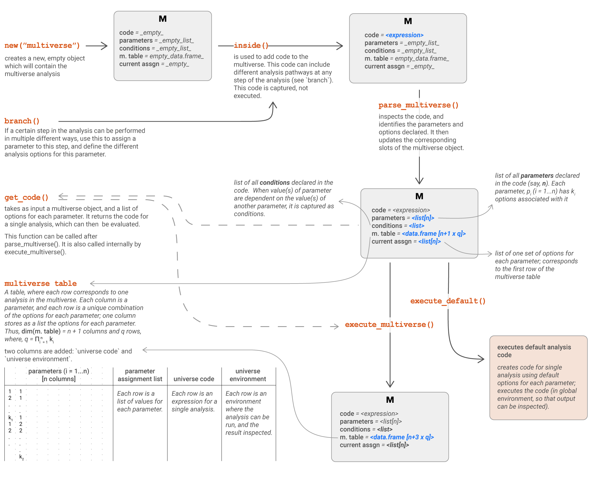

```{r setup, include=FALSE}
library(knitr)
opts_chunk$set(echo = TRUE)
opts_knit$set(output.dir="vignettes")
library(dplyr)
library(tidyr)
library(purrr)
library(ggplot2)
library(multidy)
```

## Introduction: Conducting a multiverse analysis

In this document, we'll outline a simple multiverse analysis --- calculating the mean of a set of numbers.

```{r data}
set.seed(1234567)
n = 100
x = c(10 + rt(n, 3) * 20, 20 + rt(5, 3, 100))
data = x
```

Now, there are multiple ways of calculating the mean. We could just directly call the `mean()` function on the data.

```{r mean_no_trim}
mean(data)
```

Or, we could remove the outliers by removing a fraction of the values from each end. Here, we remove 10% of the values (5% from each end).

```{r}
mean(data, trim = 0.05)
```

We could also change the fraction of values that we want to trim. This can be considered a very basic multiverse of analysis, where each single analysis would comprise of calculating the mean using different values for the `trim` argument of the `mean()` function.

## The most basic multiverse

An overview of the steps involved in creating a multiverse analysis is shown below:


```{r echo = FALSE, out.width = '100%', fig.align = 'center'}

```

We will gradually walk through each step involved in this analysis.

### The different analysis options

In our multiverse, we want to look at the result of using different values for trim. Let's first define the different options we want to set the value for trim to; we could choose to :
- not trim i.e. trim = 0
- trim 1% of the data i.e. trim = 0.005
- trim 5% of the data i.e. trim = 0.025
- trim 10% of the data i.e. trim = 0.05

Instead of repeatedly calling `mean()` with different values of trim, we can use the `branch()` function to declare that we want to calculate `mean()` using different options for the value of trim. Thus, instead of passing a value to trim (which is an argument of `mean()`), we would pass the `branch()` function.

The first argument to the `branch()` function is the name of the parameter (here "trim_value"). The other arguments are the options which are declared syntactically as `<option_name> ~ <option_calculation / option_value>`. Thus the `branch()` indicates that a parameter can take more than one option, which are then listed. 

This style of syntax allows us to declare all the possible options for this parameter at the same time. 

Thus, the `branch()` call would resemble something like this:

```{r, eval = FALSE}
branch(
  trim_values,
    "trim_none" ~ 0,
    "trim_1pc" ~ 0.005,
    "trim_5pc" ~ 0.025,
    "trim_10pc" ~ 0.05
)
```

We can now pass this branch to the `trim` argument of the `mean()` function.

```{r, eval = FALSE}
mean(data, trim = branch(
    trim_values,
      "trim_none" ~ 0,
      "trim_1pc" ~ 0.005,
      "trim_5pc" ~ 0.025,
      "trim_10pc" ~ 0.05
  )
)
```

### Creating and initialising the multiverse

However, for this to work, we would need to run this step within the multiverse, and not directly. To do that, we first need to create an empty multiverse object.

```{r}
M = multiverse()
```

The multiverse object contains five components (which we will subsequently refer to as slots): `code`, `parameters`, `conditions`, `current_parameter_assignment` and `multiverse_table`; all of them are initialised as empty (*NULL / empty list*). We will describe them in more detail later.

```{r}
code(M)
```


```{r}
parameters(M) #this is a list
```


```{r}
conditions(M) #this is empty
```


```{r}
default_parameter_assignment(M) #this is a list
```

Inside this new multiverse object, we will declare the code to calculate the mean using four different options. The `multiverse` object will store all possible combinations of analysis (in this case, the analysis is calculating the *mean*). 

When the *branches* are declared inside the multiverse, we can capture and store them without executing them. This way, we can capture the branches for more than one parameter, and interactively add more branches to the multiverse, so that it is easy to conduct a complete analysis. We will illustrate this later.

The `inside()` function takes in two arguments:
1. the multiverse object, and
2. the expression, which should be declared within `{}`

```{r}
inside(M, {
  x.mean = mean(data, 
    trim = branch(trim_values,
      "trim_none" ~ 0,
      "trim_1pc" ~ 0.005,
      "trim_5pc" ~ 0.025,
      "trim_10pc" ~ 0.05
    )
  )
})
```

Once, code is declared inside the multiverse, this is stored inside the `code` component as an un-evaluated expression. This will also populate the empty slots in the multiverse i.e. identify the parameters and create a multiverse table.

```{r}
code(M)
```

The `parameter` slot will have a named list of parameters (in this case, the only parameter we've declared is `trim_values`) and the options for each parameter (here, the four options).

```{r}
parameters(M)
```

The `multiverse_table` slot contains a tibble where each column of the tibble will be a unqiue parameter. The table will contains every possible combination of options for each parameter --- the number of rows corresponds to the number of different analysis paths (here, 4).

```{r}
multiverse_table(M)
```

The `default_parameter_assignment` slot will be initialised to the first option for each parameter (in this case, "trim_none").

```{r}
default_parameter_assignment(M)
```

### Executing the different analysis paths in the multiverse

This will be considered the default analysis option. We can execute this default option using the `execute_default()` function. `execute_default()` is also run everytime code is added to the multiverse, so users usually won't need to call it.

```{r}
M$x.mean
```

Or we can run the entire multiverse using the `execute_multiverse()` function. This will execute each analysis path in seperate environments.

```{r check_results}
M %>%
  execute_multiverse()
```


```{r}
multiverse_table(M) %>%
  unnest( mean = map(.results, "x.mean") ) %>%
  ggplot() +
  geom_col(aes(x = .universe, y = mean))
```


## Step 2: extending the multiverse

Now, let's introduce some *missing values*. We will then sample `100` values and compute the mean.
*Incomplete; requires the conditional assertion implementation*

```{r, data_2}
data = sample(c(data, rep(NA, 5)))
```


```{r eval = FALSE, echo = FALSE}
M = multiverse()
inside(M, {
  x.mean = mean(data, 
    na.rm = branch(remove_na,
      FALSE,
      TRUE
    ),
    trim = branch(trim_values,
      "trim_none" ~ 0,
      "trim_1pc" %when% (remove_na == TRUE) ~ 0.005,
      "trim_5pc" %when% (remove_na == TRUE) ~ 0.025,
      "trim_10pc" %when% (remove_na == TRUE) ~ 0.05
    )
  )
})

execute_multiverse(M)
```


```{r}
multiverse_table(M) %>%
  unnest( mean = map(.results, "x.mean") )
```


