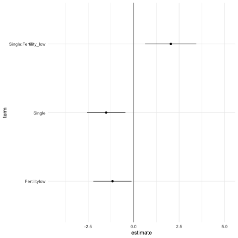

## Multiverse case study #1

In this document, we outline an initial approach to conducting a multiverse analysis in R. We will show how our package can be used to perform the multiverse analysis outlined by Steegen et al. in [Increasing Transparency Through a Multiverse Analysis](https://doi.org/10.1177/1745691616658637).

## Introduction

Data analysis can involve several decisions involving two or more options. In most statistical analysis, these decisions are taken by the researcher based on some reasonable justification. However, for several decisions, there can be more than one reasonable options to choose from. A multiverse analysis is a form of analysis which makes all such decisions explicit and conducts the complete analysis for all combinations of options (of each decision). 

Below, we illustrate an example of a single analysis for a dataset. And then extend it to a multiverse analysis. 

```{r setup, message=FALSE, warning=FALSE}
library(dplyr)
library(tidyr)
library(ggplot2)
library(purrr)
library(broom)
library(gganimate)
library(cowplot)
library(multiverse)
```


```{r, chunk-setup, include=FALSE}
knitr::opts_chunk$set(
  echo = TRUE,
  eval = if (isTRUE(exists("params"))) params$EVAL else FALSE,
  fig.width = 6, 
  fig.height = 4
)
```

## The data
The first step is to read the raw data from the file and store it as a tibble. We will be following the *_tidy data_* format here. The data is stored in two text files, and we can use `readr` to read the files into R. In this example, we will use the data collected by *Durante et al.* in [The fluctuating female vote: Politics, religion, and the ovulatory cycle](https://doi.org/10.1177/0956797612466416), which investigated the effect of fertility on religiosity and political attitudes. We will focus on their second study (which we store in `data.raw.study2`).


```{r data}
data("durante")

data.raw.study2 <- durante %>%
  mutate(
    Abortion = abs(7 - Abortion) + 1,
    StemCell = abs(7 - StemCell) + 1,
    Marijuana = abs(7 - Marijuana) + 1,
    RichTax = abs(7 - RichTax) + 1,
    StLiving = abs(7 - StLiving) + 1,
    Profit = abs(7 - Profit) + 1,
    FiscConsComp = FreeMarket + PrivSocialSec + RichTax + StLiving + Profit,
    SocConsComp = Marriage + RestrictAbortion + Abortion + StemCell + Marijuana
  )
```

The data look like this:

```{r}
data.raw.study2 %>%
  head(10)
```

The original paper looked at the relationship between fertility, relationship status, and religiosity. But there are many reasonable ways to have defined each of these three variables from this dataset, so it is a good candidate for multiverse analysis.

## A single data set analysis: one possible analysis among many

The data collected needs to be processed before it can be modeled. Preparing the data set for analysis can involve several steps and decisions regarding how to encode the different raw values. The following is one example of data processing that can be performed for this study. 


```{r single_analysis}
one_universe = data.raw.study2 %>%
  mutate( ComputedCycleLength = StartDateofLastPeriod - StartDateofPeriodBeforeLast ) %>%
  mutate( NextMenstrualOnset = StartDateofLastPeriod + ComputedCycleLength ) %>%
  mutate(
    CycleDay = 28 - (NextMenstrualOnset - DateTesting),
    CycleDay = ifelse(WorkerID == 15, 11, ifelse(WorkerID == 16, 18, CycleDay)),
    CycleDay = ifelse(CycleDay > 1 & CycleDay < 28, CycleDay, ifelse(CycleDay < 1, 1, 28))
  ) %>%
  mutate(
    Relationship = factor(ifelse(Relationship==1 | Relationship==2, "Single", "Relationship"))
  ) %>%
  filter( ComputedCycleLength > 25 & ComputedCycleLength < 35) %>%
  filter( Sure1 > 6 | Sure2 > 6 ) %>%
  mutate( Fertility = factor( ifelse(CycleDay >= 7 & CycleDay <= 14, "high", ifelse(CycleDay >= 17 & CycleDay <= 25, "low", "medium")) ) )
```

The transformed data for this one universe looks like this:

```{r}
one_universe %>%
  select( NextMenstrualOnset, Relationship, Sure1, Sure2, Fertility, everything() ) %>%
  head(10)
```

```{r, fig.align = 'center'}
one_universe %>%
  ggplot(aes(x = Relationship, y = Rel1 + Rel2 + Rel3, color = Fertility)) +
  stat_summary(position = position_dodge(width = .1), fun.data = "mean_se")
```

However, there also exists other valid processing options: instead of calculating `NextMenstrualOnset = StartDateofLastPeriod + ComputedCycleLength`, it can also be calculated as `StartDateofLastPeriod + ReportedCycleLength`. Such alternate processing options can exist for several decisions that a researcher makes in the data processing, analysis and presentation stages. This can thus result in a *multiverse of analysis*, with the one described above representing a single *universe*. 

Below, we describe how our package allows you to conduct a multiverse analysis with ease.

## Multiverse implementation

`multiverse` provides flexible functions which can be used to perform a multiverse analysis.

The first step is to define a *new multiverse*. We will use the multiverse object to create a set of universes, each representing a different way of analysing our data.

```{r}
M <- multiverse()
```

The next step is to define our possible analyses inside the multiverse. The `multiverse` package includes functions that aim to make it easy to write multiverse analyses in as close a way to a single universe analysis as possible (as seen in the single analysis shown above). 

Consider these first few lines from the transformation code in the single analysis above:

```{r eval = FALSE}
df <- data.raw.study2 %>%
  mutate(ComputedCycleLength = StartDateofLastPeriod - StartDateofPeriodBeforeLast) %>%
  mutate(NextMenstrualOnset = StartDateofLastPeriod + ComputedCycleLength)
```

But `NextMenstrualOnset` could be calculated in at least two other reasonable ways:

* `NextMenstrualOnset = StartDateofLastPeriod + ReportedCycleLength`
* `NextMenstrualOnset = StartDateNext`

To create a multiverse that includes these three possible processing options, we can use the `branch()` function. The `branch()` function defines a *parameter* (here `menstrual_calculation`) and the different *options* that the parameter can take (here, `"mc_option1"`, `"mc_option2"`, `"mc_option3"`). Each option corresponds to a different chunk of code that would be executed in a different universe.

```{r eval = FALSE}
NextMenstrualOnset = branch(menstrual_calculation, 
  "mc_option1" ~ StartDateofLastPeriod + ComputedCycleLength,
  "mc_option2" ~ StartDateofLastPeriod + ReportedCycleLength,
  "mc_option3" ~ StartDateNext
)
```

The `branch()` function indicates that, *in our multiverse*, NextMenstrualOnset can take either of the three options (here, `"mc_option1"`, `"mc_option2"`, `"mc_option3"`). Thus, we need to declare this data processing step inside the multiverse. We do this by using the `inside()` function. The `inside()` function takes in two arguments:
1. the multiverse object, M; and
2. the code for the analysis (including branches). Note that if you are passing multiple expressions, they should be enclosed within `{}`.

```{r add_to_multiverse}
# here we just create the variable `df` in the multiverse
inside(M, df <- data.raw.study2)

# here, we perform two `mutate` operations in the multiverse.
# although they could have been chained, this illustrates 
# how multiple variables can be declared together using the `{}`
inside(M, {
  df <- df %>%
    mutate( ComputedCycleLength = StartDateofLastPeriod - StartDateofPeriodBeforeLast )
  
  df <- df %>%
    mutate( NextMenstrualOnset = branch(menstrual_calculation, 
      "mc_option1" ~ StartDateofLastPeriod + ComputedCycleLength,
      "mc_option2" ~ StartDateofLastPeriod + ReportedCycleLength,
      "mc_option3" ~ StartDateNext)
    )
})
```

#### Note 
In this vignette, we make use of the  \code{inside} function which is more suited for a script-style implementation. Keeping consistency with the interactive programming interface of RStudio, we also offer the user [*multiverse code chunks*](https://mucollective.github.io/multiverse/articles/multiverse-in-rmd.html), a custom engine designed to work with the multiverse package, to implement the multiverse analyses. [*multiverse code chunks*](https://mucollective.github.io/multiverse/articles/multiverse-in-rmd.html) can be used instead of the `r` code block to write code inside a multiverse object. See \link{multiverse-in-rmd} or refer to the vignette (`vignette("multiverse-in-rmd")`) for more details on using the multiverse with RMarkdown.

### The multiverse, with declared code and branches
Once you add the code to the multiverse, it automatically parses the code to identify the `parameters` and the corresponding `options` that have been defined for each parameter.

Once the code has been added, the `multiverse` object will have the following attributes: 

1. `parameters`, which is a list of parameters

```{r parameter_list}
parameters(M)
```

2. `conditions`, which is a list of conditions (we'll define this later)
3. `expand`, which is a tibble consisting of all possible combination of values for the multiverse

```{r}
expand(M)
```

4. `code`, which is the code that the user passes to the multiverse to conduct a multiverse analysis. However, we do not execute this code and it is stored unevaluated. The user can interactively edit and rewrite this code, and can execute it for the current analysis or the entire multiverse using dedicated functions.

```{r}
code(M)
```

### Running a single analysis from the multiverse

At this point, we have defined three possible processing options (three universes) in our multiverse. Although we don't execute all the universes in the multiverses once they are defined, we do run the default analysis (i.e. the first row in the multiverse table). We can extract objects from the default analysis using the `$` operator.

```{r, generate_code}
M$df
```


### A multiverse with all possible combinations specified 
Besides calculating the onset of the next menstruation cycle, there are other variables which have multiple valid and reasonable processing options. These include defining `Relationship` and `Fertility`, and exclusion criteria based on the values for cycle length and certainty of responses. The next code chunk illustrates how this can be added to the multiverse object defined above. 

```{r}
inside(M, {
  df <- df %>%
      mutate(RelationshipStatus = branch( relationship_status, 
        "rs_option1" ~ factor(ifelse(Relationship==1 | Relationship==2, 'Single', 'Relationship')),
        "rs_option2" ~ factor(ifelse(Relationship==1, 'Single', 'Relationship')),
        "rs_option3" ~ factor(ifelse(Relationship==1, 'Single', ifelse(Relationship==3 | Relationship==4, 'Relationship', NA))) )
      ) %>%
      mutate(
        CycleDay = 28 - (NextMenstrualOnset - DateTesting),
        CycleDay = ifelse(WorkerID == 15, 11, ifelse(WorkerID == 16, 18, CycleDay)),
        CycleDay = ifelse(CycleDay > 1 & CycleDay < 28, CycleDay, ifelse(CycleDay < 1, 1, 28))
      ) %>%
      filter( branch(cycle_length, 
        "cl_option1" ~ TRUE,
        "cl_option2" ~ ComputedCycleLength > 25 & ComputedCycleLength < 35,
        "cl_option3" ~ ReportedCycleLength > 25 & ReportedCycleLength < 35
      )) %>%
      filter( branch(certainty,
        "cer_option1" ~ TRUE,
        "cer_option2" ~ Sure1 > 6 | Sure2 > 6
      )) %>%
      mutate( Fertility = branch( fertile,
        "fer_option1" ~ factor( ifelse(CycleDay >= 7 & CycleDay <= 14, "high", ifelse(CycleDay >= 17 & CycleDay <= 25, "low", "medium")) ),
        "fer_option2" ~ factor( ifelse(CycleDay >= 6 & CycleDay <= 14, "high", ifelse(CycleDay >= 17 & CycleDay <= 27, "low", "medium")) ),
        "fer_option3" ~ factor( ifelse(CycleDay >= 9 & CycleDay <= 17, "high", ifelse(CycleDay >= 18 & CycleDay <= 25, "low", "medium")) ),
        "fer_option4" ~ factor( ifelse(CycleDay >= 8 & CycleDay <= 14, "high", "low") ),
        "fer_option5" ~ factor( ifelse(CycleDay >= 8 & CycleDay <= 17, "high", "low") )
      ))
})
```

Since the multiverse object has already been created and the one parameter has already been defined, the inside function will add to the previous code.

```{r}
code(M)
```

The `expand` will contain all the possible combinations of the parameter options that have been identified.

```{r}
expand(M) %>%
  head()
```


In our multiverse we have identified 5 options for calculating `fertility`, 3 options for calculating `menstrual calculation` and `relationship status` each, 3 wyas of excluding participants based on their `cycle length` and 2 ways of excluding participants based on the self-reported `certainty` of their responses.

This results in $ 5 \times 3 \times 3 \times 3 \times 2 = 270$ possible combinations.

```{r}
expand(M) %>% nrow()
```

We can then inspect the default analysis the default single universe analysis from this multiverse:

```{r}
M$df %>%
  head()
```


### Specifying conditions in the multiverse analysis
In a multiverse analysis, it may occur that the value of one variable might depend on the value of another variable defined previously. 
For example, in our example, depending on how we filter participants based on *cycle length*, we can only the corresponding value for calculating participants' `NextMenstrualOnset`. In other words, if we are using `ComputedCycleLength` to exclude participants, this means that we should not calculate the variable `NextMenstrualOnset` (date for the onset of the next menstrual cycle) using the `ReportedCycleLength` value. Similarly, if we are using `ReportedCycleLength` to exclude participants it is inconsistent to calculate `NextMenstrualOnset` using `ComputedCycleLength`.

We can express these conditionals in the multiverse (See vignette("Conditions") for more details). Below, we use the %when% operator:

```{r eval = FALSE}
df <- data.raw.study2  %>%
    mutate( ComputedCycleLength = StartDateofLastPeriod - StartDateofPeriodBeforeLast ) %>%
    mutate(NextMenstrualOnset = branch(menstrual_calculation,
            "mc_option1" ~ (StartDateofLastPeriod + ComputedCycleLength) %when% (cycle_length != "cl_option3"),
            "mc_option2" ~ (StartDateofLastPeriod + ReportedCycleLength) %when% (cycle_length != "cl_option2"),
            "mc_option3" ~ StartDateNext)
    )
```

### Putting it all together

Specifying these conditions allows us to exclude inconsistent combinations from our analyses. Let's update our example by including these conditions:

```{r}
M = multiverse()

inside(M, {
  df <- data.raw.study2 %>%
    mutate( ComputedCycleLength = StartDateofLastPeriod - StartDateofPeriodBeforeLast )  %>%
    dplyr::filter( branch(cycle_length,
        "cl_option1" ~ TRUE,
        "cl_option2" ~ ComputedCycleLength > 25 & ComputedCycleLength < 35,
        "cl_option3" ~ ReportedCycleLength > 25 & ReportedCycleLength < 35
    )) %>%
    dplyr::filter( branch(certainty,
        "cer_option1" ~ TRUE,
        "cer_option2" ~ Sure1 > 6 | Sure2 > 6
    )) %>%
    mutate(NextMenstrualOnset = branch(menstrual_calculation,
        "mc_option1" %when% (cycle_length != "cl_option3") ~ StartDateofLastPeriod + ComputedCycleLength,
        "mc_option2" %when% (cycle_length != "cl_option2") ~ StartDateofLastPeriod + ReportedCycleLength,
        "mc_option3" ~ StartDateNext)
    )  %>%
    mutate(
      CycleDay = 28 - (NextMenstrualOnset - DateTesting),
      CycleDay = ifelse(WorkerID == 15, 11, ifelse(WorkerID == 16, 18, CycleDay)),
      CycleDay = ifelse(CycleDay > 1 & CycleDay < 28, CycleDay, ifelse(CycleDay < 1, 1, 28))
    ) %>%
    mutate( Fertility = branch( fertile,
        "fer_option1" ~ factor( ifelse(CycleDay >= 7 & CycleDay <= 14, "high", ifelse(CycleDay >= 17 & CycleDay <= 25, "low", NA)) ),
        "fer_option2" ~ factor( ifelse(CycleDay >= 6 & CycleDay <= 14, "high", ifelse(CycleDay >= 17 & CycleDay <= 27, "low", NA)) ),
        "fer_option3" ~ factor( ifelse(CycleDay >= 9 & CycleDay <= 17, "high", ifelse(CycleDay >= 18 & CycleDay <= 25, "low", NA)) ),
        "fer_option4" ~ factor( ifelse(CycleDay >= 8 & CycleDay <= 14, "high", "low") ),
        "fer_option5" ~ factor( ifelse(CycleDay >= 8 & CycleDay <= 17, "high", "low") )
    )) %>%
    mutate(RelationshipStatus = branch(relationship_status,
        "rs_option1" ~ factor(ifelse(Relationship==1 | Relationship==2, 'Single', 'Relationship')),
        "rs_option2" ~ factor(ifelse(Relationship==1, 'Single', 'Relationship')),
        "rs_option3" ~ factor(ifelse(Relationship==1, 'Single', ifelse(Relationship==3 | Relationship==4, 'Relationship', NA))) )
    )
})
```

After excluding the inconsistent choice combinations, $270 − 2 \times (5 \times 1 \times 3 \times 1 \times 2) = 210$ choice combinations remain:

```{r}
expand(M) %>% nrow()
```

Now, we've created the complete multiverse that was presented as example #2 from Steegen et al.'s paper.

## Modeling
Steegen et al. create 6 models. The first model uses data from example #1. The other five models use the data from example #2, which we've using so far.

### Model #2: Effect of Fertility and Relationship status on Religiosity
The authors compute a composite score of Religiosity by calculating the average of the three Religiosity items.

```{r}
inside(M, {
  df <- df %>%
  mutate( RelComp = round((Rel1 + Rel2 + Rel3)/3, 2))
})
```

The authors perform an ANOVA to study the effect of *Fertility*, *Relationship* and their interaction term, on the composite Religiosity score. We fit the linear model using the call: `lm( RelComp ~ Fertility * RelationshipStatus, data = df )` inside our multiverse and save the result to a variable called `fit_RelComp`.

```{r}
inside(M, {
  fit_RelComp <- lm( RelComp ~ Fertility * RelationshipStatus, data = df )
})
```

To extract the results from the analysis, we first create a tidy data-frame of the results of the model, using `broom::tidy`. Recall that declaring a variable in the multiverse only executes it in the default universe, and hence we need to call `execute_multiverse()` to execute our analysis in each multiverse.


```{r}
inside(M, {
  summary_RelComp <- fit_RelComp %>% 
    broom::tidy( conf.int = TRUE )
})

execute_multiverse(M)
```

Now that we have performed the analysis in each universe of the multiverse, we need to plot the data. To plot the data, we need to extract the relevant result data-frame from each universe into a single data-frame. The following code does this, by extracting the variable where the estimates of the model are stored, `summary_RelComp` and creating a single tidy data-frame that can be accessed easily.

```{r}
expand(M) %>%
  extract_variables(summary_RelComp) %>%
  unnest( cols = c(summary_RelComp) ) %>%
  head( 10 )
```


We then take this data frame and plot the results as a confidence interval and point estimate using `ggplot2`. As you can see, this is similar to how you would plot a point estimate and confidence intervals for a regular analysis. We then use `gganimate` to animate through the results of each universe to quickly get an overview of the robustness of the results.

Note: we discuss extracting results from the multiverse and visualising them in more detail in `vignette(visualising-multiverse)`

```{r, message = FALSE, eval = FALSE}
p <- expand(M) %>%
  extract_variables(summary_RelComp) %>%
  unnest( cols = c(summary_RelComp) ) %>%
  mutate( term = recode( term, 
                 "RelationshipStatusSingle" = "Single",
                 "Fertilitylow:RelationshipStatusSingle" = "Single:Fertility_low"
  ) ) %>%
  filter( term != "(Intercept)" ) %>%
  ggplot() + 
  geom_vline( xintercept = 0,  colour = '#979797' ) +
  geom_point( aes(x = estimate, y = term)) +
  geom_errorbarh( aes(xmin = conf.low, xmax = conf.high, y = term), height = 0) +
  theme_minimal() +
  transition_manual( .universe )

animate(p, nframes = 210, fps = 4, res = 72)
```



