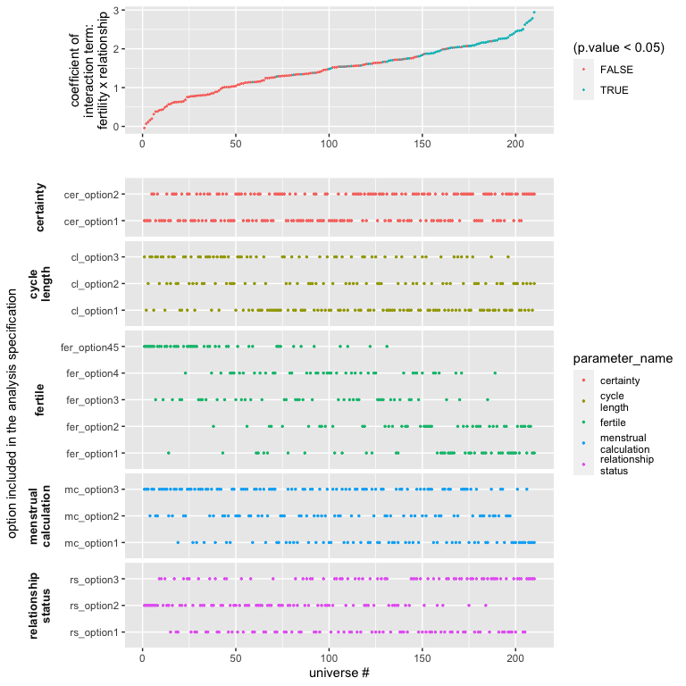

## Introduction

In this document, we show how you can extract results from the multiverse after performing a multiverse analysis. We also show some ways to visualise the results of a multiverse analysis. Because, a multiverse analysis consists of the results from hundreds or thousands of analysis, visualising them can be difficult. We will show how our package can be used to create the visualisations by Steegen et al. in [Increasing Transparency Through a Multiverse Analysis](https://doi.org/10.1177/1745691616658637) and Simonsohn et al. in [Specification curve: Descriptive and inferential statistics on all reasonable specifications](http://dx.doi.org/10.2139/ssrn.2694998), as well as using other uncertainty visualisation approaches.


```{r, setup, message=FALSE, warning=FALSE}
library(dplyr)
library(tidyr)
library(ggplot2)
library(purrr)
library(broom)
library(gganimate)
library(cowplot)
library(stringr)
library(multiverse)
```

```{r, include=FALSE}
M = multiverse()
```


```{r, chunk-setup, include=FALSE}
knitr::opts_chunk$set(
  echo = TRUE,
  eval = if (isTRUE(exists("params"))) params$EVAL else FALSE,
  fig.width = 6, 
  fig.height = 4
)
```


## Data and Analysis

We will be using the durante dataset.

```{r, data}
data("durante")

data.raw.study2 <- durante %>%
  mutate(
    Abortion = abs(7 - Abortion) + 1,
    StemCell = abs(7 - StemCell) + 1,
    Marijuana = abs(7 - Marijuana) + 1,
    RichTax = abs(7 - RichTax) + 1,
    StLiving = abs(7 - StLiving) + 1,
    Profit = abs(7 - Profit) + 1,
    FiscConsComp = FreeMarket + PrivSocialSec + RichTax + StLiving + Profit,
    SocConsComp = Marriage + RestrictAbortion + Abortion + StemCell + Marijuana
  )
```

A detailed description of this analysis can be found in `vignette(durante-multiverse-analysis)`. We will use the results from this analysis to create the visualisations.

**Note** that the `inside` function is more suited for a script-style implementation. Keeping consistency with the interactive programming interface of RStudio, we also offer the user a `multiverse code block` which can be used instead of the `r` code block to write code inside a multiverse object (see \link{multiverse-in-rmd} for more details on using the multiverse with RMarkdown).

```{r, initialise-multiverse}
M = multiverse()

inside(M, {
  df <- data.raw.study2  %>%
    mutate( ComputedCycleLength = StartDateofLastPeriod - StartDateofPeriodBeforeLast )  %>%
    dplyr::filter( branch(cycle_length,
      "cl_option1" ~ TRUE,
      "cl_option2" ~ ComputedCycleLength > 25 & ComputedCycleLength < 35,
      "cl_option3" ~ ReportedCycleLength > 25 & ReportedCycleLength < 35
    )) %>%
    dplyr::filter( branch(certainty,
      "cer_option1" ~ TRUE,
      "cer_option2" ~ Sure1 > 6 | Sure2 > 6
    )) %>%
    mutate(NextMenstrualOnset = branch(menstrual_calculation,
      "mc_option1" %when% (cycle_length != "cl_option3") ~ StartDateofLastPeriod + ComputedCycleLength,
      "mc_option2" %when% (cycle_length != "cl_option2") ~ StartDateofLastPeriod + ReportedCycleLength,
      "mc_option3" ~ StartDateNext)
    )  %>%
    mutate(
      CycleDay = 28 - (NextMenstrualOnset - DateTesting),
      CycleDay = ifelse(CycleDay > 1 & CycleDay < 28, CycleDay, ifelse(CycleDay < 1, 1, 28))
    ) %>%
    mutate( Fertility = branch( fertile,
      "fer_option1" ~ factor( ifelse(CycleDay >= 7 & CycleDay <= 14, "high", ifelse(CycleDay >= 17 & CycleDay <= 25, "low", NA)) ),
      "fer_option2" ~ factor( ifelse(CycleDay >= 6 & CycleDay <= 14, "high", ifelse(CycleDay >= 17 & CycleDay <= 27, "low", NA)) ),
      "fer_option3" ~ factor( ifelse(CycleDay >= 9 & CycleDay <= 17, "high", ifelse(CycleDay >= 18 & CycleDay <= 25, "low", NA)) ),
      "fer_option4" ~ factor( ifelse(CycleDay >= 8 & CycleDay <= 14, "high", "low") ),
      "fer_option45" ~ factor( ifelse(CycleDay >= 8 & CycleDay <= 17, "high", "low") )
    )) %>%
    mutate(RelationshipStatus = branch(relationship_status,
      "rs_option1" ~ factor(ifelse(Relationship==1 | Relationship==2, 'Single', 'Relationship')),
      "rs_option2" ~ factor(ifelse(Relationship==1, 'Single', 'Relationship')),
      "rs_option3" ~ factor(ifelse(Relationship==1, 'Single', ifelse(Relationship==3 | Relationship==4, 'Relationship', NA))) )
    )
  
  df <- df %>%
    mutate( RelComp = round((Rel1 + Rel2 + Rel3)/3, 2))
})
```

### Model #2: Effect of Fertility and Relationship status on Religiosity
Steegen et al. analyse the data using 6 models. All the models except the first use this dataset. For the visualisations, we will focus on the effect of Fertility and Relationship status on Religiosity.

The authors perform an ANOVA to study the effect of *Fertility*, *Relationship* and their interaction term, on the composite Religiosity score (`RelComp`). We perform this analysis and extract the results from the multiverse into a tidy `data frame`.

```{r, linear-models}
inside(M, {
  fit_RelComp <- lm( RelComp ~ Fertility * RelationshipStatus, data = df )
  
  fit_FiscConsComp <- lm( FiscConsComp ~ Fertility * RelationshipStatus, data = df)
  
  fit_SocConsComp <- lm( SocConsComp ~ Fertility * RelationshipStatus, data = df)

  fit_Donate <- glm( Donate ~ Fertility * Relationship, data = df, family = binomial(link = "logit") )
  
  fit_Vote <- glm( Vote ~ Fertility * Relationship, data = df, family = binomial(link = "logit") )
})
```

In most analysis, you would then look at the results using the `summary` function. However, when performing a multiverse analysis, the summary would be executed in each universe of the multiverse, and would not be accessible outside each universe. However, there are ways to easily extract the results from each universe, as long as the results within each universe are as *tidy data*.

## The results

### Computing the results in each multiverse
The `broom` package allows extracting the summary of most linear models using the `tidy()` function. The `tidy` method summarises information about the components of a model including the estimates, std. error, t-statistic, p-value for each coefficient and returns a tibble (a tidy data frame). Additional arguments can be passed to obtain the upper and lower 95% confidence limits, or to change the confidence level.

```{r, model-summaries}
inside(M, {
  summary_RelComp <- fit_RelComp %>% 
    broom::tidy( conf.int = TRUE )
  
  summary_FiscConsComp <- fit_FiscConsComp %>% 
    broom::tidy( conf.int = TRUE )
  
  summary_SocConsComp <- fit_SocConsComp %>% 
    broom::tidy( conf.int = TRUE )
  
  summary_Donate <- fit_Donate %>% 
    broom::tidy( conf.int = TRUE )
  
  summary_Vote <- fit_Vote %>% 
    broom::tidy( conf.int = TRUE )
})
```

Finally, we will execute all the generated analysis combinations in the multiverse, since so far we have only defined them.

```{r, execute-multiverse}
execute_multiverse(M)
```

### Extracting the results
All the computed summaries (`summary_RelComp`, `summary_FiscConsComp`, `summary_SocConsComp`, `summary_Donate` and `summary_Vote`) are stored within `.results` column (a separate environment) in the multiverse table. We can extract these summaries as a tibble using and store it in a separate column, and then unnest this new column:


```{r, multiverse-results}
expand(M) %>%
  mutate( summary = map(.results, "summary_RelComp") ) %>%
  unnest( summary )
```

We can then use various R packages to visualise the results. Below, we show some standard visualisations.

## Visualisations

### Animating the coefficients of the model from each multiverse
One way to visualise over the multiverse is to animate over the results from each universe in the multiverse. This approach, inspired by the concept of Hypothetical Outcome plots was described by Dragicevic et al. in [Increasing the Transparency of Research Papers with Explorable Multiverse Analyses](https://dl.acm.org/doi/10.1145/3290605.3300295). This approach allows us to quickly see the robustness of a result --- if a particular result is consistent across all analysis paths or idiosyncratic to a specific analysis path.

```{r, message = FALSE, fig.width = 6, fig.height = 4, eval = FALSE}
p <- expand(M) %>%
  mutate( summary_RelComp = map(.results, "summary_RelComp") ) %>%
  unnest( cols = c(summary_RelComp) ) %>%
  mutate( term = recode( term, 
                 "RelationshipStatusSingle" = "Single",
                 "Fertilitylow:RelationshipStatusSingle" = "Single:Fertility_low"
  ) ) %>%
  filter( term != "(Intercept)" ) %>%
  ggplot() + 
  geom_vline( xintercept = 0,  colour = '#979797' ) +
  geom_point( aes(x = estimate, y = term)) +
  geom_errorbarh( aes(xmin = conf.low, xmax = conf.high, y = term), height = 0) +
  theme_minimal() +
  transition_manual( .universe )

animate(p, nframes = 210, fps = 2)
```


### Histogram of p-values of the Fertility × Relationship status interaction
Another approach would be to summarise the results. Steegen et al. which depicts a histogram of p values of the Fertility × Relationship status interaction on religiosity for the multiverse of 210 data sets in Study 2 (`summary_RelComp`), on fiscal and social political attitudes for the multiverse of 210 data sets in Study 2 (`summary_FiscConsComp` and `summary_SocConsComp`), and on voting and donation preferences for the multiverse of 210 data sets in Study 2 (`summary_Donate` and `summary_Vote`). The dashed line indicates p = 0.05.

Below we show how to re-create the visualisation. 

```{r fig.width = 9, fig.height = 9}
expand(M) %>%
  mutate( index = seq(1:nrow(.)) ) %>%
  mutate( 
    summary_RelComp = map(.results, "summary_RelComp" ),
    summary_FiscConsComp = map(.results, "summary_FiscConsComp" ),
    summary_SocConsComp = map(.results, "summary_SocConsComp" ),
    summary_Donate = map(.results, "summary_Donate" ),
    summary_Vote = map(.results, "summary_Vote" )
  ) %>%
  select( summary_RelComp:summary_Vote ) %>%
  gather( "analysis", "result" ) %>%
  unnest(result) %>%
  filter( term == "Fertilitylow:RelationshipStatusSingle" | term == "Fertilitylow:Relationship") %>%
  ggplot() +
  geom_histogram(aes(x = p.value), bins = 100, fill = "#ffffff", color = "#333333") +
  geom_vline( xintercept = 0.05, color = "red", linetype = "dashed") +
  facet_wrap(~ analysis, scales = "free", nrow = 3)
```

### Specification curve
Simonsohn et al. propose visualising results from the multiverse as a `specification curve`, which consists of two panels. The top panel shows the effect size (here the value of a coefficient) for each universe (or specification). The bottom panel shows which specification of the parameters results in that result.

```{r, fig.width = 8, fig.height = 8, eval = FALSE}
data.spec_curve <- expand(M) %>%
  mutate( summary_RelComp = map(.results, "summary_RelComp") ) %>%
  unnest( cols = c(summary_RelComp) ) %>%
  filter( term == "Fertilitylow:RelationshipStatusSingle" ) %>%
  select( .universe, !! names(parameters(M)), estimate, p.value ) %>%
  arrange( estimate ) %>%
  mutate( .universe = 1:nrow(.))

p1 <- data.spec_curve %>%
  gather( "parameter_name", "parameter_option", !! names(parameters(M)) ) %>%
  select( .universe, parameter_name, parameter_option) %>%
  mutate(
    parameter_name = factor(str_replace(parameter_name, "_", "\n"))
  ) %>%
  ggplot() +
  geom_point( aes(x = .universe, y = parameter_option, color = parameter_name), size = 0.5 ) +
  labs( x = "universe #", y = "option included in the analysis specification") + 
  facet_grid(parameter_name ~ ., space="free_y", scales="free_y", switch="y") +
  theme(strip.placement = "outside",
        strip.background = element_rect(fill=NA,colour=NA),
        panel.spacing.x=unit(0.15,"cm"), 
        strip.text.y = element_text(angle = 180, face="bold", size=10), 
        panel.spacing = unit(0.25, "lines")
      )

p2 <- data.spec_curve %>%
  ggplot() +
  geom_point( aes(.universe, estimate, color = (p.value < 0.05)), size = 0.25) +
  labs(x = "", y = "coefficient of\ninteraction term:\nfertility x relationship")
  
cowplot::plot_grid(p2, p1, axis = "bltr",  align = "v", ncol = 1, rel_heights = c(1, 3))
```



